# Archon CLI

<div align="center">
  
</div>

A privacy-first, self-aware AI coding assistant written in Rust. Archon replaces cloud-dependent AI CLIs with a fully local consciousness layer, persistent memory, configurable personality, behavioral rules, and an interactive TUI, while proxying Claude's API directly with zero telemetry.

---

## Table of Contents

- [Overview](#overview)
- [Quick Start](#quick-start)
- [Build from Source](#build-from-source)
- [Architecture](#architecture)
- [Setup](#setup)
  - [macOS](#macos)
  - [Linux](#linux)
  - [Windows](#windows)
- [Authentication](#authentication)
- [Configuration](#configuration)
- [Local LLMs and Proxies](#local-llms-and-proxies)
- [CLI Reference](#cli-reference)
- [Slash Commands](#slash-commands)
- [Tools Reference](#tools-reference)
- [Themes](#themes)
- [Memory System](#memory-system)
- [Memory Garden](#memory-garden)
- [Consciousness System](#consciousness-system)
- [Correction Tracking](#correction-tracking)
- [Personality Persistence](#personality-persistence)
- [Agent Loop](#agent-loop)
- [Subagent Spawning](#subagent-spawning)
- [Multi-Agent Teams](#multi-agent-teams)
- [Skills System](#skills-system)
- [Hooks System](#hooks-system)
- [Plugins](#plugins)
- [MCP Integration](#mcp-integration)
- [LSP Integration](#lsp-integration)
- [Checkpointing & File Snapshots](#checkpointing--file-snapshots)
- [Cron & Scheduling](#cron--scheduling)
- [Permission System](#permission-system)
- [Identity & Spoofing](#identity--spoofing)
- [Session Management](#session-management)
- [Remote Control & Headless Mode](#remote-control--headless-mode)
- [IDE Extensions](#ide-extensions)
- [Web UI](#web-ui)
- [Vim Mode](#vim-mode)
- [Cost, Effort & Fast Mode](#cost-effort--fast-mode)
- [Context Compaction](#context-compaction)
- [Pipeline Engine](#pipeline-engine)
  - [Agent Definition System](#agent-definition-system)
  - [Gate Enforcement](#gate-enforcement)
  - [Structured Artefacts](#structured-artefacts)
  - [Session Recovery](#session-recovery)
  - [Ledger System](#ledger-system)
- [LEANN Semantic Code Search](#leann-semantic-code-search)
- [Knowledge Base](#knowledge-base)
- [Learning Systems](#learning-systems)
- [Crate Architecture](#crate-architecture)
- [Phase Roadmap](#phase-roadmap)
- [Release Notes (v0.1.6 → v0.1.25)](#release-notes-v016--v0125)
- [License](#license)

---

## Overview

| Feature | Claude Code | Archon |
|---------|-------------|--------|
| Telemetry | Yes | None |
| Memory | Markdown files on disk | Local CozoDB graph with typed relationships |
| Memory search | Contextual (LLM-based) | Hybrid BM25 keyword + vector cosine (HNSW) |
| Memory consolidation | Auto-Dream (basic pruning) | 6-phase garden (decay, prune, dedup, merge, overflow, timestamp) |
| Embeddings | None | fastembed local (768-dim) or OpenAI (1536-dim) |
| Correction tracking | Saved as preferences | Auto-detected with 5 severity levels, rule reinforcement |
| Personality | Fixed | Configurable (MBTI, Enneagram, traits) |
| Personality persistence | None | Full cross-session snapshot (InnerVoice + rule scores + trends) |
| Self-reflection | None | InnerVoice (confidence, energy, struggles, successes) |
| Behavioral rules | ARCHON.md only | Scored rules (0-100) with decay, reinforcement, trend tracking |
| TUI | Basic | Full ratatui TUI with 23 themes |
| Session resume | ID only | ID prefix, name, or name prefix |
| Tool execution | Node.js | Native Rust async |
| Binary size | ~200 MB | ~66 MB (release, v0.1.13) |
| MCP transports | stdio | stdio, WebSocket, streamable-HTTP |
| Plugins | No | Dynamic .so/.dll/.dylib, trait-based ABI |
| Multi-agent teams | Single agent | Sequential, Parallel, Pipeline, DAG modes |
| LSP integration | No | goToDefinition, findReferences, hover, callHierarchy, etc. |
| Remote control | No | `archon serve` + `archon remote ws/ssh` |
| Coding pipeline | No | 50-agent pipeline (11-layer prompt, 6 phases) |
| Research pipeline | No | 46-agent PhD research pipeline (5-part prompt) |
| Semantic code search | No | Native LEANN (tree-sitter chunking, HNSW vectors) |
| Knowledge base | No | CozoDB document ingest, LLM compilation, Q&A |
| Learning systems | No | SONA, GNN, CausalMemory, ReasoningBank (12 modes), Reflexion |

---

## Quick Start

```bash
# Build (requires Rust 1.85+)
git clone https://github.com/ste-bah/archon-cli
cd archon-cli
cargo build --release

# Authenticate (either API key or OAuth)
export ANTHROPIC_API_KEY="sk-ant-..."
# or: ./target/release/archon login

# Run interactive TUI
./target/release/archon

# Non-interactive print mode
./target/release/archon -p "summarize src/main.rs" --output-format json
```

---

## Build from Source

archon-cli is a 21-crate Cargo workspace. There are no precompiled binaries — clone, install Rust, build with `cargo build --release`. End-to-end build time is ~3-4 minutes on a modern laptop, longer on WSL2 (see WSL2 caveat below).

### Prerequisites

| Requirement | Minimum | Notes |
|-------------|---------|-------|
| Rust toolchain | 1.85+ | edition 2024 — older toolchains will not compile |
| `cargo` | bundled with Rust | comes from rustup |
| Git | any recent | for `git clone` and branch-aware sessions at runtime |
| Disk space | ~3 GB free | target/ build artefacts dominate |
| RAM | 4 GB minimum, 8 GB+ recommended | the linker phase peaks; WSL2 OOMs with parallel rustc on 4 GB |
| OS | Linux, macOS 12+, Windows 10/11 (native or WSL2) | |

### Install Rust

If you don't already have Rust installed:

```bash
curl --proto '=https' --tlsv1.2 -sSf https://sh.rustup.rs | sh
source "$HOME/.cargo/env"
rustc --version    # verify: should print 1.85.0 or newer
```

`rustup` will pick up the workspace's pinned toolchain from `rust-toolchain.toml` (if present) on first build.

### Install OS build dependencies

archon-cli links against OpenSSL via `reqwest` (rustls is also enabled, but build-deps still need pkg-config + libssl headers on Linux for some transitive crates).

#### Ubuntu / Debian / WSL2-Ubuntu

```bash
sudo apt update
sudo apt install -y build-essential pkg-config libssl-dev git
```

#### Fedora / RHEL / Rocky

```bash
sudo dnf install -y gcc pkg-config openssl-devel git
```

#### Arch / Manjaro

```bash
sudo pacman -S --needed base-devel openssl pkg-config git
```

#### macOS

```bash
xcode-select --install                                # Xcode CLI tools
# OpenSSL is supplied by the system; no extra steps needed for default builds.
# If a transitive crate complains about OpenSSL, install via brew:
brew install pkg-config openssl
export PKG_CONFIG_PATH="$(brew --prefix openssl)/lib/pkgconfig"
```

#### Windows (native)

Install via [winget](https://learn.microsoft.com/en-us/windows/package-manager/winget/) in PowerShell:

```powershell
winget install Rustlang.Rustup
winget install Microsoft.VisualStudio.2022.BuildTools
# In the VS Build Tools installer, select "Desktop development with C++"
winget install Git.Git
```

### Clone and build

```bash
git clone https://github.com/ste-bah/archon-cli
cd archon-cli
cargo build --release --bin archon
```

The release binary will be at `target/release/archon` (~66 MB).

For an incremental dev build (faster compile, larger binary, debug symbols):

```bash
cargo build --bin archon
./target/debug/archon --version
```

### WSL2 caveat — parallelism limit

If you are building inside **WSL2**, do NOT let cargo run rustc in parallel against the full 21-crate workspace. WSL2's memory pressure on multi-process compilation has caused OOM kills in our test environments. Instead, restrict to one job:

```bash
cargo build --release --bin archon -j1
```

Build time on WSL2 with `-j1` is ~3-4 minutes; without `-j1` it can OOM the entire WSL2 VM. Native Linux and macOS do not need this flag.

### Install to PATH

After a successful build, place the binary somewhere in `$PATH`:

```bash
# Option A: copy to /usr/local/bin (Linux/macOS)
sudo cp target/release/archon /usr/local/bin/

# Option B: cargo install (Linux/macOS/Windows)
cargo install --path .
# Installs to ~/.cargo/bin/archon — make sure ~/.cargo/bin is in PATH
```

For Windows native (PowerShell):

```powershell
$env:PATH += ";$PWD\target\release"
# Or copy archon.exe to a directory already in PATH
```

### Verify the build

```bash
archon --version
# Expected output: archon 0.1.20 (<short-sha>)

archon --help                   # full subcommand listing
archon --list-themes            # 23 themes available
archon --list-output-styles     # 5 output styles available
```

### First run

archon-cli stores per-user state under `~/.local/share/archon/` (Linux/macOS) or `%APPDATA%\archon\` (Windows) and reads project config from `<workdir>/.archon/config.toml`. On the very first run, no config exists yet — `archon` boots with built-in defaults and you authenticate via:

```bash
archon login                              # OAuth PKCE flow (Claude.ai subscriber)
# OR
export ANTHROPIC_API_KEY="sk-ant-..."     # direct API-key auth
```

See [Authentication](#authentication) and [Configuration](#configuration) for full setup.

### Run the test suite (optional)

```bash
# Native Linux/macOS — full parallelism
cargo test --workspace

# WSL2 — restrict parallelism (same reason as build)
cargo test --workspace -j1 -- --test-threads=2

# Faster, prettier output via nextest (one-time install)
cargo install cargo-nextest
cargo nextest run --workspace -j1 -- --test-threads=2
```

### Common build problems

| Symptom | Cause | Fix |
|---------|-------|-----|
| `error: package 'archon-cli-workspace' specifies edition 2024` | Rust < 1.85 | `rustup update stable` |
| `failed to resolve openssl` on Linux | missing `libssl-dev` | install OS build deps (above) |
| WSL2 build hangs then `Killed`/`signal: 9` | OOM during parallel rustc | rebuild with `cargo build --release -j1` |
| `linker 'cc' not found` | missing C toolchain | install `build-essential` (Linux) or Xcode CLI tools (macOS) |
| Long build (30+ min on first run) | full dependency graph fetch + compile | normal for first build; subsequent rebuilds use the incremental cache |
| `error: linking with cc failed` after a long compile | linker memory exhaustion | install `lld` and add `RUSTFLAGS='-Clink-arg=-fuse-ld=lld'` to the env, or switch to `-j1` |

### Build flags reference

| Flag | Purpose |
|------|---------|
| `--release` | optimized build (slow compile, fast runtime, ~66 MB output) |
| `--bin archon` | only build the `archon` CLI binary — skips test/example targets and other workspace bins (`archon-pipeline-runner`, etc.) for faster iteration |
| `-j1` | restrict cargo to one rustc process (mandatory on WSL2 with <8 GB RAM) |
| `--offline` | reuse the local registry cache; do NOT fetch new crates (faster on rebuilds, fails on first build) |
| `--profile dev` | default debug build; preserves debug symbols, no optimization |

---

## Architecture

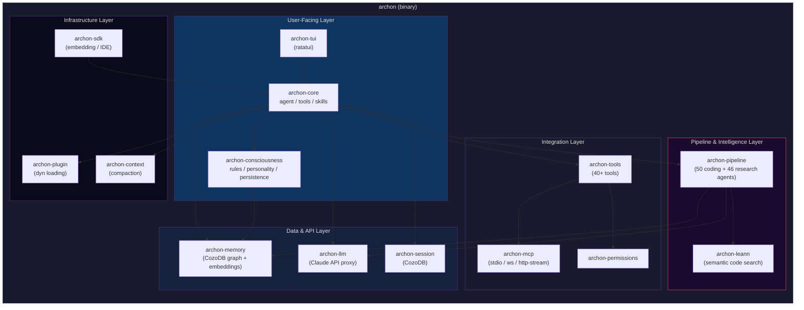

---

## Setup

### Prerequisites

- **Rust 1.85+** (edition 2024)
- **Claude API key** or active Claude subscription
- **Git** (optional, for branch-aware sessions)

---

### macOS

```bash
# 1. Install Rust
curl --proto '=https' --tlsv1.2 -sSf https://sh.rustup.rs | sh
source "$HOME/.cargo/env"

# 2. Install build dependencies (Xcode Command Line Tools)
xcode-select --install

# 3. Clone and build
git clone https://github.com/ste-bah/archon-cli
cd archon-cli
cargo build --release

# 4. Install to PATH
cp target/release/archon /usr/local/bin/archon
# or
cargo install --path .

# 5. Set API key
export ANTHROPIC_API_KEY="sk-ant-..."
# Add to ~/.zshrc or ~/.bash_profile for persistence

# 6. Run
archon
```

**Optional, brew dependencies** (only if build fails due to OpenSSL):
```bash
brew install pkg-config openssl
export PKG_CONFIG_PATH="$(brew --prefix openssl)/lib/pkgconfig"
```

---

### Linux

#### Ubuntu / Debian

```bash
curl --proto '=https' --tlsv1.2 -sSf https://sh.rustup.rs | sh
source "$HOME/.cargo/env"
sudo apt update && sudo apt install -y build-essential pkg-config libssl-dev
git clone https://github.com/ste-bah/archon-cli
cd archon-cli
cargo build --release
sudo cp target/release/archon /usr/local/bin/archon
export ANTHROPIC_API_KEY="sk-ant-..."
echo 'export ANTHROPIC_API_KEY="sk-ant-..."' >> ~/.bashrc
```

#### Fedora / RHEL / Rocky

```bash
sudo dnf install -y gcc pkg-config openssl-devel
# Then build as above
```

#### Arch Linux

```bash
sudo pacman -S base-devel openssl pkg-config
# Then build as above
```

---

### Windows

#### Option A: Native (Windows 10/11)

```powershell
winget install Rustlang.Rustup
winget install Microsoft.VisualStudio.2022.BuildTools
# Select "Desktop development with C++" during install

git clone https://github.com/ste-bah/archon-cli
cd archon-cli
cargo build --release

$env:PATH += ";$PWD\target\release"
$env:ANTHROPIC_API_KEY = "sk-ant-..."
.\target\release\archon.exe
```

#### Option B: WSL2 (Recommended for Windows)

```powershell
wsl --install -d Ubuntu
# Then follow Linux/Ubuntu setup above inside WSL
```

---

## Authentication

Archon supports three authentication methods, tried in this order:

### 1. OAuth (recommended for Claude subscribers)

```bash
archon login
```

This opens a PKCE OAuth flow in your browser, exchanges the authorization code for tokens, and stores them at `~/.config/archon/oauth.json`. Tokens are refreshed automatically with file locking to prevent race conditions across concurrent sessions. Re-run `archon login` to re-authenticate; `archon logout` (or `/logout` in the TUI) signs out.

### 2. API key

```bash
export ANTHROPIC_API_KEY="sk-ant-..."
# or ARCHON_API_KEY (alias)
```

### 3. Pre-set bearer token

```bash
export ARCHON_OAUTH_TOKEN="..."
# or ANTHROPIC_AUTH_TOKEN (legacy alias)
```

The OAuth flow is designed to match the original Claude Code client (`redirect_uri = http://localhost:{port}/callback`), so existing Claude Code tokens on the same machine work transparently.

---

## Configuration

Archon generates a commented config file on first run at `~/.config/archon/config.toml`.

```toml
[api]
default_model = "claude-sonnet-4-6"   # Model used for the main agent
thinking_budget = 16384               # Max thinking tokens (extended thinking)
default_effort = "high"               # "low" | "medium" | "high"
max_retries = 3
# base_url = "http://localhost:4000/v1/messages"  # Override (LiteLLM/proxy)

[identity]
mode = "spoof"                        # "spoof" | "native"
spoof_version = "2.1.89"              # Version reported to the API
anti_distillation = false             # Inject anti-distillation field in spoof mode

[personality]
name = "Archon"                       # Shown in TUI header
type = "INTJ"                         # MBTI type, auto-selects theme
enneagram = "4w5"
traits = ["strategic", "direct", "truth-over-comfort"]
communication_style = "terse"         # Injected into system prompt

[consciousness]
inner_voice = true                    # Background monologue before responses
energy_decay_rate = 0.02
persist_personality = true            # Persist InnerVoice + rule scores across sessions
personality_history_limit = 50        # Max personality snapshots to retain
initial_rules = [
    "Always ask before modifying files",
    "Explain reasoning before acting",
    "Never create files unless explicitly requested",
]

[tools]
bash_timeout = 120
bash_max_output = 102400
max_concurrency = 4

[permissions]
mode = "ask"                          # ask | auto | deny | plan | acceptEdits
                                      #  | dontAsk | bypassPermissions
allow_paths = []
deny_paths = []
sandbox = false                       # Read-only enforcement

[memory]
enabled = true                        # CozoDB memory graph

[memory.garden]
auto_consolidate = true               # Run consolidation on session start
min_hours_between_runs = 24           # Throttle auto-consolidation
dedup_similarity_threshold = 0.92     # Jaccard threshold for deduplication
staleness_days = 30                   # Days without access before stale
staleness_importance_floor = 0.3      # Stale memories below this are pruned
importance_decay_per_day = 0.01       # Daily importance reduction for unaccessed
max_memories = 5000                   # Hard cap (lowest importance pruned)
briefing_limit = 15                   # Top-N memories in session briefing

[context]
compact_threshold = 0.8               # Context fill % that triggers compaction
preserve_recent_turns = 3
prompt_cache = true                   # Anthropic prompt cache on static blocks

[session]
auto_resume = true                    # Resume last session on startup

[logging]
level = "info"                        # trace | debug | info | warn | error
max_files = 50
max_file_size_mb = 10

[cost]
warn_threshold = 30.0                 # Warn when session cost exceeds $N (default 30)
hard_limit = 0.0                      # 0.0 = no hard limit

[ws_remote]
port = 8420                           # archon serve listener port
# tls_cert = "/path/to/cert.pem"
# tls_key = "/path/to/key.pem"

[web]
port = 8421
bind_address = "127.0.0.1"
open_browser = true

[tui]
vim_mode = false                      # Enable vim keybindings

[orchestrator]
max_concurrent = 4                    # Max parallel team agents
timeout_secs = 300
max_retries = 2

[voice]                               # Voice input (optional)
enabled = false                       # Spawn voice capture → STT loop
device = "default"                    # Audio input device
vad_threshold = 0.02                  # VAD RMS suppression floor
stt_provider = "mock"                 # mock | openai | local
stt_api_key = ""                      # Required for stt_provider = "openai"
stt_url = "http://localhost:9000"     # For local whisper.cpp / server
hotkey = "ctrl+v"                     # TUI push-to-record hotkey
toggle_mode = true                    # true = toggle, false = push-to-talk (2s window)

[remote.ssh]
agent_forwarding = false              # Try SSH agent even without SSH_AUTH_SOCK
```

### Environment Variables

| Variable | Description |
|----------|-------------|
| `ANTHROPIC_API_KEY` | Claude API key (unless using OAuth) |
| `ANTHROPIC_BASE_URL` | Override API endpoint (LiteLLM, Ollama, etc.) |
| `ARCHON_API_KEY` | Alias for `ANTHROPIC_API_KEY` |
| `ARCHON_OAUTH_TOKEN` | Pre-set OAuth bearer token (skips login) |
| `ANTHROPIC_AUTH_TOKEN` | Legacy bearer token alias |
| `OPENAI_API_KEY` | OpenAI API key for embeddings and STT (see [OpenAI API Key](#openai-api-key)) |
| `ARCHON_MEMORY_OPENAIKEY` | Alias for `OPENAI_API_KEY` (memory embeddings only) |
| `ARCHON_CONFIG` | Override config file path |
| `ARCHON_LOG` | Override log level |
| `RUST_LOG` | Tracing subscriber filter |

### OpenAI API Key

The `OPENAI_API_KEY` is **not required** for core Archon functionality. Archon uses the Anthropic API (Claude) for all chat, coding, and pipeline operations. However, an OpenAI API key enables three optional features:

| Feature | What it does | Config | Without it |
|---------|-------------|--------|------------|
| **Memory embeddings** | Higher-quality 1536-dim OpenAI embeddings for semantic memory search | `[memory] embedding_provider = "openai"` | Falls back to local fastembed (768-dim BGE-base-en-v1.5, no network calls) |
| **LLM provider** | Use OpenAI models (GPT-4o, etc.) as the primary LLM instead of Claude | `[llm] provider = "openai"` | Uses Anthropic (default) |
| **Voice STT** | OpenAI Whisper for speech-to-text in voice input mode | `[voice] stt_provider = "openai"` | Use `"mock"` or a local whisper.cpp server |

**Key resolution order**: `OPENAI_API_KEY` env var > `ARCHON_MEMORY_OPENAIKEY` env var (memory only) > `llm.openai.api_key` in config.toml.

**Default behavior** (no OpenAI key set): embedding provider is `"auto"`, which detects the missing key and falls back to local fastembed. No external API calls are made for embeddings. Voice STT defaults to `"mock"` (disabled).

```bash
# Only set if you want OpenAI embeddings or STT
export OPENAI_API_KEY="sk-..."

# Or set only for memory embeddings
export ARCHON_MEMORY_OPENAIKEY="sk-..."

# Or configure in ~/.config/archon/config.toml
# [llm.openai]
# api_key = "sk-..."
```

---

## Local LLMs and Proxies

Archon points at any Anthropic-compatible endpoint via `ANTHROPIC_BASE_URL` or `api.base_url`. Works with LiteLLM, Ollama (with Anthropic adapter), and other proxy gateways.

### LiteLLM (recommended proxy)

```bash
pip install litellm
litellm --model ollama/llama3 --port 4000

ANTHROPIC_BASE_URL=http://localhost:4000/v1/messages archon
```

Or set permanently:

```toml
[api]
base_url = "http://localhost:4000/v1/messages"
```

### Beta header validation

On first startup, Archon sends a cheap probe request (Haiku, 1 token) to validate which `anthropic-beta` headers the endpoint accepts, then strips any it rejects, no manual configuration required. Run `/refresh-identity` in the TUI to clear the cache and re-probe.

---

## CLI Reference

Run `archon --help` for the live, authoritative listing. Every entry below is verified against `src/cli_args.rs` at v0.1.13.

### Subcommands

| Subcommand | Synopsis |
|------------|----------|
| `archon` | Start interactive TUI (default) |
| `archon login` | Authenticate with Anthropic via OAuth PKCE flow |
| `archon serve [--port PORT] [--token-path PATH]` | Start WebSocket server for remote agent access |
| `archon remote ws <URL> [--token TOKEN]` | Connect to remote agent via WebSocket |
| `archon remote ssh <TARGET>` | Connect to remote agent via SSH |
| `archon web [--port PORT] [--bind-address ADDR] [--no-open]` | Start browser-based web UI |
| `archon team run --team NAME <GOAL>` | Execute a multi-agent team on a goal |
| `archon team list` | List configured teams |
| `archon plugin list` | List discovered plugins |
| `archon plugin info <NAME>` | Show plugin details |
| `archon ide-stdio` | Run in IDE stdio mode (JSON-RPC over stdin/stdout) |
| `archon pipeline code <TASK> [--dry-run]` | Run the coding pipeline on a task |
| `archon pipeline research <TOPIC> [--dry-run]` | Run the research pipeline on a topic |
| `archon pipeline status <SESSION_ID>` | Show status of a pipeline session |
| `archon pipeline resume <SESSION_ID>` | Resume an interrupted pipeline session |
| `archon pipeline list` | List all pipeline sessions |
| `archon pipeline abort <SESSION_ID>` | Abort a running pipeline session |
| `archon pipeline run <FILE> [--format FMT] [--detach]` | Run declarative pipeline from spec file |
| `archon pipeline cancel <ID>` | Cancel a running declarative pipeline |
| `archon run-agent-async <NAME> [--input FILE] [--version REQ] [--detach]` | Submit an async agent task |
| `archon task-status <TASK_ID> [--watch]` | Check status of an async task |
| `archon task-result <TASK_ID> [--stream]` | Get result of a completed async task |
| `archon task-cancel <TASK_ID>` | Cancel a running async task |
| `archon task-list [--state STATE] [--agent AGENT] [--since DURATION]` | List async tasks |
| `archon task-events <TASK_ID> [--from-seq SEQ]` | Stream task events (NDJSON) |
| `archon metrics` | Prometheus task execution metrics |
| `archon agent-list [--include-invalid]` | List all discovered agents (CLI-only path) |
| `archon agent-search [--tag TAG] [--capability CAP] [--name-pattern P] [--version REQ] ...` | Search agents by tag, capability, name, or version |
| `archon agent-info <NAME> [--version REQ] [--json]` | Show detailed agent information |
| `archon update [--check] [--force]` | Check for / apply updates |
| `archon --sessions [--branch B] [--dir D] [--after DATE] [--before DATE] [--search TXT] [--stats] [--delete ID]` | Session search & management (replaces `--list-sessions`) |
| `archon --list-themes` | List TUI themes |
| `archon --list-output-styles` | List output styles |

> The TUI also exposes a richer agent surface via `/agent list`, `/agent info`, `/run-agent` and the pipeline launchers `/archon-code`, `/archon-research` (see Slash Commands).

### Top-level flags

| Flag | Purpose |
|------|---------|
| `-p, --print [QUERY]` | Non-interactive single-query mode (`-p` reads stdin) |
| `--input-format <FMT>` | `text` / `json` / `stream-json` (default: text) |
| `--output-format <FMT>` | `text` / `json` / `stream-json` (default: text) |
| `--json-schema <SCHEMA>` | Validate final assistant output against JSON schema |
| `--max-turns <N>` | Hard cap on agent turns |
| `--max-budget-usd <AMOUNT>` | Hard cost limit in USD |
| `--no-session-persistence` | Don't persist session to disk (print mode) |
| `-n, --session-name <NAME>` | Assign name to new session |
| `-c, --continue-session` | Continue most recent session in cwd |
| `--fork-session` | Fork resumed session instead of appending |
| `--resume [ID\|NAME]` | Resume by ID, name, or prefix (list if no arg) |
| `--no-resume` | Disable auto-resume for this invocation |
| `--model <MODEL>` | Override default model |
| `--fast` | Fast mode (reduced latency, lower quality) |
| `--effort <LEVEL>` | `high` / `medium` / `low` |
| `--identity-spoof` | Enable Claude Code header spoofing |
| `--remote-url <URL>` | Remote URL for `/session` QR display |
| `--agent <NAME>` | Use named agent definition |
| `--system-prompt <TEXT>` / `--system-prompt-file <PATH>` | Replace system prompt |
| `--append-system-prompt <TEXT>` / `--append-system-prompt-file <PATH>` | Append to default system prompt |
| `--theme <NAME>` | Startup TUI theme |
| `--output-style <NAME>` | `Explanatory` / `Learning` / `Formal` / `Concise` |
| `--permission-mode <MODE>` | Override permissions (`default`, `acceptEdits`, `plan`, `auto`, `dontAsk`, `bypassPermissions`) |
| `--dangerously-skip-permissions` | Skip all permission checks |
| `--allow-dangerously-skip-permissions` | Allow `bypassPermissions` in mode cycle |
| `--bare` | Minimal mode (no hooks, ARCHON.md, MCP auto-start) |
| `--init` / `--init-only` | Run init hooks then continue / exit |
| `--disable-slash-commands` | Disable slash command parsing |
| `--headless` | No TUI; JSON-lines stdio for backend integration |
| `--session-id <ID>` | Session ID for headless/remote (auto-generated if omitted) |
| `--mcp-config <FILES>` | MCP config files (repeatable) |
| `--strict-mcp-config` | Use only `--mcp-config` files (skip discovery) |
| `--add-dir <PATHS>` | Additional working directories for file access |
| `--tools <LIST>` | Restrict available tools |
| `--allowed-tools <PATTERNS>` | Tools that skip permission checks |
| `--disallowed-tools <PATTERNS>` | Tools removed from model context |
| `--bg [QUERY]` / `--bg-name <NAME>` | Spawn background session |
| `--ps` / `--attach <ID>` / `--kill <ID>` / `--logs <ID>` | Manage background sessions |
| `--settings <PATH>` | Additional TOML settings overlay |
| `--setting-sources <LAYERS>` | Comma-separated config layers (`user,project,local`) |
| `--metrics-port <PORT>` | Prometheus `/metrics` exporter port (0 disables) |
| `--verbose` / `--debug [CATEGORIES]` / `--debug-file <PATH>` | Logging controls |

---

## Slash Commands

All slash commands work in the interactive TUI. Type `/help` to see them in-app. As of v0.1.13 the registry contains **64 primary commands** (lockstep-tested at `EXPECTED_COMMAND_COUNT = 64` in `src/command/registry.rs`). Aliases come from each handler's `aliases()` method.

### Core & Meta

| Command | Aliases | Description |
|---------|---------|-------------|
| `/help` | `?`, `h` | Show available commands and shortcuts |
| `/clear` | `cls` | Clear conversation history |
| `/exit` | `q` | Exit Archon (graceful shutdown) |
| `/context` | — | Show current context window usage |
| `/status` | `info` | Session status (model, effort, token use) |
| `/doctor` | — | Run diagnostics |
| `/cost` | — | Session token cost breakdown |
| `/usage` | — | Token usage, cost, turn count |
| `/extra-usage` | — | 6-section detailed usage report |
| `/summary` | — | One-line session headline |
| `/effort` | — | Set reasoning effort (`high`/`medium`/`low`) |
| `/fast` | — | Toggle fast mode |
| `/thinking` | — | Toggle extended thinking display |
| `/plan` | — | Toggle Plan Mode |
| `/copy` | — | Copy last assistant response to clipboard |

### Git Integration

| Command | Aliases | Description |
|---------|---------|-------------|
| `/diff` | — | Show git diff |
| `/commit` | — | AI-assisted commit (gathers status/diff/log into a structured prompt) |
| `/review` | — | Review a PR (no arg lists open PRs; with number reviews the diff) |

### Session Management

| Command | Aliases | Description |
|---------|---------|-------------|
| `/resume` | `continue`, `open-session` | Resume a previous session |
| `/tag` | — | Toggle a searchable tag on the current session |
| `/rename` | — | Rename current session |
| `/fork` | — | Fork the session into a new branch |
| `/rewind` | — | Open message-selector overlay to rewind |
| `/checkpoint` | — | Create or restore a session checkpoint |
| `/session` | — | Show remote-session QR code + URL |

### File & Project

| Command | Aliases | Description |
|---------|---------|-------------|
| `/files` | — | File-picker overlay rooted at working dir (Enter injects `@<path> `) |
| `/search` | — | Recursive basename substring search (capped at 200 results) |
| `/add-dir` | — | Add working directory for file access |
| `/recall` | — | Search memories by keyword |
| `/garden` | — | Run memory consolidation now, print report |
| `/memory` | — | Store / recall / manage memories |
| `/tasks` | — | List and manage background tasks |

### Agents & Pipelines

| Command | Aliases | Description |
|---------|---------|-------------|
| `/agent` | — | Umbrella: `/agent list`, `/agent info <name>`, `/agent run <name>` |
| `/run-agent` | — | Invoke a custom agent by name with a task description (async via TaskService) |
| `/archon-code` | — | Run the 50-agent coding pipeline on a task |
| `/archon-research` | — | Run the 46-agent PhD research pipeline on a topic |
| `/managed-agents` | — | Show managed-agent (remote-registry) status + how to fetch the listing |
| `/refresh` | — | Re-scan the agent registry from disk (picks up newly-dropped `.md` agents) |

### Configuration & Discovery

| Command | Aliases | Description |
|---------|---------|-------------|
| `/theme` | — | Change UI theme |
| `/color` | — | Change prompt bar accent color |
| `/model` | `m`, `switch-model` | Show or switch the active model |
| `/permissions` | — | Show current permission mode |
| `/sandbox` | `sandbox-toggle` | Toggle sandbox restrictions (Bubble-mode gate) |
| `/config` | `settings`, `prefs` | Show / modify settings |
| `/reload` | — | Force configuration reload |
| `/vim` | — | Toggle vim-style modal input |
| `/skills` | — | Browse and invoke available skills |
| `/providers` | — | List all registered LLM providers (native + OpenAI-compatible) |

### Infrastructure & Resources

| Command | Aliases | Description |
|---------|---------|-------------|
| `/mcp` | — | Show MCP server status |
| `/connect` | — | List configured MCP servers (`/connect <name>` shows connection hint) |
| `/plugin` | — | Manage WASM plugins (`list`, `info`; enable/disable/install/reload deferred) |
| `/reload-plugins` | — | Re-scan plugin directories from disk |
| `/hooks` | — | List or manage hook registrations |
| `/voice` | — | Show or manage voice input configuration |

### Analysis & Insights

| Command | Aliases | Description |
|---------|---------|-------------|
| `/denials` | — | Show denied permissions in current session |
| `/rules` | — | View or edit behavioral rules |

### Utility

| Command | Aliases | Description |
|---------|---------|-------------|
| `/cancel` | `stop`, `abort` | Cancel the current operation |
| `/compact` | — | Trigger context compaction |
| `/export` | `save` | Export session transcript |
| `/login` | — | Re-authenticate |
| `/logout` | — | Sign out |
| `/release-notes` | — | Show version changelog |
| `/bug` | — | Report bug (links to GitHub issues) |
| `/teleport` | — | Jump to a named conversation location (hidden from `/help`) |

### Built-in Skills (additional commands)

Beyond the 64 primaries above, archon-cli ships **30 built-in skills** in `crates/archon-core/src/skills/{builtin,expanded}.rs`. They behave like slash commands but are resolved through the Skill registry rather than the primary registry. User-authored skills in `.archon/skills/` and plugin-supplied skills extend this surface further.

| Command | Description |
|---------|-------------|
| `/git-status` (alias `/gs`) | Show repo status |
| `/branch` | Manage branches (create / switch) |
| `/pr` | Create a pull request via `gh` |
| `/restore` | List, diff, or restore file checkpoints (`/restore`, `/restore <file>`, `/restore <file> <turn>`, `/restore --all`) |
| `/undo` | Undo last file modification |
| `/init` | Initialize project with ARCHON.md template |
| `/sessions` | Search and list previous sessions (with filters) |
| `/keybindings` | Show keybinding reference |
| `/statusline` | Configure status line content |
| `/insights` | Session patterns, tool usage, error rates |
| `/stats` | Daily usage, session history, model preferences |
| `/security-review` | Analyze pending changes for vulnerabilities |
| `/feedback` | Submit feedback |
| `/schedule` | Create a scheduled task (delegates to `CronCreate`) |
| `/remote-control` | Show remote control mode info |
| `/btw` | Aside marker (tangent, don't change focus) |
| `/refresh-identity` | Clear beta header cache & reprobe |

> Many of these names also appear as primaries (e.g., `/fork`, `/rename`, `/usage`, `/copy`, `/recall`, `/theme`). The primary handler takes precedence at dispatch time; the skill is the fallback / cross-platform variant.

---

## Tools Reference

Tools are callable by the LLM during agent turns. **43 registered tools across 13 categories** (verified at v0.1.13). Permission level is per-tool: `Safe` (auto-approved by default), `Risky` (prompts in `default` mode), or context-dependent (Bash/PowerShell classify per-command via `archon_permissions::classifier`).

### File & Code

| Tool | Permission | Purpose |
|------|-----------|---------|
| `Read` | Safe | Read files with pagination (image/PDF, Jupyter notebooks supported) |
| `Write` | Risky | Write files (creates parent dirs, overwrites existing) |
| `Edit` | Risky | Exact-string replacement edits |
| `ApplyPatch` | Risky | Apply a unified-diff patch to an absolute file path |
| `Glob` | Safe | Fast file pattern matching (sorted by mtime) |
| `Grep` | Safe | Ripgrep-backed regex search (content / files-with-matches / count modes) |
| `Bash` | Variable | Execute shell command (classified at dispatch) |

### Shell & Observability

| Tool | Permission | Purpose |
|------|-----------|---------|
| `PowerShell` | Variable | Execute PowerShell command |
| `Monitor` | Variable | Run a shell command and collect stdout as line-events within a bounded window |
| `PushNotification` | Safe | Emit a user-visible notification (e.g., long-running task complete) |

### Web

| Tool | Permission | Purpose |
|------|-----------|---------|
| `WebFetch` | Safe | HTTP GET with response body (HTML→markdown) |
| `WebSearch` | Safe | DuckDuckGo search (titles, URLs, snippets) |

### Agent Orchestration

| Tool | Permission | Purpose |
|------|-----------|---------|
| `Agent` | Safe* | Spawn a subagent. Concurrent invocations run in parallel via `join_all` (v0.1.12+) |
| `SendMessage` | Safe | Send a follow-up message to a running subagent by ID or name |
| `AskUserQuestion` | Safe | Blocking user confirmation (structured choices) |

> *Note: in `default` permission mode the `Agent` tool is auto-approved (PRD-AGENTS-001 Option B); dangerous downstream tools (Bash/Write/Edit) inherit gating from the parent's mode. See [Permission System](#permission-system).

### Planning & Isolation

| Tool | Permission | Purpose |
|------|-----------|---------|
| `EnterPlanMode` | Safe | Enter Plan Mode (read-only tool whitelist) |
| `ExitPlanMode` | Safe | Exit Plan Mode |
| `EnterWorktree` | Risky | Create an isolated git worktree for the current session |
| `ExitWorktree` | Risky | Exit worktree (`merge` / `keep` / `remove`) |

### Task Management

| Tool | Permission | Purpose |
|------|-----------|---------|
| `TodoWrite` | Safe | Overwrite session todo list (max 100 items) |
| `TaskCreate` | Variable | Create a tracked task; optionally spawns a background agent |
| `TaskGet` | Safe | Get details by task ID |
| `TaskUpdate` | Safe | Update description / status |
| `TaskList` | Safe | List all tasks with status |
| `TaskStop` | Risky | Cancel a running task |
| `TaskOutput` | Safe | Read task output stream (offset + limit supported) |

### Memory

| Tool | Permission | Purpose |
|------|-----------|---------|
| `memory_store` | Safe | Persist a memory in CozoDB (Fact/Decision/Rule/...) |
| `memory_recall` | Safe | Hybrid BM25 + vector search over the memory graph |

### Code Intelligence

| Tool | Permission | Purpose |
|------|-----------|---------|
| `lsp` | Safe | LSP dispatch: `goToDefinition`, `findReferences`, `hover`, `documentSymbol`, `workspaceSymbol`, `goToImplementation`, `prepareCallHierarchy`, `incomingCalls`, `outgoingCalls`. Returns empty when no language server is connected. |
| `CartographerScan` | Safe | Index a codebase for symbols (Rust, Python, TS, JS, Go) |

### Scheduling

| Tool | Permission | Purpose |
|------|-----------|---------|
| `CronCreate` | Risky | Schedule a recurring task with a cron expression |
| `CronList` | Safe | List scheduled tasks |
| `CronDelete` | Risky | Remove a scheduled task by ID |

### Configuration & Discovery

| Tool | Permission | Purpose |
|------|-----------|---------|
| `Config` | Variable | Get or set runtime config (session-scoped; does not modify config files on disk) |
| `ToolSearch` | Safe | Fetch full schemas for deferred tools (`select:Foo,Bar` or keyword search) |
| `Skill` | Safe | Enumerate or invoke a built-in skill (`list` / `invoke`) |

### Notebook & State

| Tool | Permission | Purpose |
|------|-----------|---------|
| `NotebookEdit` | Risky | Edit Jupyter `.ipynb` cells (insert/replace/delete/move) |

### MCP

| Tool | Permission | Purpose |
|------|-----------|---------|
| `ListMcpResources` | Safe | List resources from connected MCP servers (filter by server) |
| `ReadMcpResource` | Safe | Read an MCP resource by URI (text inline, binary base64; truncated at 100KB) |

### Team (Multi-Agent)

| Tool | Permission | Purpose |
|------|-----------|---------|
| `TeamCreate` | Safe | Create a team (writes `team.json` + per-member inboxes; does NOT spawn agents) |
| `TeamDelete` | Risky | Delete a team and its inbox files |

### Runtime Control

| Tool | Permission | Purpose |
|------|-----------|---------|
| `RemoteTrigger` | Risky | HTTP POST to an allow-listed remote endpoint (`remote_triggers.allowed_hosts`) |
| `Sleep` | Safe | Async-safe delay (max 300s) |

---

## Themes

23 themes total (16 MBTI + 7 utility, plus an `auto` indirection that resolves to `dark` based on system preference). Switch with `/theme <name>` or `--theme <name>`. Run `archon --list-themes` for the live list.

### MBTI Themes (16)

| Command | Type | Palette |
|---------|------|---------|
| `/theme intj` | Architect | Midnight blue, cold cyan |
| `/theme intp` | Logician | Deep navy, icy slate |
| `/theme entj` | Commander | Steel blue, amber gold |
| `/theme entp` | Debater | Electric teal, bright magenta |
| `/theme infj` | Advocate | Deep violet, rose |
| `/theme infp` | Mediator | Soft indigo, warm pink |
| `/theme enfj` | Protagonist | Warm violet, golden amber |
| `/theme enfp` | Campaigner | Vibrant purple, bright rose |
| `/theme istj` | Logistician | Forest green, warm grey |
| `/theme isfj` | Defender | Sage green, warm cream |
| `/theme estj` | Executive | Deep navy, earth brown |
| `/theme esfj` | Consul | Warm teal, soft gold |
| `/theme istp` | Virtuoso | Slate grey, sharp orange |
| `/theme isfp` | Adventurer | Warm beige, terracotta |
| `/theme estp` | Entrepreneur | Bold red, vivid yellow |
| `/theme esfp` | Entertainer | Coral, energetic yellow |

### Utility Themes (7 + auto)

| Command | Description |
|---------|-------------|
| `/theme dark` | Classic dark terminal |
| `/theme light` | Light background |
| `/theme ocean` | Deep blue ocean |
| `/theme fire` | Red/orange fire |
| `/theme forest` | Natural greens |
| `/theme mono` | Monochrome grey |
| `/theme daltonized` | Colorblind-friendly palette |
| `/theme auto` | System dark/light detection (currently resolves to `dark`) |

---

## Memory System

Unlike Claude Code which stores memories as markdown files, Archon persists knowledge in a local CozoDB graph database with typed nodes, relationship edges, vector embeddings, and hybrid search.

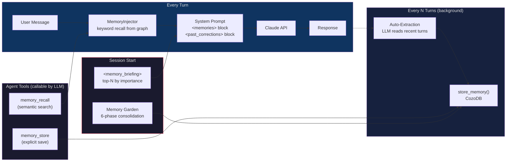

### Memory Types

| Type | When Used |
|------|-----------|
| `Fact` | Objective info learned about the codebase or user |
| `Decision` | Architecture/design choices made |
| `Preference` | User preferences about style, tools, workflow |
| `Rule` | Behavioral constraints (scored 0-100, with decay + reinforcement) |
| `Correction` | Things the assistant got wrong, with severity level |
| `Pattern` | Recurring code patterns observed |
| `PersonalitySnapshot` | Cross-session InnerVoice + rule scores + session stats |

### Relationship Types

Memory nodes are connected by typed edges enabling graph traversal:

| RelType | Meaning |
|---------|---------|
| `RelatedTo` | Generic association between memories |
| `CausedBy` | A caused B (corrections causing rule creation) |
| `Contradicts` | Semantic opposition between memories |
| `Supersedes` | B replaces A (created during deduplication) |
| `DerivedFrom` | B was derived from A |

### Storage

- **Database**: CozoDB (Datalog, SQLite WAL backend)
- **Path**: `~/.local/share/archon/memory.db` (Linux/macOS) or `%APPDATA%\archon\memory.db` (Windows)
- **Embeddings**: fastembed (local BGE-base-en-v1.5, 768-dim, no network calls) or OpenAI (1536-dim)
- **Vector index**: HNSW (m=50, ef_construction=200, cosine distance)
- **Search**: Hybrid keyword BM25 + vector cosine similarity (configurable alpha blend)
- **Access tracking**: Every `get_memory()` bumps `access_count` and `last_accessed` (used by garden decay/pruning)

---

## Memory Garden

Autonomous memory consolidation that prevents unbounded graph growth. Runs automatically on session start (if >24h since last run) or manually via `/garden`.

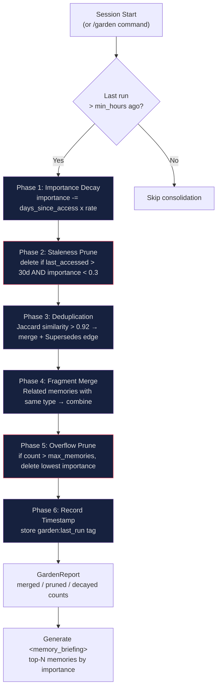

### Protected Types

`Rule` and `PersonalitySnapshot` memories are **never** decayed, pruned, deduplicated, or overflow-deleted. Only pruneable types (Fact, Decision, Correction, Pattern, Preference) are affected.

### Commands

| Command | Action |
|---------|--------|
| `/garden` | Run all 6 consolidation phases now, print report |
| `/garden stats` | Show memory count by type, staleness distribution, top-N by importance |

### Session Briefing

On first turn, the system prompt receives a `<memory_briefing>` block:

```xml
<memory_briefing>
Memory graph: 847 memories (342 facts, 45 decisions, 67 corrections, ...)
Last consolidated: 2 hours ago (merged 3, pruned 12)
Key memories:
- [decision] Use CozoDB for memory, SQLite for sessions (importance: 0.95)
- [correction] Never skip Sherlock reviews (importance: 0.92, accessed 47 times)
- [pattern] User prefers bundled PRs for refactors (importance: 0.88)
</memory_briefing>
```

---

## Consciousness System

Assembles the system prompt from multiple sources before each API call.

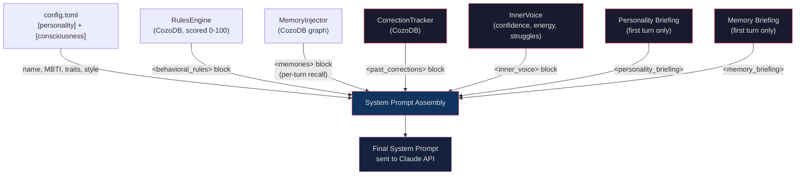

### InnerVoice

When `consciousness.inner_voice = true`, Archon tracks internal state that evolves with each turn:

| Field | Description | Update Trigger |
|-------|-------------|----------------|
| `confidence` | 0.0-1.0, starts at 0.7 | +0.02 on tool success, -0.05 on failure, -0.10 on correction |
| `energy` | 0.0-1.0, starts at 1.0 | Decays by `energy_decay_rate` each turn |
| `struggles` | Tools with 3+ consecutive failures | Accumulated during session |
| `successes` | Tools with consistent success | Accumulated during session |
| `corrections_received` | Count of user corrections | Incremented on detection |

The `<inner_voice>` block is injected into every system prompt, giving the agent self-awareness of its own performance trajectory.

### Configuring Rules

Rules in `config.toml` under `[consciousness].initial_rules` are seeded into CozoDB on startup, idempotently. Adding a new rule injects it on next run without duplicating. The LLM can also create rules dynamically using `memory_store` with `memory_type = "Rule"`.

Rules are scored 0-100. Scores increase when a user correction triggers reinforcement (+5.0 per correction, scaled by severity). Scores decrease via periodic decay (every 50 turns). High-scoring rules appear first in the `<behavioral_rules>` prompt block.

---

## Correction Tracking

Archon automatically detects user corrections from message patterns and records them as `MemoryType::Correction` nodes with severity-based scoring.

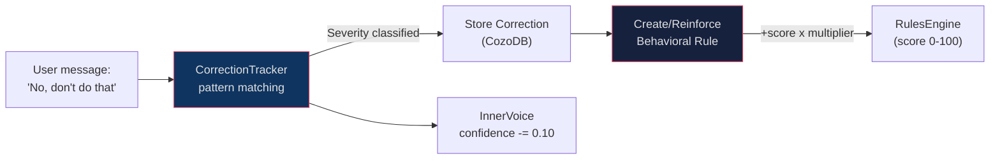

### Severity Levels

| Type | Triggers | Multiplier | Example |
|------|----------|------------|---------|
| `FactualError` | "no", "wrong", "that's wrong" | 1.5x | "No, the endpoint returns JSON" |
| `ApproachCorrection` | "instead", "should have", "better approach" | 2.0x | "You should have used async instead" |
| `RepeatedInstruction` | "i said", "i already told you" | 3.0x | "I already told you not to do that" |
| `DidForbiddenAction` | "don't", "do not", "stop", "never do that" | 4.0x | "Don't modify files without asking" |
| `ActedWithoutPermission` | "didn't ask", "without permission" | 5.0x | "You didn't ask before running that" |

Each correction boosts the associated rule's score by `multiplier x 5.0` (clamped at 100). Past corrections relevant to the current context are recalled every turn and injected as a `<past_corrections>` block.

---

## Personality Persistence

Archon persists its consciousness state across sessions, enabling cross-session learning and behavioral evolution.

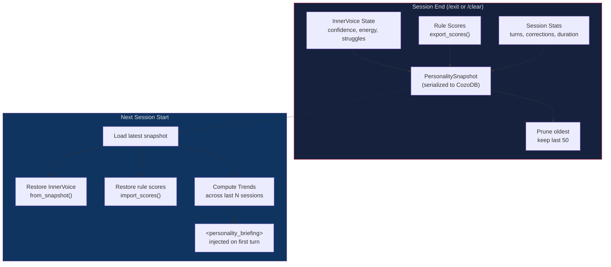

### What Persists

| State | Across Sessions | Details |
|-------|----------------|---------|
| InnerVoice confidence | Yes | Restored from last session's final value |
| InnerVoice energy | Yes | Restored from snapshot |
| Struggles & successes | Yes | Carried forward as starting context |
| Rule scores | Yes | A rule reinforced to 85 starts at 85 next session |
| Correction count | Yes | Cumulative across sessions |

### Trend Tracking

Computed from the last N personality snapshots (default: 50):

- **Average confidence** across recent sessions
- **Correction rate** trend (Rising / Falling / Stable)
- **Persistent struggles** (areas appearing in 2+ sessions)
- **Reliable successes** (consistently successful areas)

### Session-Start Briefing

```xml
<personality_briefing>
Sessions: 47 total
Last session: confidence 0.7 -> 0.4 (3 corrections in "shell execution")
Trend: correction rate falling (improving), confidence rising over last 10 sessions
Persistent struggles: shell execution (12 sessions), file path handling (8 sessions)
Reliable strengths: code generation (41 sessions), test writing (38 sessions)
Top reinforced rules: "Always ask before modifying files" (score: 92)
</personality_briefing>
```

Disable with `persist_personality = false` in `[consciousness]` config.

---

## Agent Loop

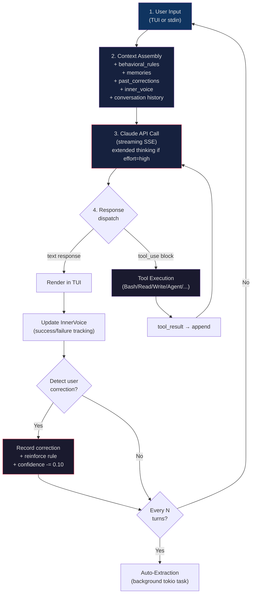

---

## Subagent Spawning

The `Agent` tool enables the main agent to spawn child agents for parallel or delegated work. Each subagent is a fully isolated `archon-core` instance with its own conversation context.

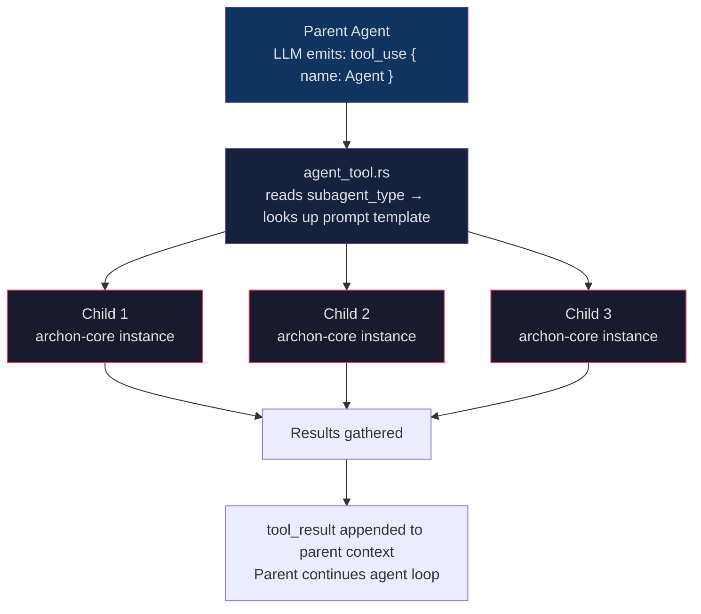

Subagents have access to the same tool set as the parent but run in isolated task contexts managed by `archon-tools/src/task_manager.rs`. Use `SendMessage` to continue a subagent with follow-up instructions (its context is preserved).

### Background subagents

Spawn with `run_in_background: true` to return immediately:

- `TaskList`, view running tasks
- `TaskGet` / `TaskOutput`, inspect output
- `TaskStop`, cancel

---

## Multi-Agent Teams

Teams orchestrate groups of specialized subagents under a coordinator, with explicit execution topology.

### Team definition, `.archon/teams.toml`

```toml
[backend-squad]
coordinator = "system-architect"
agents = ["backend-dev", "tester", "reviewer"]
mode = "pipeline"   # sequential | parallel | pipeline | dag
timeout_secs = 600

[analysis-swarm]
coordinator = "code-analyzer"
agents = ["perf-analyzer", "security-tester", "reviewer"]
mode = "parallel"
```

### Execution modes

| Mode | Behaviour |
|------|-----------|
| `sequential` | Agents run one after another; each sees prior output |
| `parallel` | All agents run concurrently with the same goal |
| `pipeline` | Output of agent N feeds agent N+1 (filter chain) |
| `dag` | Arbitrary dependency graph (defined per-team) |

### Running teams

```bash
archon team run --team backend-squad "implement JWT refresh"
archon team list
```

---

## Skills System

Skills are slash commands backed by Rust code. Two types:

- **Builtin skills**, compiled into `archon-core` (43 skills in `crates/archon-core/src/skills/builtin.rs` + `expanded.rs`)
- **User skills**, markdown + frontmatter in `.archon/skills/` or `~/.config/archon/skills/`

### User skill definition

```markdown
---
name: review-pr
description: Review a pull request by number
args: "<pr_number>"
---

You are reviewing PR #{{args}}. Fetch it with `gh pr view {{args}} --json ...`,
analyze the diff, and report security issues, style violations, and test gaps.
```

Once dropped into `.archon/skills/`, invoke with `/review-pr 42` in the TUI.

---

## Hooks System

Shell commands that execute in response to lifecycle events. Defined in `config.toml` or `.archon/settings.json` (also loads `.claude/settings.json` for backward compat).

### Hook events

`Setup`, `SessionStart`, `SessionEnd`, `PreToolUse`, `PostToolUse`, `PostToolUseFailure`, `PreCompact`, `PostCompact`, `ConfigChange`, `CwdChanged`, `FileChanged`, `InstructionsLoaded`, `UserPromptSubmit`, `Stop`, `SubagentStart`, `SubagentStop`, `TaskCreated`, `TaskCompleted`, `PermissionDenied`, `PermissionRequest`, `Notification`.

### Example, TOML

```toml
[[hooks.pre_tool_use]]
command = "scripts/check-dangerous-patterns.sh"
timeout = 30
blocking = true   # exit code 2 cancels the tool call

[[hooks.session_start]]
command = "git status --short"
timeout = 5
```

### Example, `.archon/settings.json` (structured matchers)

```json
{
  "hooks": {
    "PreToolUse": [
      {
        "matcher": { "tool_name": "Bash" },
        "hooks": [{ "type": "command", "command": "scripts/audit-bash.sh" }]
      }
    ]
  }
}
```

Hooks receive event data via JSON on stdin and can short-circuit operations via exit code 2.

---

## Plugins

Plugins are dynamically loaded Rust libraries (`.so`/`.dll`/`.dylib`) implementing the `archon_plugin::api` trait. They can register new tools, hooks, skills, and slash commands.

### Plugin layout

```
.archon/plugins/
├── my-plugin/
│   ├── plugin.toml     # manifest (name, version, capabilities)
│   └── libmy_plugin.so # compiled plugin
```

### Manifest, `plugin.toml`

```toml
name = "my-plugin"
version = "0.1.0"
capabilities = ["tools", "skills", "hooks"]
```

### CLI

```bash
archon plugin list
archon plugin info my-plugin
```

Plugin host bridges tool calls and hook invocations via JSON-RPC over stdio, so plugins run out-of-process with crash isolation.

---

## MCP Integration

Model Context Protocol servers extend Archon with external tools and resources.

### Supported transports

| Transport | Use Case |
|-----------|----------|
| `stdio` | Local processes (default) |
| `websocket` (`ws://`, `wss://`) | Remote/network MCP servers |
| `http_streamable` | HTTP streaming (beta) |

### `.mcp.json` schema

```json
{
  "mcpServers": {
    "filesystem": {
      "command": "npx",
      "args": ["-y", "@modelcontextprotocol/server-filesystem", "/tmp"],
      "transport": "stdio"
    },
    "github": {
      "command": "mcp-server-github",
      "env": { "GITHUB_TOKEN": "${GITHUB_TOKEN}" },
      "disabled": false
    },
    "remote-memory": {
      "transport": "websocket",
      "url": "wss://mcp.example.com/memory",
      "headers": { "Authorization": "Bearer ${MCP_TOKEN}" }
    }
  }
}
```

### Config loading

- Global: `~/.config/archon/.mcp.json`
- Project-local: `.mcp.json` in working directory (overrides global per-server)
- CLI: `--mcp-config FILES...` (repeatable), `--strict-mcp-config` to ignore auto-discovery

Environment variables are expanded inline (`${VAR}`). Servers with `"disabled": true` are skipped.

### Reconnection

WebSocket transport uses exponential backoff with ±12.5% jitter, capped at 30s. Permanent close codes (1002, 4001, 4003) halt reconnection. A 10-minute retry budget and 60s sleep-gap detection prevent runaway reconnect loops after laptop suspend.

---

## LSP Integration

Archon speaks Language Server Protocol over stdio to any LSP server (rust-analyzer, pyright, typescript-language-server, gopls, clangd, etc.).

### Supported operations

All dispatched through the single `LSP` tool:

- `goToDefinition`
- `findReferences`
- `hover`
- `documentSymbol`
- `workspaceSymbol`
- `goToImplementation`
- `prepareCallHierarchy` / `incomingCalls` / `outgoingCalls`

### Server auto-discovery

Archon detects the project language from file extensions and launches the appropriate LSP server. Override via config or `.archon/lsp.toml`:

```toml
[servers.rust]
command = "rust-analyzer"
args = []
init_timeout_ms = 30000
request_timeout_ms = 10000

[servers.python]
command = "pyright-langserver"
args = ["--stdio"]
```

Diagnostics are pushed in real time and surfaced via the `/insights` skill.

---

## Checkpointing & File Snapshots

Archon snapshots every file the agent modifies, keyed by turn number. Use checkpoints to undo individual file changes or restore earlier states.

### Storage

- **Database**: `~/.local/share/archon/checkpoints.db` (CozoDB)
- **Metadata**: `file_path`, `turn_number`, `tool_name`, `timestamp`, `file_hash`
- **Diff engine**: `checkpoint_diff` module computes line-level diffs between versions

### Commands

| Command | Action |
|---------|--------|
| `/checkpoint` | Save a named checkpoint |
| `/rewind` | Jump back to previous checkpoint |
| `/restore` | List all modified files with checkpoints |
| `/restore <FILE>` | Show diff and restore to latest snapshot |
| `/restore <FILE> <TURN>` | Restore to specific turn number |
| `/restore --all` | Restore all modified files |
| `/undo` | Undo last file modification |

---

## Cron & Scheduling

Recurring background tasks defined with standard 5-field cron expressions.

### Tools

| Tool | Purpose |
|------|---------|
| `CronCreate` | Schedule task with cron expression + description |
| `CronList` | Show all scheduled tasks |
| `CronDelete` | Remove scheduled task by ID |

### Example

```
/schedule "every morning at 9am, run the test suite and summarize failures"
```

The `/schedule` skill delegates to `CronCreate`, which parses natural language into cron (e.g., `0 9 * * *`) and stores the task for the background scheduler.

---

## Permission System

Enforced on every tool call that touches the filesystem, shell, or network.

### Modes

| Mode | Behaviour |
|------|-----------|
| `ask` (default) | Prompt user for risky operations |
| `auto` | Auto-approve all tool calls |
| `deny` | Deny all unsafe operations (read-only) |
| `plan` | Plan-only mode, no writes, no shell |
| `acceptEdits` | Auto-accept file edits, ask for shell |
| `dontAsk` | Never prompt (silent auto-approve) |
| `bypassPermissions` | Skip all permission checks |

### Rule lists

```toml
[permissions]
mode = "ask"
always_allow = ["Read:*", "Glob:*", "Grep:*"]
always_deny = ["Bash:rm -rf*", "Write:/etc/*"]
always_ask = ["Bash:git push*"]
allow_paths = ["/home/user/project"]
deny_paths = ["/etc", "/.ssh"]
sandbox = false
```

### CLI overrides

- `--permission-mode <MODE>`, runtime override
- `--dangerously-skip-permissions`, equivalent to `bypassPermissions`
- `--sandbox`, enforce `deny` for writes

---

## Identity & Spoofing

Archon can identify itself as Claude Code (`spoof`) or as itself (`native`).

### Spoof layers (when `identity.mode = "spoof"`)

1. `x-app: cli` header
2. `User-Agent: claude-cli/{version} (external, cli)`
3. `x-entrypoint: cli` header
4. Dynamically-discovered `anthropic-beta` headers
5. `metadata.user_id` field matching Claude Code format
6. `metadata.user_email` (when available from auth)
7. Tool schemas matching Claude Code tool set
8. System prompt prelude matching Claude Code default
9. `anti_distillation` field (when `anti_distillation = true`)

### Managing identity

- `identity.spoof_version = "2.1.89"`, version reported to API
- `/refresh-identity`, clear beta header cache and reprobe
- `identity.mode = "native"`, disable all spoofing

---

## Session Management

Sessions store full message history, git branch, working directory, token usage, cost, and a name in CozoDB at `~/.local/share/archon/sessions.db`.

### Resuming

```bash
# Full UUID
archon --resume 8383f1ea-1234-5678-abcd-000000000000

# UUID prefix
archon --resume 8383f1ea

# Exact session name
archon --resume "fix-auth-bug"

# Name prefix
archon --resume "fix-auth"

# List / search resumable sessions (replaces the older --list-sessions alias)
archon --sessions
```

Resolution order: exact UUID → UUID prefix → exact name → name prefix. Ambiguous matches return candidates.

### Forking

```bash
archon --fork-session --resume "fix-auth-bug"
```

Creates a new session whose history is a copy of the source at the current turn, useful for exploring alternative paths without corrupting the original.

---

## Remote Control & Headless Mode

Run Archon as a server for remote access, or as a JSON-stdio backend for custom frontends.

### WebSocket server

```bash
archon serve --port 8420 --token-path ~/.config/archon/remote.token
```

Clients authenticate with `Authorization: Bearer <token>`. Events stream as JSON-lines over WebSocket (assistant messages, tool calls, tool results, cost updates).

### Remote client

```bash
archon remote ws ws://host:8420/ws --token $(cat remote.token)
archon remote ssh user@host --port 22 --key ~/.ssh/id_rsa
```

### Headless mode

```bash
archon --headless -p "list all TODO comments"
```

No TUI; emits JSON-lines on stdout, one event per line. Used by the VSCode extension and Web UI to embed Archon.

---

## IDE Extensions

### Protocol

IDE extensions communicate with Archon via JSON-RPC 2.0 over stdin/stdout. Start the transport with:

```bash
archon ide-stdio
```

**Requests** (IDE -> Archon): `archon/initialize`, `archon/prompt`, `archon/cancel`, `archon/toolResult`, `archon/status`, `archon/config`.

**Notifications** (Archon -> IDE): `archon/textDelta`, `archon/thinkingDelta`, `archon/toolCall`, `archon/permissionRequest`, `archon/turnComplete`, `archon/error`.

Each message is one JSON-lines frame (newline-delimited). See `crates/archon-sdk/src/ide/protocol.rs` for full type definitions.

### VS Code

Full extension at `extensions/vscode/`. Features:
- Chat panel with streaming responses
- Inline diff view for file edits
- Terminal integration
- Permission approval UI

Install: `cd extensions/vscode && npm install && vsce package`, then install the generated `.vsix`.

### JetBrains

Plugin skeleton at `extensions/jetbrains/` (IntelliJ / PyCharm / WebStorm). Kotlin-based, uses the Archon Kotlin SDK.

---

## Web UI

Browser interface backed by the WebSocket server.

```bash
archon web --port 8421
# Open http://127.0.0.1:8421
```

Config:

```toml
[web]
port = 8421
bind_address = "127.0.0.1"
open_browser = true
```

Frontend built from `web/src/` (TypeScript SPA); run `web/build.sh` to rebuild `web/dist/`.

---

## Vim Mode

Enable vim keybindings in the TUI input box:

```toml
[tui]
vim_mode = true
```

### Bindings

| Keys | Action |
|------|--------|
| `i` / `a` / `I` / `A` | Insert modes |
| `Esc` | Normal mode |
| `dd` / `yy` / `p` | Delete / yank / paste line |
| `gg` / `G` | Top / bottom of buffer |
| `v` | Visual mode |
| `:w` | Submit message |
| `:q` | Quit Archon |

Full reference: `/keybindings`.

---

## Cost, Effort & Fast Mode

### Cost tracking

Per-turn token costs are accumulated per session and surfaced via `/cost` and `/usage`. Alerts:

```toml
[cost]
warn_threshold = 30.0    # Warn when session cost exceeds $N (default)
hard_limit = 0.0         # 0.0 = no hard cap
```

### Effort levels

Affects `thinking_budget`, temperature, and context window allocation:

- `high`, full thinking budget, maximum context
- `medium`, reduced thinking, balanced
- `low`, minimal thinking, fastest responses

Switch at runtime: `/effort high`, `--effort low`, or `[api].default_effort`.

### Fast mode

```bash
archon --fast
# or /fast in TUI
```

Disables extended thinking, uses aggressive token limits, and skips some memory injection. Same model, lower quality, lower latency, good for quick questions.

---

## Context Compaction

Automatic compaction prevents hitting the context window limit.

```toml
[context]
compact_threshold = 0.8       # Fill % that triggers compaction
preserve_recent_turns = 3     # Always keep last N turns verbatim
prompt_cache = true           # Enable Anthropic prompt cache
```

### Manual compaction

| Command | Action |
|---------|--------|
| `/compact` | Auto-compact (LLM summarizes older turns) |
| `/compact micro` | Minimal compaction (preserve more detail) |
| `/compact snip N-M` | Remove turns N through M |
| `/compact auto` | Adaptive compression |

`PreCompact` / `PostCompact` hooks fire around compaction.

---

## Pipeline Engine

Archon includes two full agent pipelines ported from the TypeScript god-agent SDK to native Rust.

### Coding Pipeline (50 agents)

A 6-phase, 50-agent software development pipeline with runtime-loaded agent definitions (.md frontmatter + TOML manifests), gate enforcement, session recovery, and structured artefacts. Each agent receives an 11-layer composite prompt assembled from task analysis, agent instructions (.md body), codebase context, LEANN search results, and prior agent outputs.

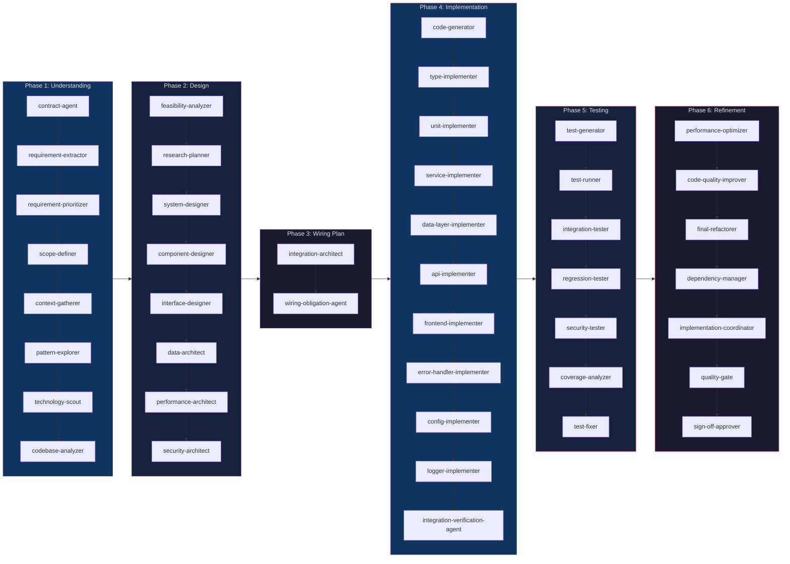

NOTE: Each phase also has a phase-N-reviewer (Sherlock adversarial gate) and a recovery-agent in Phase 6, but they are omitted from the diagram for clarity.

**Prompt Assembly (11 layers):**

| Layer | Name | Priority | Source |
|-------|------|----------|--------|
| L1 | `base_prompt` | Required | Agent role, phase, model, description |
| L1.5 | `agent_instructions` | AgentInstructions | Full .md file body (parsed via frontmatter) |
| L2 | `task_context` | Required | User's task description |
| L3 | `leann_semantic_context` | LeannSemanticContext | LEANN code search results |
| L4 | `rlm_namespace_context` | RlmContext | Prior agent outputs from RLM store |
| L5 | `desc_episodes` | DescEpisodes | DESC episodic memory |
| L6 | `sona_patterns` | SonaPatterns | SONA trajectory patterns |
| L7 | `reflexion_trajectories` | ReflexionTrajectories | Failed trajectory injection for retries |
| L8 | `pattern_matcher_results` | PatternMatcherResults | Reasoning context |
| L9 | `sherlock_verdicts` | SherlockVerdicts | (reserved) |
| L10 | `algorithm_strategy` | AlgorithmStrategy | Algorithm-specific prompt snippet |
| L11 | `prompt_cap` | — | Token budget enforcement via truncation |

### Research Pipeline (46 agents)

A 7-phase, 46-agent PhD-level research pipeline with runtime-loaded agent definitions. Organized from Foundation through Validation with phases 6-7 having full tool access for writing output.

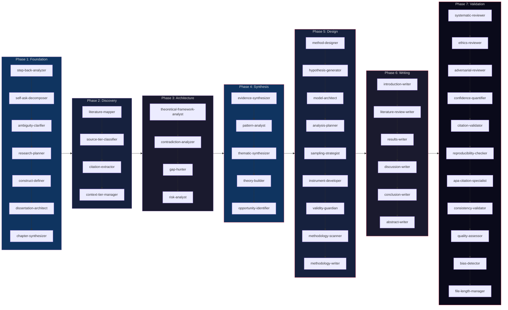

### Pipeline Execution

Both pipelines share the `PipelineFacade` trait and a common runner loop:

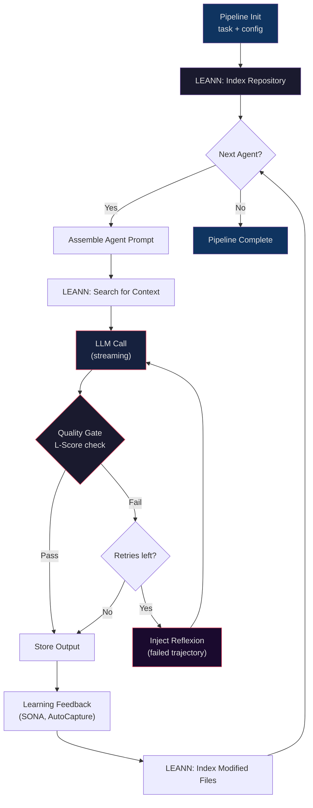

### Agent Definition System

Two formats are supported. Pipeline agents (coding / research) use the **TOML-manifest + frontmatter `.md`** layout. User-authored custom agents can use either the **flat-file YAML-frontmatter** form (single `.md`, claude-flow shape) or the legacy **6-file directory** form. v0.1.10/v0.1.11 added flat-file discovery and wired both into the unified `AgentRegistry`.

#### Pipeline-style (TOML manifest + frontmatter `.md`)

```
.archon/agents/
├── coding-pipeline/
│   ├── pipeline.toml          # 50-agent execution order + phase defs
│   ├── contract-agent.md      # Agent #1 (YAML frontmatter + instructions)
│   ├── requirement-extractor.md
│   ├── ...
│   └── recovery-agent.md
└── phdresearch/
    ├── pipeline.toml          # 46-agent execution order + phase defs
    ├── step-back-analyzer.md
    ├── ...
    └── file-length-manager.md
```

**Pipeline frontmatter fields** (parsed by `archon_pipeline::agent_loader::parse_frontmatter`):

| Field | Type | Description |
|-------|------|-------------|
| `name` | string | Agent key (kebab-case) |
| `type` | string | Phase name |
| `description` | string | Role description |
| `algorithm` | string | Primary reasoning algorithm (ReAct, ToT, Reflexion) |
| `fallback_algorithm` | string | Fallback if primary fails |
| `memory_reads` | list | RLM namespaces to read |
| `memory_writes` | list | RLM namespaces to write |
| `tools` | list | Allowed tools |
| `qualityGates` | list/map | Quality gate criteria |
| `capabilities` | list | Agent capabilities |

#### Flat-file YAML-frontmatter (custom agents, v0.1.10+)

Single `.md` file per agent. Discoverable anywhere under `.archon/agents/` (recursive walk). Preferred for new custom agents.

```markdown
---
name: over-engineering-therapist
description: Therapeutic code reviewer specializing in over-engineering patterns
tools: Read, Grep, Glob, Bash
model: sonnet
color: teal
tags: [review, refactor]
---

# Over-Engineering Therapist

You are a specialized code reviewer combining...
[body becomes the system_prompt]
```

| YAML field | Maps to | Notes |
|------------|---------|-------|
| `name` | `agent_type` | Falls back to filename stem if absent |
| `description` | `description` | One-sentence role |
| `tools` | `allowed_tools` | Comma-separated string OR YAML array; both accepted |
| `model` | `model` | `sonnet`, `opus`, full model ID — passed through |
| `color` | `color` | TUI display tint |
| `tags` | `tags` | YAML array, optional |
| body after `---` | `system_prompt` | Trimmed; everything after the closing delimiter |

Files without frontmatter (READMEs, etc.) are silently skipped. Malformed YAML logs a warning; the walk continues.

#### Legacy 6-file directory (custom agents, v0.1.0+)

Multi-file format under `.archon/agents/custom/<name>/`. Use when you need rich per-tool guidance (`tools.md`), structured memory configuration (`memory-keys.json`), or hooks/isolation in `meta.json`.

```
.archon/agents/custom/my-agent/
├── agent.md          # Role + ## INTENT section (first paragraph extracted as description)
├── behavior.md       # Behavioral instructions (optional, appended to agent.md)
├── context.md        # Static context injection (optional)
├── tools.md          # Allowed tools + per-tool narrative guidance
├── memory-keys.json  # { memory_scope, recall_queries, leann_queries }
└── meta.json         # { model, effort, max_turns, permission_mode, isolation, hooks }
```

#### Format selection

- **Flat-file YAML** — new agents, simple cases, one-file portability, claude-flow compatibility.
- **6-file** — agents needing rich `tool_guidance` text, custom `memory_scope` / `recall_queries` / `leann_queries`, `meta.json` hooks, or `permission_mode` / `isolation` overrides.

#### Priority order on name collisions

`AgentRegistry::load_with_user_home()` loads agents in 7 tiers (later overrides earlier):

1. Built-in agents
2. Project plugins (`.archon/plugins/<name>/agents/`)
3. User plugins (`~/.archon/plugins/<name>/agents/`)
4. Project flat-file agents (`.archon/agents/**/*.md`, excluding `custom/`)
5. Project 6-file agents (`.archon/agents/custom/<name>/`)
6. User flat-file agents (`~/.archon/agents/**/*.md`, excluding `custom/`)
7. User 6-file agents (`~/.archon/agents/custom/<name>/`)

User scope wins over project. 6-file wins over flat-file at the same scope (more explicit shape — if both exist with the same name, the 6-file directory was authored deliberately).

### Gate Enforcement

Five deterministic gates enforce code quality using tool output only (no LLM self-assessment):

| Gate | Module | Description |
|------|--------|-------------|
| ForbiddenPatternScanner | `coding/gates.rs` | Blocks TODO, stubs, `unimplemented!()`, empty function bodies |
| CompilationGate | `coding/gates.rs` | `cargo build` / `npm run build` must exit 0 |
| OrphanDetectionGate | `coding/gates.rs` | Every new file must be referenced by at least one other file |
| TestsRunGate | `coding/gates.rs` | Test suite must exit 0 |
| E2ESmokeTestGate | `coding/gates.rs` | Feature invoked end-to-end with fraud detection (rejects test-only output) |

### Structured Artefacts

Six typed artefacts form the pipeline's audit chain:

```
TaskContract → EvidencePack → WiringPlan → ImplementationReport → ValidationReport → MergePacket
```

| Artefact | Producer | Contents |
|----------|----------|----------|
| `TaskContract` | contract-agent | Parsed intent, acceptance criteria, constraints |
| `EvidencePack` | Phase reviewers | File-line facts, call graphs, test references |
| `WiringPlan` | wiring-obligation-agent | Typed obligations that gate Phase 4 |
| `ImplementationReport` | implementation-coordinator | Changed files, new symbols, wiring status |
| `ValidationReport` | quality-gate | Gate results, AC trace with evidence |
| `MergePacket` | sign-off-approver | Risk report, evidence bundle, sign-off |

All artefacts are persisted atomically (write-to-tmp + rename) via `artefacts::save_artefact()`.

### Session Recovery

Pipeline sessions checkpoint after every agent completion. Interrupted sessions can be detected and resumed:

| Function | Description |
|----------|-------------|
| `checkpoint()` | Atomic write of session state (fsync + rename) |
| `resume()` | Reload interrupted session, reset to Running |
| `detect_interrupted()` | Find all Running/Paused sessions |
| `abort()` | Mark session as permanently failed |

### Ledger System

Three append-only ledgers provide a complete audit trail:

| Ledger | Records |
|--------|---------|
| `DecisionLedger` | All decisions with reason, affected files, timestamp |
| `TaskLedger` | Task assignments, status changes, wiring obligations |
| `VerificationLedger` | Gate pass/fail results with evidence summaries |

---

## LEANN Semantic Code Search

LEANN (Learning-Enhanced Approximate Nearest Neighbors) is a native semantic code search engine built into Archon. It indexes source code at the chunk level using tree-sitter parsing and vector embeddings, enabling natural-language queries over codebases.

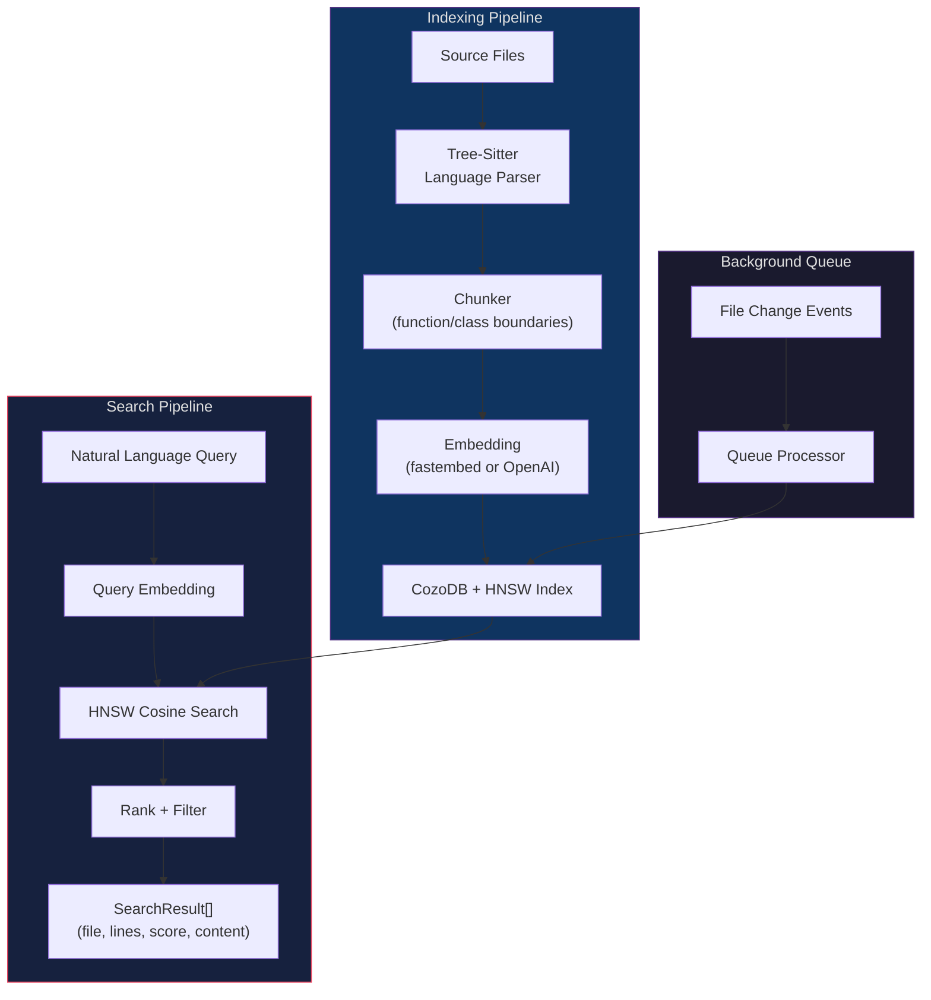

### Features

| Feature | Details |
|---------|---------|
| Chunking | Tree-sitter AST-aware boundaries (functions, classes, methods) |
| Embeddings | fastembed local (768-dim BGE-base) or OpenAI (1536-dim) |
| Index | HNSW approximate nearest neighbors via CozoDB |
| Search | Cosine similarity with configurable top-k |
| Queue | Background indexing queue with add/process/status |
| Languages | Rust, Python, TypeScript, JavaScript, Go, Java, C, C++ |

### API

```rust
let index = CodeIndex::new("./index.db", embedding_config)?;

// Index a repository
index.index_repository(path, &config).await?;

// Search with natural language
let results = index.search_code("authentication middleware", 10)?;

// Find similar code
let similar = index.find_similar_code(snippet, 5)?;

// Background queue
index.add_to_queue(queue_path, &file_paths)?;
index.process_queue(queue_path).await?;
```

---

## Knowledge Base

CozoDB-backed document knowledge base with LLM compilation and Q&A.

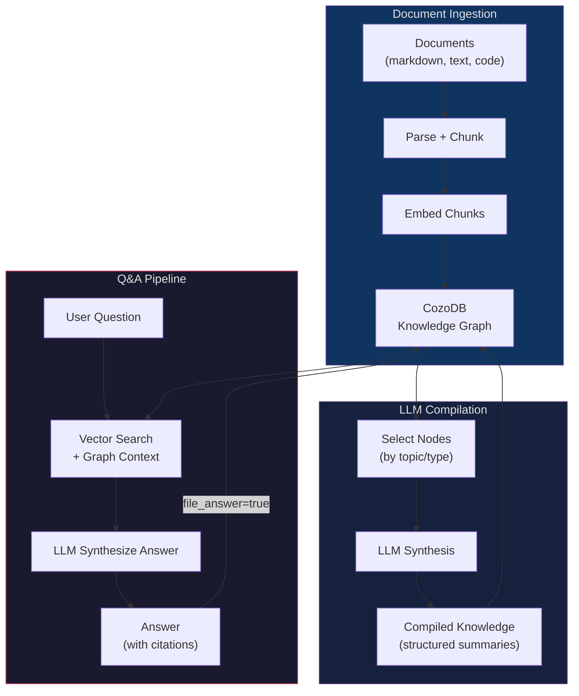

### Q&A Scoring

Answer-type nodes receive a 0.9x relevance penalty to prevent answer recycling (answers to prior questions outranking source material). This is enforced by `EC-PIPE-018`.

### Access

The Knowledge Base lives in `crates/archon-pipeline/src/kb/` and is consumed by pipeline agents (e.g., the research pipeline's literature-mapper, citation-extractor, evidence-synthesizer). It is **not currently exposed as an `archon kb` CLI subcommand** — invocation happens via the research pipeline (`archon pipeline research <topic>` or `/archon-research <topic>`) or via direct library use of the `archon_pipeline::kb` API.

---

## Learning Systems

Archon's pipeline engine includes 8 interconnected learning systems that provide trajectory optimization, causal reasoning, graph neural enhancement, and contradiction detection.

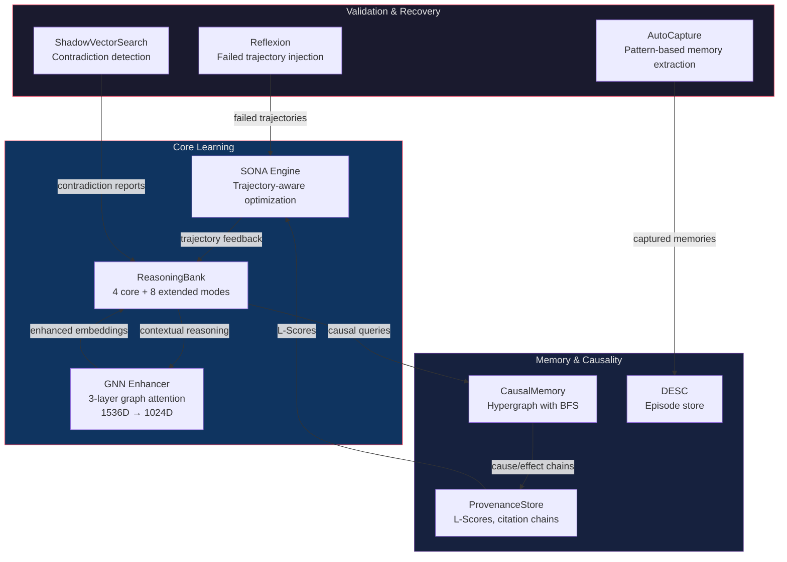

### System Details

| System | Purpose | Key Feature |
|--------|---------|-------------|
| **SONA** | Trajectory-aware optimization | Tracks agent performance across runs, adjusts prompts |
| **ReasoningBank** | Multi-modal reasoning (12 modes) | Core: deductive, inductive, abductive, analogical. Extended: adversarial, counterfactual, temporal, constraint, decomposition, first-principles, causal, contextual |
| **GNN Enhancer** | Graph neural network | 3-layer attention (1536->1280->1280->1024), Xavier init, NaN fallback, Adam optimizer, contrastive loss, EWC regularization |
| **CausalMemory** | Causal relationship tracking | Hypergraph with multi-cause hyperedges, BFS traversal (max 5 hops), cycle detection |
| **ProvenanceStore** | Source credibility scoring | L-Scores (recency decay, authority, corroboration, domain relevance), citation path traversal |
| **ShadowVectorSearch** | Contradiction detection | Semantic inversion (negate embedding), find docs similar to shadow vector |
| **DESC** | Episode store | Stores agent execution episodes for experience replay |
| **Reflexion** | Retry enhancement | Injects failed trajectory context into retry prompts (attempt > 1 only) |

### Graceful Degradation

All learning systems accept `Option<T>` dependencies. When a system is unavailable (e.g., no GNN weights trained yet), the pipeline continues with reduced capability rather than failing. This satisfies `REQ-LEARN-013`.

### GNN Architecture

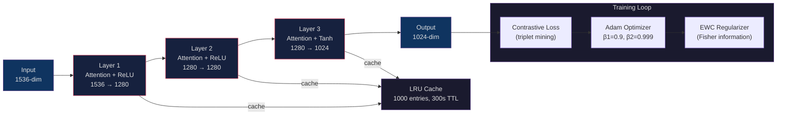

### AutoCapture

Regex-based pattern detection that extracts memories from conversation without LLM inference:

| Pattern Type | Examples | Confidence |
|-------------|----------|------------|
| Correction | "no", "wrong", "that's incorrect" | 0.8 |
| Decision | "let's go with", "we decided" | 0.7 |
| Error | "failed", "crashed", "broken" | 0.75 |
| Preference | "I prefer", "always use", "never do" | 0.7 |
| Project State | "deployed", "released", "merged" | 0.65 |

Deduplication uses Jaccard similarity with a 0.8 threshold to prevent redundant captures.

---

## Crate Architecture

```
archon (binary)
│
├── archon-core          Agent loop, config, skills, hooks, CLI parsing
│   ├── orchestrator/    Multi-agent team execution (seq/parallel/pipeline/dag)
│   ├── skills/          Builtin + expanded slash commands
│   ├── hooks/           Lifecycle hook executor
│   └── team/            Team backend state
│
├── archon-llm           Claude API client (streaming SSE, retries, OAuth)
│   ├── anthropic.rs     Messages API client
│   ├── identity.rs      9-layer spoofing
│   ├── oauth.rs         PKCE flow + token refresh (file-locked)
│   ├── effort.rs        Effort level → API param mapping
│   └── fast_mode.rs     Fast mode overrides
│
├── archon-tools         40+ tools
│   ├── bash/read/write/edit/glob/grep    File & shell
│   ├── agent_tool.rs                     Subagent spawn
│   ├── lsp_client.rs + lsp_tool.rs       LSP bridge
│   ├── webfetch.rs                       HTTP fetch + HTML parse
│   ├── web_search.rs                     DuckDuckGo web search
│   ├── task_*.rs                         Background task tools
│   ├── cron_*.rs                         Scheduling
│   ├── team_*.rs                         Team coordination
│   ├── mcp_resources.rs                  MCP bridge tools
│   ├── checkpoint.rs                     File snapshots
│   └── toolsearch.rs                     Dynamic tool discovery
│
├── archon-permissions   Permission mode enforcement + rule engine
│
├── archon-mcp           MCP transport (stdio/ws/http-streamable)
│   ├── transport_ws.rs  WebSocket with backoff + sleep detection
│   └── config.rs        .mcp.json parsing + env expansion
│
├── archon-consciousness System prompt assembly + cross-session learning
│   ├── personality.rs   MBTI/Enneagram → prompt fragment
│   ├── rules.rs         RulesEngine (scored rules, decay, reinforcement)
│   ├── corrections.rs   CorrectionTracker (5 severity levels, auto-detect)
│   ├── persistence.rs   Cross-session snapshots, trends, briefing
│   ├── defaults.rs      Idempotent rule seeding
│   ├── inner_voice.rs   Confidence, energy, struggles, successes
│   └── assembler.rs     System prompt assembly (7 sources)
│
├── archon-memory        CozoDB memory graph + consolidation
│   ├── graph.rs         store / recall / search / relationships
│   ├── injection.rs     Per-turn <memories> block
│   ├── extraction.rs    Auto-extraction pipeline
│   ├── garden.rs        6-phase consolidation, briefing, /garden command
│   ├── embedding/       fastembed local embeddings (BGE-base-en-v1.5)
│   ├── vector_search.rs HNSW cosine similarity
│   └── hybrid_search.rs BM25 + vector cosine (alpha-blended)
│
├── archon-session       Session + checkpoint + plan persistence
│   ├── storage.rs       Session save/load/list/prefix-match
│   ├── resume.rs        4-step ID+name resolution
│   ├── checkpoint.rs    File snapshot store (diff, restore-to-turn)
│   └── plan.rs          Plan storage (PlanDocument, PlanStore)
│
├── archon-tui           ratatui TUI
│   ├── app.rs           State, events, input box
│   ├── split_pane.rs    Split-pane layout (Ctrl+\)
│   ├── theme.rs         23 themes (16 MBTI + 7 utility + auto)
│   └── vim.rs           Vim mode keybindings
│
├── archon-pipeline      50-agent coding + 46-agent research pipelines
│   ├── coding/          CodingFacade, 50 agent definitions, 11-layer prompt
│   │   ├── agents.rs    Static AGENTS array (50 agents, 6 phases)
│   │   ├── facade.rs    CodingFacade with agent_instructions layer
│   │   ├── gates.rs     5 deterministic gates + fraud detection
│   │   ├── contract.rs  TaskContract artefact
│   │   ├── evidence.rs  EvidencePack + validation
│   │   └── wiring.rs    WiringPlan obligations
│   ├── research/        ResearchFacade, 46 agent definitions, 7 phases
│   ├── agent_loader.rs  Runtime .md frontmatter parser
│   ├── manifest.rs      TOML pipeline manifest parser
│   ├── artefacts.rs     6 typed artefacts + AC traced gate
│   ├── session.rs       Checkpoint / resume / detect_interrupted
│   ├── ledgers.rs       Append-only Decision/Task/Verification ledgers
│   ├── layered_context.rs  L0-L3 four-tier context loader
│   ├── runner.rs        PipelineFacade trait, shared runner loop
│   ├── prompt_cap.rs    Token budget enforcement (12 priority tiers)
│   ├── retry.rs         Retry with Reflexion injection
│   ├── kb/              Knowledge base (ingest, compile, query, Q&A)
│   ├── learning/        SONA, ReasoningBank, GNN, CausalMemory, Provenance,
│   │                    ShadowVectorSearch, DESC, Reflexion, extended modes
│   └── capture.rs       AutoCapture (regex-based memory extraction)
│
├── archon-leann         Native semantic code search
│   ├── indexer.rs       Repository/file indexing with embeddings
│   ├── chunker.rs       Tree-sitter AST-aware code chunking
│   ├── search.rs        HNSW cosine similarity search
│   ├── queue.rs         Background indexing queue processor
│   └── metadata.rs      CodeChunk, SearchResult, IndexConfig types
│
├── archon-context       Context compaction engine
│
├── archon-plugin        Dynamic plugin loader
│   ├── loader.rs        .so/.dll/.dylib loading
│   ├── host.rs          JSON-RPC plugin host
│   └── adapter_*.rs     Tool/hook/skill/command adapters
│
└── archon-sdk           Embedding SDK + Web/IDE bridges
    ├── builder.rs       AgentBuilder for embedding
    ├── web/             WebSocket server + HTTP
    └── ide/             IDE protocol handlers
```

### Key Dependencies

| Crate | Version | Purpose |
|-------|---------|---------|
| `ratatui` | 0.29 | Terminal UI rendering |
| `crossterm` | 0.28 | Cross-platform terminal backend |
| `cozo-ce` | 0.7.13 | CozoDB, memory/session/checkpoint store |
| `fastembed` | 4 | Local vector embeddings (no API) |
| `tokio` | 1 | Async runtime |
| `reqwest` | 0.12 | HTTP client (rustls) |
| `clap` | 4 | CLI argument parsing |
| `serde` / `toml` |, | Config serialization |
| `git2` | 0.19 | Git branch detection |
| `tree-sitter` | 0.24 | Syntax highlighting + LEANN code chunking |
| `async-lsp` |, | LSP protocol client |
| `tungstenite` |, | WebSocket transport |
| `tower-http` | 0.6 | HTTP middleware (web UI) |

---

## Phase Roadmap

| Phase | Status | Description |
|-------|--------|-------------|
| **Phase 1**, Core Engine | ✅ Complete | Agent loop, streaming API, tool execution, permission system, config, TUI, session management |
| **Phase 2**, Consciousness | ✅ Complete | Memory graph (CozoDB), auto-extraction, per-turn injection, rules engine, personality config, inner voice |
| **Phase 3**, UX & Ergonomics | ✅ Complete | 23 themes, MBTI themes, resume by name/prefix, `/color` and `/theme` commands, memory tools wired |
| **Phase 4**, Plugins & Skills | ✅ Complete | Plugin system (`archon-plugin`), user-defined slash commands, skill system, hook extensibility |
| **Phase 5**, Multi-Agent & Learning | ✅ Complete | Subagent orchestration, team execution, MCP transport, LSP client, WebSocket remote, personality persistence (cross-session InnerVoice + rule scores + trends), memory garden (6-phase consolidation + `/garden` command), correction tracking with severity-based rule reinforcement |
| **Phase 6**, Pipelines & Intelligence | ✅ Complete | 50-agent coding pipeline (CodingFacade, 11-layer prompt, 6 phases), agent_loader (.md frontmatter + TOML manifests), 5 deterministic gates, 6 structured artefacts, session recovery, append-only ledgers, layered context (L0-L3), 46-agent research pipeline (ResearchFacade, 7 phases), LEANN semantic code search (tree-sitter + HNSW), Knowledge Base (ingest/compile/Q&A), Learning systems (SONA, ReasoningBank 12 modes, GNN 3-layer attention, CausalMemory hypergraph, ProvenanceStore L-Scores, ShadowVectorSearch contradiction detection, DESC, Reflexion), AutoCapture |

---

## Release Notes (v0.1.6 → v0.1.27)

Last 2 weeks of stabilisation work. Each version was shipped to `main` as a single PR.

### v0.1.27 — GNN hygiene: early stopping + foreground test hardening (PR #18)

Closes two findings from the v0.1.24-v0.1.26 GNN port audits. No new functionality.

- **Finding A — foreground-blocking test was probabilistic-pass.** `gnn_auto_trainer_does_not_block_foreground` asserted latency ratio < 2x but didn't verify training actually overlapped with the measurement window. If `training_in_progress` never flipped true, the test passed trivially. Fixed by tracking `training_observed` across wait loop + during-timings loop and asserting `training_observed || training_count > 0` before the latency check.
- **Finding B — `early_stopping_patience` config field was unused.** `TrainingConfig` defaulted to patience=3 but the epoch loop ignored it, causing validation loss to regress past best (0.634 at epoch 4 → 0.715 at epoch 11). Fixed by: tracking `best_epoch_weights` (pre-epoch snapshot), breaking when `epochs_since_improvement >= patience`, restoring best-epoch weights on early stop. Falls back to train_loss when validation disabled. `TrainingOutcome` extended with `best_epoch`, `best_val_loss`, `best_train_loss`.
- 3 new tests in `gnn_early_stopping.rs`: plateau detection, weight restoration verification, patience=0 disabled.
- All existing acceptance gates pass (training reduces loss, foreground non-blocking, rollback).

### v0.1.26 — GNN auto-retraining (PR #17)

Background tokio task wrapping GnnTrainer: trigger system (new memories/corrections/elapsed), throttle, spawn/status/shutdown API, `/learning-status` integration. CozoDB-backed WeightStore persistence.

### v0.1.25 — GNN training infrastructure (PR #13)

PR 2 of GNN port: Adam optimizer, backpropagation, triplet loss, and EWC regularizer. 27 new unit tests covering optimizer safety, activation gradients, softmax Jacobian, residual gradient splitting, and loss function correctness.
- Adam optimizer with bias correction, weight decay, NaN/Inf guards, MIN_V_HAT stability floor, and reset()
- softmax_backward: sigma_i * (dL/dsigma_i - dot(sigma, dL/dsigma)) matching TS reference
- activation_backward fix: ReLU/LeakyRelu gate on pre_activation, Tanh/Sigmoid formula on true_post_activation
- Residual gradient splitting: upstream gradient flows to both main path and skip connection
- LayerActivationCache: added true_post_activation field (pre-residual+norm) for correct Tanh/Sigmoid backward
- 10 optimizer tests + 11 backprop tests + 10 loss tests = 31 new unit tests
- Contrastive/triplet loss with hard triplet mining parity tests
- All 416 lib tests + 4 GNN parity tests pass (0 failures)

### v0.1.24 — GNN forward pass parity with TypeScript (PR #12)

PR 1 of GNN port: faithful round-trip 3-layer GNN (1536→1024→1280→1536) with graph attention, residual connections, layer normalization, and LRU+TTL cache. Acceptance gate: cosine similarity >= 0.999 vs TS reference fixtures.
- Ported `gnn-enhancer.ts`, `gnn-math.ts`, `gnn-cache.ts` to Rust (`archon-pipeline` crate)
- xoshiro128** PRNG with non-standard output function matching JS `Math.imul` exactly
- FNV-1a stride-4 cache key hash byte-matching TS behaviour
- Scaled dot-product graph attention with adjacency-weighted softmax
- Numerically stable softmax with uniform fallback on zero-sum
- 385 lib tests + 8 integration tests (gnn_parity_with_ts, gnn_attention)
- Pure `Vec<Vec<f32>>` — no new ML crate dependencies

### v0.1.23 — Wire all learning systems into production (PR #11)

All 8 learning subsystems wired end-to-end into the pipeline runner:
- **AutoExtraction** — new module; background extraction of memories from agent outputs every N turns. 6 unit tests.
- **AutoCapture** — wired through `session.rs` → `run_session_loop` → `AgentHandle::run_turn`. Captures agent outputs as facts.
- **Reflexion** — retry loop (max 3 attempts) with quality-gated reflexion injection. Failed trajectories recorded per-agent, cap-limited. 6 tests.
- **LearningIntegration** — orchestrates SONA + ReasoningBank context injection before prompt build, quality feedback after agent completion. 8 tests.
- **ReasoningBank** — 4 reasoning modes (PatternMatch, CausalInference, Contextual, Hybrid) with auto mode selection, trajectory tracking, and GNN-enhanced embeddings. 14 integration tests.
- **`/learning-status`** — new slash command; reports config-based enabled/disabled status of all 8 learning subsystems in table format.
- **`archon kb`** — new CLI subcommand with `ingest`, `list`, `search`, `stats` actions. CozoDB-backed.
- **Delete duplicate `RunAgentSkill`** — removed stub skill from `agent_skills.rs`; `/run-agent` now exclusively uses the real `RunAgentHandler`.
- **Fix stale hint text** — `agent_slash.rs` no longer references deleted `RunAgentSkill`.
- **Config schema** — added `learning.reflexion`, `memory.auto_extraction` sections.
- **KB CLI tests** — 4 tests (stats, list, search empty, dispatch). Learning status smoke test.

### v0.1.13 — Purge `tokio Mutex::blocking_lock` from async paths (PR #10)

`tokio::sync::Mutex::blocking_lock()` panics from inside an async runtime task. The v0.1.12 audit grepped `block_on / block_in_place / Runtime::new` but missed `blocking_lock`, leaving 16 production-code matches across 4 site classes. Fixed:

- `crates/archon-core/src/subagent_executor.rs:210` — the immediate panic on agent launch (`parent_permission_mode.blocking_lock()` from async `build_subagent_tools`). Made the method async, switched to `.lock().await`.
- `src/session.rs` — 8 sites in async `run_print_mode_session` and related; in-place fix to `.lock().await`.
- `crates/archon-core/src/tasks/queue.rs` — 5 sites. Per-review, swapped `pending: tokio::sync::Mutex<VecDeque<_>>` to `std::sync::Mutex<VecDeque<_>>` (no `.await` held inside critical sections — verified). `TaskQueue` trait stays sync; callers in `service.rs`/`executor.rs` unchanged.
- New regression-guard test `no_blocking_lock_outside_allowlist` (workspace-wide grep, allowlist starts empty) to prevent recurrence.

### v0.1.12 — Embedding panic fix + parallel concurrent agent dispatch (PR #9)

Two architectural fixes shipped together:

- **Launch panic.** `crates/archon-memory/src/embedding/openai.rs::request_batch` called `reqwest::blocking::Client::send()` without `block_in_place`. `reqwest::blocking` constructs a tokio runtime per call, which panics from async context with "Cannot start a runtime from within a runtime". Wrapped `OpenAIEmbedding::embed` body in `tokio::task::block_in_place`.
- **Parallel tool dispatch.** `subagent.rs::run` was iterating `pending_tools` in a serial `for` loop, so N tool_use blocks per turn ran one-by-one. Refactored to claurst's three-phase pattern (`/tmp/claurst/src-rust/crates/query/src/lib.rs:1815-1944`): sequential pre-hooks → `futures::future::join_all` over `Vec<Either<ready, execute>>` → sequential post-hooks. `join_all` preserves input order natively (Anthropic API requires it). N concurrent Agent dispatches per turn.

Also confirmed `AgentTool::execute` is reentrant (`BACKGROUND_AGENTS` uses per-`agent_id` inserts, no global lock); added a barrier-based regression test asserting two concurrent invocations rendezvous mid-flight with `BACKGROUND_AGENTS.iter_running().count() == 2`.

### v0.1.11 — Wire flat-file YAML loader into `AgentRegistry` (PR #8)

v0.1.10 added flat-file YAML-frontmatter agent discovery — but only to `LocalDiscoverySource` (the `DiscoveryCatalog` code path used by the CLI subcommand `archon agent list`). The TUI surface (`/agent list`, `/run-agent`, AgentTool spawning, all session paths) reads from a different system: `AgentRegistry::load_with_user_home()`.

Result before v0.1.11: `/agent list` showed 13 agents (`custom/<name>/` 6-file dirs); 300+ flat-file `.md` agents in `.archon/agents/` (e.g., `over-engineering-therapist.md`, `github/*.md`, `templates/*.md`) silently dropped.

Fix: new `load_flat_file_agents(dir, source)` in `crates/archon-core/src/agents/loader.rs`. Wired as priority tiers 4.5 (project) and 5.5 (user) in `load_with_user_home`. User scope wins over project; 6-file wins over flat-file at the same scope.

### v0.1.10 — Flat-file YAML-frontmatter agent discovery + permission inheritance (PR #7)

- **Discovery (Option B).** `LocalDiscoverySource::load_all` now walks `.md` files in addition to JSON/YAML/TOML and parses YAML frontmatter (`---`-delimited). Defaults injected for `version` and `resource_requirements` when absent. Files without frontmatter (READMEs) are silently skipped. EC-DISCOVERY-001 invalid-state preserved with `state: AgentState::Invalid(reason)` for malformed frontmatter.
- **Permission inheritance.** `crates/archon-permissions/src/checker.rs::DEFAULT_SAFE_TOOLS` now includes `Agent`. Subagents inherit the parent's `permission_mode` via `subagent_executor.rs:660-675`. In `default` mode, `/run-agent <name>` no longer returns "elevated permissions required". Dangerous downstream tools (Bash/Write/Edit) still gated.

### v0.1.9 — Registry-backed slash-command autocomplete (PR #6)

`crates/archon-tui/src/commands.rs::all_commands()` was a hardcoded `Vec<CommandInfo>` with 28 entries while `default_registry()` registered 64 primaries. Result: 30+ commands invisible to autocomplete, including `/archon-code`, `/archon-research`, `/run-agent`. New `Registry::primaries_with_descriptions()` plus catalog injection at TUI startup. Lockstep regression test pins `catalog.len() == EXPECTED_COMMAND_COUNT`.

### v0.1.7 / v0.1.8 — Pipeline & agent slash-command rollout

- v0.1.7: `/run-agent` primary + Shift+Tab permission-mode cycling + cursor visibility hotfix.
- v0.1.8: Deliverable C — TUI pipeline launchers `/archon-code` and `/archon-research`, real `task_service.submit()` wire (was hint-only in v0.1.7), LEANN integration, real research RLM with CozoDB+HNSW.

### v0.1.6 — Slash-command parity (PR #2)

Added 12 slash commands across phases (`/exit`, `/files`, `/search`, `/summary`, `/providers`, `/agent`, `/managed-agents`, `/refresh`, `/connect`, `/extra-usage`, `/plugin`, `/reload-plugins`).

---

## License

See `LICENSE` file. Archon is not affiliated with Anthropic.

> **Note:** Archon proxies the Anthropic Claude API. You must have a valid API key and comply with Anthropic's usage policies.
