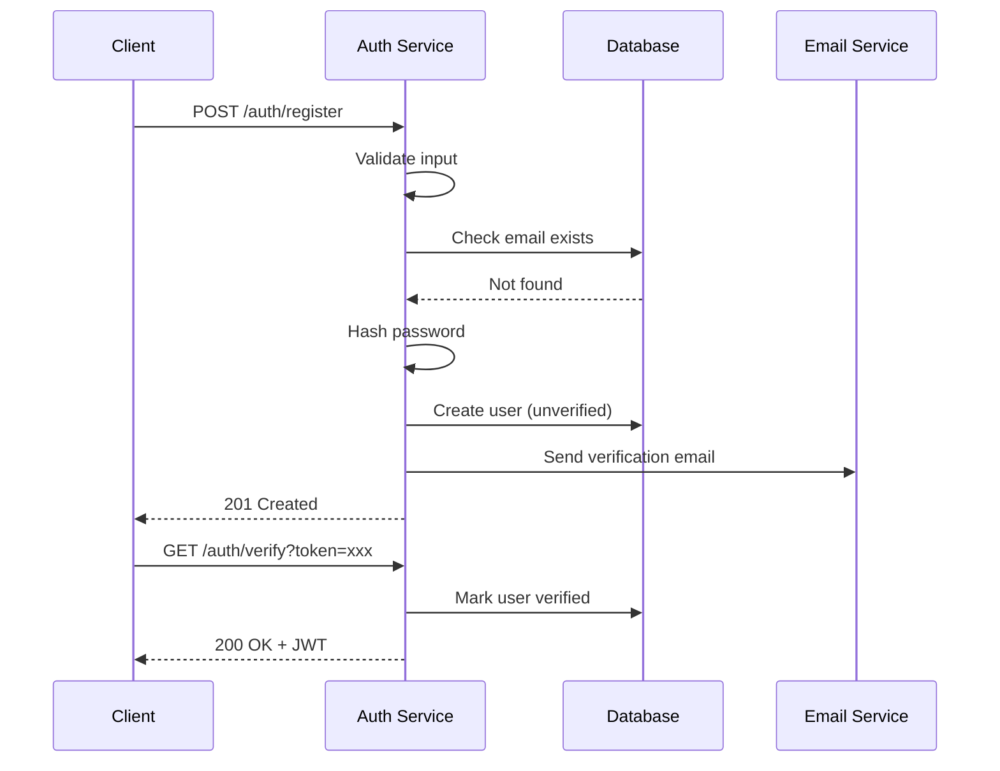

# AI-Agent Specification Development Guide

## A Complete Framework for Translating PRDs into Machine-Executable Specifications

---

## Part 1: Foundation Principles

### 1.1 The Core Philosophy

Specifications for AI agents serve a fundamentally different purpose than traditional documentation. They function as **executable blueprints**—precise instruction sets that eliminate ambiguity and provide the AI with everything it needs to build autonomously.

Three principles govern this approach:

**Intent as source of truth.** The specification captures *what* the system should do and *why*, not how to implement it. Implementation details live in separate technical specifications. This separation allows the AI to make intelligent implementation choices while staying anchored to human intent.

**Machine-first, human-readable.** Every specification must be optimized for LLM parsing while remaining comprehensible to humans. This means explicit structure, unambiguous language, and predictable formatting patterns.

**Context persistence by design.** AI agents have no memory between sessions. Specifications must be self-contained enough that an agent can pick up work with zero prior context and continue correctly.

### 1.2 The Specification Hierarchy

Specifications exist in layers, each serving a distinct purpose:

```
Level 1: Project Constitution (immutable rules)
Level 2: Functional Specifications (what to build)
Level 3: Technical Specifications (how to build it)
Level 4: Task Specifications (atomic work units)
Level 5: Context Files (live project state)
```

A PRD feeds into Levels 2-4. The Constitution and Context Files wrap around them to provide guardrails and memory.

---

## Part 2: Breaking Down a PRD

### 2.1 The PRD Decomposition Process

Product Requirements Documents typically arrive as narrative descriptions of features, user needs, and business goals. Your job is to transform this narrative into structured, traceable requirements.

**Step 1: Extract User Journeys**

Identify every distinct user type and their primary interactions with the system. For each journey, capture:

- Who is the user (role, permissions, context)
- What triggers this journey
- What constitutes success
- What could go wrong

**Step 2: Identify Functional Domains**

Group related functionality into domains. Common domains include:

- Authentication and authorization
- Data management (CRUD operations)
- Business logic and workflows
- Integrations and external systems
- Reporting and analytics
- Administration and configuration

**Step 3: Extract Requirements with IDs**

Every requirement gets a unique identifier following the pattern `[REQ-DOMAIN-##]`. This enables:

- Traceability from code back to requirements
- Automated compliance checking
- Clear communication about specific items

Write the IDs so a machine can find them without help. In the PRD, each
normative requirement is **one bullet on its own line, prefixed `- `, opening
with an ID matching `REQ-<AREA>-<NNN>`**, grouped under the numbered section it
belongs to:

```markdown
### 8.3 Native Interval Enforcement

- REQ-DL-020: Production datasets must set `native_interval=true`.
- REQ-DL-021: Any derived/resampled dataset must set `production_eligible=false`.
```

That regularity is the whole point: the full set of requirement IDs can then be
extracted with a regex and no LLM, which is what makes "every requirement is
claimed by some task" a check rather than a hope. IDs buried mid-paragraph, or
split across wrapped lines, are not extracted and therefore are not checked —
they pass by being invisible, which is the worst available outcome.

**Step 4: Identify Non-Functional Requirements**

Extract implicit requirements around performance, security, reliability, accessibility, and compliance. These often hide in PRD language like "fast," "secure," or "enterprise-grade."

**Step 5: Surface Edge Cases and Error States**

For each requirement, ask: What happens when this fails? What are the boundary conditions? What invalid inputs might users provide?

### 2.2 PRD Decomposition Template

Use this template to systematically process any PRD:

```markdown
## PRD Analysis: [Feature Name]

### Extracted User Types
| User Type | Description | Permission Level |
|-----------|-------------|------------------|
| [type]    | [desc]      | [level]          |

### User Journeys Identified
1. [Journey name]: [One-sentence description]
2. ...

### Functional Domains
- [ ] Domain 1: [name]
- [ ] Domain 2: [name]

### Requirements Extraction
| ID | Domain | Requirement | Source (PRD section) |
|----|--------|-------------|---------------------|
| REQ-XXX-01 | | | |

### Non-Functional Requirements
| ID | Category | Requirement | Metric |
|----|----------|-------------|--------|
| NFR-XXX-01 | | | |

### Edge Cases Identified
| Related Req | Edge Case | Expected Behavior |
|-------------|-----------|-------------------|
| | | |

### Open Questions for Stakeholders
1. [Question requiring clarification]
```

---

## Part 3: The Specification Document Structure

### 3.1 File Organization

Organize specifications in a predictable directory structure that AI agents can navigate reliably:

```
project-root/
├── .ai/                          # AI context and memory
│   ├── activeContext.md          # Current session state
│   ├── decisionLog.md            # Architectural decisions
│   └── progress.md               # Roadmap completion status
├── specs/
│   ├── constitution.md           # Immutable project rules
│   ├── functional/
│   │   ├── _index.md             # Manifest of all functional specs
│   │   ├── auth.md
│   │   ├── users.md
│   │   └── [domain].md
│   ├── technical/
│   │   ├── _index.md
│   │   ├── architecture.md
│   │   ├── data-models.md
│   │   └── api-contracts.md
│   └── tasks/
│       ├── _index.md
│       └── [task-id].md
└── docs/
    └── diagrams/
        └── architecture.mmd       # Mermaid source files
```

**Where decomposed-PRD task files live.** The tree above is for hand-authored
specs, which are found by being referenced. A PRD decomposed for automated
execution has a second, stricter layout, because its task files are found by
walking a directory:

```
PRD-TRADING-DATA-LAKE-AHDM-001.md          # the PRD itself
PRD-TRADING-DATA-LAKE-AHDM-001/            # sibling directory, same name
├── TASK-TDL-001-data-lake-gap-audit.md
├── TASK-TDL-010-registry-schema-v1.md
├── TASK-TDL-020-ohlcv-validation-reports.md
└── TASK-TDL-140-adversarial-review-and-readiness.md
```

The rules are mechanical, and each one fails closed rather than degrading:

- **One task per file.** There is no multi-task file format.
- **Discovery is a single non-recursive directory read** for names matching
  `TASK-*.md`. A task file one directory deeper is not found at all — not
  warned about, not partially loaded, not found. A correctly formatted task in
  the wrong place contributes nothing to the run. A directory holding no
  matching file is refused naming the directory.
- **The filename carries the task id.** It must match
  `TASK-<DOMAIN>-<NNN>-<slug>.md`; the id is the first three dash-separated
  parts of the stem — `TASK`, an uppercase-alphanumeric domain, and exactly
  three digits. `TASK-TDL-010-registry-schema-v1.md` yields `TASK-TDL-010`. A
  filename no id can be read from is refused naming the file.
- **The `task_id` inside the file must equal the id from the filename.** A
  mismatch is refused naming both, rather than one of them silently winning.
- **The PRD sits beside the directory**, named for the same PRD id. Tasks point
  back at it with `prd:` and at its sections with `source_sections:`, so the
  PRD's section numbering is part of the contract, not presentation. See §3.5.

### 3.2 The Constitution File

The constitution defines immutable rules that apply to every change. AI agents must check this before any implementation.

```xml
<constitution version="1.0" last_updated="YYYY-MM-DD">

<metadata>
  <project_name>Project Name</project_name>
  <spec_version>1.0.0</spec_version>
  <authors>Team/Individual</authors>
</metadata>

<tech_stack>
  <language version="X.X">Language Name</language>
  <framework version="X.X">Framework Name</framework>
  <database>Database Name</database>
  <required_libraries>
    <library version="X.X">Library 1</library>
    <library version="X.X">Library 2</library>
  </required_libraries>
</tech_stack>

<directory_structure>
<!-- Output of: tree -L 2 -I 'node_modules|.git|__pycache__' -->
src/
├── components/
├── services/
├── utils/
├── types/
└── config/
</directory_structure>

<coding_standards>
  <naming_conventions>
    <files>kebab-case for files, PascalCase for components</files>
    <variables>camelCase for variables, SCREAMING_SNAKE for constants</variables>
    <functions>camelCase, verb-first (e.g., getUserById)</functions>
  </naming_conventions>
  
  <file_organization>
    <rule>One component per file</rule>
    <rule>Co-locate tests with source files as [name].test.ts</rule>
    <rule>Shared utilities go in src/utils/</rule>
  </file_organization>
  
  <error_handling>
    <rule>All async operations must have explicit error handling</rule>
    <rule>Errors must be logged with context before re-throwing</rule>
    <rule>User-facing errors must use the ErrorBoundary pattern</rule>
  </error_handling>
</coding_standards>

<anti_patterns>
  <forbidden>
    <item reason="Deprecated">Do NOT use var; use const or let</item>
    <item reason="Security">Do NOT store secrets in code; use environment variables</item>
    <item reason="Consistency">Do NOT create new utility files without checking existing utils/</item>
    <item reason="Maintainability">Do NOT use magic numbers; define constants</item>
    <item reason="Testing">Do NOT stub data inline; use factories in tests/fixtures/</item>
    <item reason="Architecture">Do NOT call APIs directly from components; use service layer</item>
  </forbidden>
</anti_patterns>

<security_requirements>
  <rule id="SEC-01">All user input must be validated and sanitized</rule>
  <rule id="SEC-02">Authentication tokens expire after 24 hours</rule>
  <rule id="SEC-03">Passwords require minimum 12 characters with complexity</rule>
  <rule id="SEC-04">All API endpoints require authentication except /health and /auth/*</rule>
</security_requirements>

<performance_budgets>
  <metric name="initial_load">Less than 3 seconds on 3G</metric>
  <metric name="api_response">Less than 200ms p95</metric>
  <metric name="database_query">Less than 100ms p95</metric>
</performance_budgets>

<testing_requirements>
  <coverage_minimum>80% line coverage</coverage_minimum>
  <required_tests>
    <test_type>Unit tests for all business logic</test_type>
    <test_type>Integration tests for API endpoints</test_type>
    <test_type>E2E tests for critical user journeys</test_type>
  </required_tests>
</testing_requirements>

</constitution>
```

### 3.3 Functional Specification Template

Each functional spec describes a domain or feature in terms of user outcomes, not implementation details.

This template is XML and stays XML. Functional and technical specs are read by
humans and by an LLM, both of which tolerate any consistent structure. Task
files are not: they are deserialized by a parser, and they use the YAML format
in §3.5. Do not carry the XML shape across into task files.

```xml
<functional_spec id="SPEC-AUTH" version="1.0">

<metadata>
  <title>Authentication System</title>
  <status>approved</status>
  <owner>Team/Person</owner>
  <last_updated>YYYY-MM-DD</last_updated>
  <related_specs>
    <spec_ref>SPEC-USERS</spec_ref>
  </related_specs>
</metadata>

<overview>
A concise description of what this feature/domain accomplishes and why it exists.
This should answer: What problem does this solve? Who benefits?
</overview>

<user_stories>

<story id="US-AUTH-01" priority="must-have">
  <narrative>
    As a new visitor
    I want to create an account with my email
    So that I can access personalized features
  </narrative>
  
  <acceptance_criteria>
    <criterion id="AC-01">
      <given>I am on the registration page</given>
      <when>I submit valid email, password, and name</when>
      <then>My account is created and I receive a verification email</then>
    </criterion>
    <criterion id="AC-02">
      <given>I am on the registration page</given>
      <when>I submit an email that already exists</when>
      <then>I see an error message "An account with this email already exists"</then>
    </criterion>
    <criterion id="AC-03">
      <given>I am on the registration page</given>
      <when>I submit a password shorter than 12 characters</when>
      <then>I see validation error before form submission</then>
    </criterion>
  </acceptance_criteria>
</story>

<story id="US-AUTH-02" priority="must-have">
  <narrative>
    As a registered user
    I want to log in with my credentials
    So that I can access my account
  </narrative>
  
  <acceptance_criteria>
    <criterion id="AC-01">
      <given>I have a verified account</given>
      <when>I submit correct email and password</when>
      <then>I am redirected to the dashboard with an active session</then>
    </criterion>
    <criterion id="AC-02">
      <given>I submit incorrect credentials</given>
      <when>I have failed 5 times in 15 minutes</when>
      <then>My account is temporarily locked for 30 minutes</then>
    </criterion>
  </acceptance_criteria>
</story>

</user_stories>

<requirements>

<requirement id="REQ-AUTH-01" story_ref="US-AUTH-01" priority="must">
  <description>Email validation must verify format and domain deliverability</description>
  <rationale>Prevents fake accounts and ensures communication channel works</rationale>
</requirement>

<requirement id="REQ-AUTH-02" story_ref="US-AUTH-01" priority="must">
  <description>Passwords must be hashed using bcrypt with cost factor 12</description>
  <rationale>Industry standard for password storage security</rationale>
</requirement>

<requirement id="REQ-AUTH-03" story_ref="US-AUTH-02" priority="must">
  <description>Session tokens must be JWT with 24-hour expiration</description>
  <rationale>Balances security with user convenience</rationale>
</requirement>

<requirement id="REQ-AUTH-04" story_ref="US-AUTH-02" priority="should">
  <description>Support "remember me" option extending session to 30 days</description>
  <rationale>Improves UX for trusted devices</rationale>
</requirement>

</requirements>

<edge_cases>

<edge_case id="EC-AUTH-01" req_ref="REQ-AUTH-01">
  <scenario>User registers with email containing plus addressing (user+tag@domain.com)</scenario>
  <expected_behavior>Accept as valid; treat as unique email address</expected_behavior>
</edge_case>

<edge_case id="EC-AUTH-02" req_ref="REQ-AUTH-02">
  <scenario>User attempts to set password that matches a known breached password</scenario>
  <expected_behavior>Reject with message "This password has been found in data breaches"</expected_behavior>
</edge_case>

<edge_case id="EC-AUTH-03" req_ref="REQ-AUTH-03">
  <scenario>User's session expires while filling out a long form</scenario>
  <expected_behavior>Preserve form data, redirect to login, restore after auth</expected_behavior>
</edge_case>

</edge_cases>

<error_states>

<error id="ERR-AUTH-01" http_code="400">
  <condition>Email format invalid</condition>
  <message>Please enter a valid email address</message>
  <recovery>Highlight email field, show format example</recovery>
</error>

<error id="ERR-AUTH-02" http_code="401">
  <condition>Invalid credentials</condition>
  <message>Email or password is incorrect</message>
  <recovery>Clear password field, maintain email, show "Forgot password?" link</recovery>
</error>

<error id="ERR-AUTH-03" http_code="429">
  <condition>Too many failed attempts</condition>
  <message>Account temporarily locked. Try again in {minutes} minutes.</message>
  <recovery>Show countdown timer, offer password reset option</recovery>
</error>

</error_states>

<test_plan>

<test_case id="TC-AUTH-01" type="unit" req_ref="REQ-AUTH-01">
  <description>Email validation accepts valid formats</description>
  <inputs>["user@domain.com", "user+tag@domain.co.uk", "user.name@sub.domain.com"]</inputs>
  <expected>All return true</expected>
</test_case>

<test_case id="TC-AUTH-02" type="unit" req_ref="REQ-AUTH-01">
  <description>Email validation rejects invalid formats</description>
  <inputs>["notanemail", "@domain.com", "user@", "user@domain"]</inputs>
  <expected>All return false</expected>
</test_case>

<test_case id="TC-AUTH-03" type="integration" req_ref="REQ-AUTH-02">
  <description>Password hashing produces verifiable hash</description>
  <steps>
    1. Hash password "TestPassword123!"
    2. Verify hash against same password
    3. Verify hash fails against different password
  </steps>
  <expected>Step 2 returns true, Step 3 returns false</expected>
</test_case>

<test_case id="TC-AUTH-04" type="e2e" story_ref="US-AUTH-01">
  <description>Complete registration flow</description>
  <steps>
    1. Navigate to /register
    2. Fill form with valid data
    3. Submit form
    4. Check for success message
    5. Verify email received (mock)
    6. Click verification link
    7. Verify account active
  </steps>
</test_case>

</test_plan>

</functional_spec>
```

### 3.4 Technical Specification Template

Technical specs define *how* to implement functional requirements. They're language-specific and architecture-aware.

Like the functional spec, this document is XML by design and is not parsed by
tooling. The task files derived from it are parsed, and use the YAML format in
§3.5.

```xml
<technical_spec id="TECH-AUTH" version="1.0" implements="SPEC-AUTH">

<metadata>
  <title>Authentication Implementation</title>
  <status>approved</status>
  <last_updated>YYYY-MM-DD</last_updated>
</metadata>

<architecture_diagram>

</architecture_diagram>

<data_models>

<model name="User">
  <field name="id" type="UUID" constraints="primary_key, auto_generated"/>
  <field name="email" type="string(255)" constraints="unique, not_null, indexed"/>
  <field name="password_hash" type="string(60)" constraints="not_null"/>
  <field name="name" type="string(100)" constraints="not_null"/>
  <field name="email_verified" type="boolean" constraints="default: false"/>
  <field name="created_at" type="timestamp" constraints="not_null, auto_generated"/>
  <field name="updated_at" type="timestamp" constraints="not_null, auto_updated"/>
  <field name="locked_until" type="timestamp" constraints="nullable"/>
  <field name="failed_login_attempts" type="integer" constraints="default: 0"/>
</model>

<model name="Session">
  <field name="id" type="UUID" constraints="primary_key"/>
  <field name="user_id" type="UUID" constraints="foreign_key(User.id), indexed"/>
  <field name="token_hash" type="string(64)" constraints="unique, indexed"/>
  <field name="expires_at" type="timestamp" constraints="not_null"/>
  <field name="created_at" type="timestamp" constraints="not_null"/>
  <field name="remember_me" type="boolean" constraints="default: false"/>
</model>

</data_models>

<api_contracts>

<endpoint path="/auth/register" method="POST">
  <description>Create new user account</description>
  <implements>REQ-AUTH-01, REQ-AUTH-02</implements>
  
  <request_body content_type="application/json">
    <field name="email" type="string" required="true" validation="email format"/>
    <field name="password" type="string" required="true" validation="min 12 chars"/>
    <field name="name" type="string" required="true" validation="min 1, max 100 chars"/>
  </request_body>
  
  <responses>
    <response status="201">
      <description>Account created successfully</description>
      <body>
        {
          "id": "uuid",
          "email": "string",
          "name": "string",
          "message": "Verification email sent"
        }
      </body>
    </response>
    <response status="400">
      <description>Validation error</description>
      <body>
        {
          "error": "validation_error",
          "details": [{"field": "string", "message": "string"}]
        }
      </body>
    </response>
    <response status="409">
      <description>Email already exists</description>
      <body>
        {
          "error": "email_exists",
          "message": "An account with this email already exists"
        }
      </body>
    </response>
  </responses>
</endpoint>

<endpoint path="/auth/login" method="POST">
  <description>Authenticate user and create session</description>
  <implements>REQ-AUTH-03</implements>
  
  <request_body content_type="application/json">
    <field name="email" type="string" required="true"/>
    <field name="password" type="string" required="true"/>
    <field name="remember_me" type="boolean" required="false" default="false"/>
  </request_body>
  
  <responses>
    <response status="200">
      <description>Login successful</description>
      <body>
        {
          "token": "jwt_string",
          "expires_at": "iso_timestamp",
          "user": {
            "id": "uuid",
            "email": "string",
            "name": "string"
          }
        }
      </body>
    </response>
    <response status="401">
      <description>Invalid credentials</description>
    </response>
    <response status="429">
      <description>Account locked</description>
      <body>
        {
          "error": "account_locked",
          "locked_until": "iso_timestamp"
        }
      </body>
    </response>
  </responses>
</endpoint>

</api_contracts>

<component_contracts>

<component name="AuthService" path="src/services/auth.service.ts">
  <description>Core authentication business logic</description>
  
  <method name="registerUser">
    <signature>async registerUser(dto: RegisterDto): Promise&lt;User&gt;</signature>
    <implements>REQ-AUTH-01, REQ-AUTH-02</implements>
    <behavior>
      1. Validate email format
      2. Check email uniqueness
      3. Validate password strength
      4. Check password against breach database
      5. Hash password with bcrypt
      6. Create user record
      7. Generate verification token
      8. Queue verification email
      9. Return created user (without password_hash)
    </behavior>
    <throws>
      - ValidationError: Invalid input
      - ConflictError: Email exists
      - WeakPasswordError: Password in breach database
    </throws>
  </method>
  
  <method name="authenticateUser">
    <signature>async authenticateUser(email: string, password: string, rememberMe: boolean): Promise&lt;AuthResult&gt;</signature>
    <implements>REQ-AUTH-03, REQ-AUTH-04</implements>
    <behavior>
      1. Find user by email
      2. Check if account is locked
      3. Verify password against hash
      4. If failed: increment attempts, check for lockout threshold
      5. If success: reset failed attempts, generate JWT
      6. Set expiration based on rememberMe flag
      7. Create session record
      8. Return token and user data
    </behavior>
  </method>
  
</component>

</component_contracts>

<implementation_notes>

<note category="security">
JWT secret must be loaded from environment variable JWT_SECRET.
Minimum 256-bit key required.
</note>

<note category="performance">
Email uniqueness check should use database unique constraint, not SELECT.
Add index on (email, email_verified) for login queries.
</note>

<note category="integration">
Email service is async. Use message queue (defined in TECH-MESSAGING spec).
Do not await email delivery in registration flow.
</note>

</implementation_notes>

</technical_spec>
```

### 3.5 Task Specification Template

Tasks are atomic work units that an AI agent can complete in a single session. They should be small enough to fit in context but complete enough to be independently testable.

**Task files are machine-consumed; spec documents are not.** This is the one
place in this guide where the format is not a matter of taste. A functional or
technical spec is read by a human or an LLM, either of which copes with any
consistent structure — so those stay XML (§3.3, §3.4). A task file is read by a
parser. The parser opens the file, takes the **first fenced ` ```yaml ` block**,
and deserializes it as a mapping. XML tags contain no `key: value` line, so a
parser handed an XML task spec recovers nothing from it: no `depends_on`, no
target files, no test commands.

Earlier revisions of this guide taught an XML `<task_spec>` here. A task file in
that shape did not error — it produced a record with a filename-derived id, a
heading-derived title and an **empty dependency graph**, and the run proceeded
to execute against that empty graph, in parallel, in whatever order it liked.
That partial-parse path has been removed. A task file whose YAML block is
missing, unparseable, not a mapping, or missing a required key is now refused by
name and the run stops. Tasks authored in the old XML shape are rejected, not
silently downgraded. Author them in the format below.

A task file is a markdown document with exactly two machine-read parts: one
fenced YAML block immediately after the H1, and a set of H2 sections whose
bullet lists are extracted by heading name.

````markdown
# TASK-<DOMAIN>-<NNN> — <Title>

```yaml
task_id: TASK-<DOMAIN>-<NNN>
prd: PRD-<NAME>
domain: <DOMAIN>
title: <Title>
workstream: <W# Name>
complexity: low|medium|high
status: ready|pending|in_review|blocked|done
depends_on: []
blocks: []
source_sections: []
implements: []
required_env_keys: []
required_tools: []
shared_append_target_files: []
deliverable_contracts: []
```

## Purpose
## Scope            (### In / ### Out)
## Files Expected to Change
## Files Forbidden to Change
## Acceptance Criteria
## Focused Tests
## Adversarial Review Notes
## Required Task Checklist
## Global Constraints
````

Declare every key, including the ones that are empty. An empty list is a claim —
"this task depends on nothing", "this task implements no requirement" — and a
claim can be checked. An absent key is a hole, and nothing can be checked
against a hole. `task_id`, `title`, `complexity`, `status`, `depends_on`,
`blocks`, `implements`, `required_env_keys`, `required_tools` and
`deliverable_contracts` are refused outright if absent, naming the file and
every missing key.

#### `implements` — the requirement IDs this task satisfies

`implements` lists the normative requirement IDs from the PRD that this task is
answerable for, for example `implements: [REQ-DL-020, REQ-DL-021]`. Declare it
on every task. A task that implements no requirement — an audit, a review, a
readiness sweep — declares `implements: []`, and never omits the field. Treat an
omission as an incomplete task file and fix it rather than inferring an empty
list from silence: silence and `[]` must not be the same input. A task file
that omits `implements` is refused by name, like any other missing required
key.

Two checks follow from this field, and neither is possible without it. Both run
in `archon workflow lint --tasks <DIR>`, which reports and does not block — it
names the gap, closing it is the author's:

1. **Every ID a task cites must exist in the PRD.** A citation of a requirement
   that was renumbered or deleted is a stale task, and it is caught by
   intersection, not by reading.
2. **Every normative requirement in the PRD must be claimed by at least one
   task.** A requirement no task claims is a decomposition gap. Record it as an
   explicit residual gap with a fail-closed behavior; do not leave it silent.
   Unclaimed and unrecorded is the one state that looks like success.

`implements` also binds a requirement to the focused tests meant to prove it,
which is what allows a requirement to be marked satisfied by executed evidence
rather than by assertion.

#### `status` — what the scheduler is allowed to do with this task

Five values, each with a defined effect. This is not a label for humans:

| `status` | Effect on scheduling |
|---|---|
| `done` | Never scheduled, on a fresh run or a resume, and **satisfies its dependents** — tasks waiting on it become runnable. |
| `blocked` | Scheduled only once every dependency it declares is complete. |
| `ready`, `pending` | Ordinary work, runnable when its dependencies allow. |
| `in_review` | Ordinary work. **Review is not completion** — an `in_review` task is scheduled like any other. |

Two authoring errors are refused rather than guessed at:

- **`status: blocked` with an empty `depends_on`.** Nothing in the task set can
  ever unblock it, so the task set is refused naming the task and its file.
  Either the dependency is missing or the status is stale; both are fixable, and
  neither is fixable by a scheduler picking one.
- **An unrecognised value.** The task set is refused naming the value, the task
  and the file. A status that cannot be classified is never read as finished, so
  a typo like `dnoe` cannot quietly skip work.

#### `depends_on` and `blocks` — one graph, two directions

`depends_on` lists the tasks that must complete before this one. `blocks` lists
the tasks that must wait for this one. **Both are parsed and both contribute
edges**: an edge declared from either end is an edge, and the two lists are
reconciled into a single graph before anything is scheduled. Declare ordering
from whichever end is clearer at authoring time; you do not need to mirror it in
the other task.

This is worth saying because it was not always true. `blocks` was parsed by
nothing at all: a task that expressed its ordering only in that direction
contributed no edge whatsoever, and its dependents ran early. In one real
17-task corpus, 26 `blocks` edges were contributing nothing.

Three contradictions are refused by name rather than folded into the graph,
because folding them would manufacture a cycle and report an authoring mistake
as a graph shape:

- a task that declares it blocks itself;
- a task that both `blocks` and `depends_on` the same task;
- two tasks that each declare they block the other.

The reconciled graph is then checked for cycles, and a cycle is reported as the
full path through it.

#### Ordering-only dependencies are legitimate

A task may depend on another purely so that code exists before it runs — the
CLI surface must exist before a command that uses it, even though no artifact
flows between them. That is a real dependency and it is classified
automatically: a dependency that produces no artifacts, whose dependent consumes
only artifacts, is reported as *ordering-only* and never as a defect.

**Do not invent a `deliverable_contracts` entry to silence it.** A fabricated
contract names an artifact nothing produces, and every gate downstream then
either fails against a file that will never exist or, worse, passes vacuously.
A quiet warning bought with a false contract is a worse position than the
warning.

#### `deliverable_contracts` — what this task must leave on disk

Each entry declares an artifact the task is answerable for:

```yaml
deliverable_contracts:
  - kind: trading_data_registry
    artifact_path: .archon/trading-lab/data/registry.json
```

`kind` and `artifact_path` are required. `registry_path`,
`typed_verifier_command` and `min_instances` are optional, and
`typed_verifier_command` may reference `{artifact_path}` and `{registry_path}`.

**Use a distinct `kind` for creating a file and for appending to it, even when
the path is identical.** `trading_data_registry` creates the registry;
`trading_data_registry_entry` appends an entry to it. That distinction is the
only thing that lets the tooling tell the producer of a file from a contributor
to it, and producer and contributor need different ordering, different
verification and different write coordination.

#### Templated artifact paths need an instance binding

A path containing `<...>` placeholders —
`.archon/trading-lab/data/datasets/<dataset-id>/<version>/validation.json` —
cannot be checked as written. There is no file named `<dataset-id>`. A task
declaring a templated path MUST also declare where the real values come from:

```yaml
deliverable_contracts:
  - kind: dataset_validation_report
    artifact_path: .archon/trading-lab/data/datasets/<dataset-id>/<version>/validation.json
    instance_source_path: .archon/trading-lab/data/registry.json
    instance_source_records_field: datasets
    instance_artifact_field: validation_path
    min_instances: 1
```

Read that as: the registry is the enumeration; its `datasets` array holds the
records; each record's `validation_path` names one real instance of the
templated path; and there must be at least one. Bind the instances to a source
collection — `instance_artifact_field` together with `instance_source_path` and
`instance_source_records_field` (`registry_path` and `registry_records_field`
are the equivalent pair when the enumeration is the registry the contract
already names) — so that every expanded path is named by a real record, **or**
declare `min_instances: 1` or more so that the expansion is at least a claim
that can fail.

`instance_source_path` and `registry_path` must themselves be concrete. A
template in either is always refused: those paths are opened literally and
nothing expands them.

What fails, and when:

- **No binding at all.** The gate can neither pass nor fail against the literal
  path, so it fails closed at plan time: the verification step for that contract
  becomes a command that prints the unexpanded token and exits non-zero. The
  task cannot pass.
- **`min_instances: 0` with a templated path.** Zero matches satisfy the floor,
  so the gate is vacuous — it reports success having verified nothing. This is
  not hypothetical: it shipped, and an adversarial reviewer caught it. Never
  write `min_instances: 0` on a templated path.
- **`typed_verifier_command` on a templated path.** Refused. A typed verifier is
  handed exactly one concrete path and cannot expand a template. Use one or the
  other.
- **A templated `registry_path` or `instance_source_path`.** Always refused —
  those paths are opened literally and no binding expands them.

#### `shared_append_target_files` — concurrent writes, declared

List a path here only when this task writes it **concurrently with another
task**, typically an append to a shared registry or index. Declaring a path
tells the write coordinator not to serialize this task against the other writers
of that path.

Be exact about what the declaration means: **it asserts that the write is
coordinated and atomic; it does not make it so.** The implementing task owns
that — append under a lock, or write-and-rename — and the PRD must state the
atomicity requirement separately as a normative requirement. A declaration
against a naive read-modify-write is a licence to lose data.

The dangerous case is the opposite one. An undeclared shared write is
unprotected in the only way that matters: nothing can coordinate a write nobody
declared. If two tasks touch the same file, both declare it.

#### `source_sections` and `prd`

`source_sections: ['8.4', '22', '25.1']` names the PRD sections this task was
derived from, and `prd:` names the PRD. These are how a reviewer gets from a
task back to the requirement text without searching. They depend on the PRD
having stable, numbered sections; see the PRD authoring guide.

#### The markdown sections

Bullet lists under the H2 headings are extracted by heading name, so keep the
heading text exactly as given.

- **`## Scope`** carries `### In` and `### Out`. "Out" is where you name the task
  that owns the work instead, so a reviewer can tell deferral from omission.
- **`## Files Expected to Change` / `## Files Forbidden to Change`.** The
  forbidden list is the more useful of the two: it is what stops a task fixing
  its own failing gate by editing the gate.
- **`## Acceptance Criteria` and `## Focused Tests`** are the executed evidence
  that `implements` binds requirements to. A criterion no test can produce
  evidence for is a criterion that will be marked satisfied by assertion.
- **`## Adversarial Review Notes`** — see below.
- **`## Required Task Checklist`** restates, inside the task, what the PRD's task
  acceptance checklist requires of it, so the checklist travels with the file.
- **`## Global Constraints`** restates the project-wide rules that apply here —
  file-size limits, no hardcoded secrets, no vague "later"/"TBD"/"best effort"
  without a residual-gap record and a fail-closed behavior.

#### `## Adversarial Review Notes` is per-task, not project-wide

These notes are read by an adversarial reviewer that sees **only this task** —
its file, its diff, its evidence. Write falsification hypotheses specific to
this task: what would make this task's evidence look good while the work is
wrong. "Verify the migration cannot delete an artifact it failed to copy" is
usable. "Verify the system is secure" is not, and neither is anything phrased
for a reviewer holding every task at once — that reviewer is a different one,
and notes written for it are wasted here.

#### Worked example

````markdown
# TASK-TDL-010 — Registry Schema v2 + Migration

```yaml
task_id: TASK-TDL-010
prd: PRD-TRADING-DATA-LAKE-AHDM-001
domain: TDL
title: Registry Schema v2 + Migration
workstream: W1 Storage + Validation
complexity: high
status: blocked
depends_on: ['TASK-TDL-001']
blocks: ['TASK-TDL-020']
source_sections: ['8.1', '17', '18', '19', '26']
implements: [REQ-DL-001, REQ-DL-002, REQ-DL-003, REQ-DL-004, REQ-DL-005]
required_env_keys: []
required_tools: []
shared_append_target_files: []
deliverable_contracts:
  - kind: trading_data_registry
    artifact_path: .archon/trading-lab/data/registry.json
  - kind: registry_migration_report
    artifact_path: .archon/trading-lab/data/registry-migration-report.json
```

## Purpose

Implement registry v2 and dataset metadata schema while preserving v1
readability and migration safety.

## Scope

### In

- Registry schema `archon-trading-data-registry-v2`.
- v1 registry read compatibility.
- Atomic migration with backup file.

### Out

- Provider fetch adapters (TASK-TDL-030 onward).

## Files Expected to Change
## Files Forbidden to Change
## Acceptance Criteria
## Focused Tests
## Adversarial Review Notes
## Required Task Checklist
## Global Constraints
````

Read it as a set of claims. It is `blocked` and names the dependency that will
release it. It declares the reverse edge to `TASK-TDL-020` so that task does not
have to. It claims five requirement IDs, each of which must exist in the PRD. It
creates the registry — `kind: trading_data_registry` — where a later task that
appends to the same file will declare `trading_data_registry_entry` instead. It
writes no shared file concurrently, and says so.

---

## Part 4: Context Files (The Memory Bank)

### 4.1 Active Context File

This file represents the AI's "working memory" for the current session. It must be read at session start and updated at session end.

```markdown
# Active Context

## Last Updated
YYYY-MM-DD HH:MM by [human/agent]

## Current Focus
Brief description of what we're working on right now.

## Active Task
**Task ID:** TASK-AUTH-001
**Status:** In Progress
**Started:** YYYY-MM-DD

## Recent Decisions
- [Date] Decision made about X because Y
- [Date] Changed approach to Z after discovering W

## Current Blockers
- [ ] Waiting on API credentials for email service
- [x] ~~Database connection issue~~ (resolved: wrong env var)

## Open Questions
1. Should we use refresh tokens? (Awaiting stakeholder input)
2. What's the session timeout for mobile vs web?

## Next Steps
1. Complete TASK-AUTH-001 registration endpoint
2. Begin TASK-AUTH-002 login endpoint
3. ...

## Session Notes
Any observations, attempted approaches, or context that should persist.
```

### 4.2 Decision Log

Immutable record of architectural and design decisions. Prevents the AI from re-litigating settled debates.

```markdown
# Decision Log

## DEC-001: Password Hashing Algorithm
**Date:** YYYY-MM-DD
**Status:** Final
**Decision:** Use bcrypt with cost factor 12
**Context:** Needed to choose between bcrypt, Argon2, and scrypt
**Options Considered:**
- Argon2: More modern, but less library support
- scrypt: Good but complex to configure correctly
- bcrypt: Industry standard, excellent library support
**Rationale:** bcrypt provides excellent security with proven track record. Cost factor 12 balances security and performance for our expected load.
**Consequences:** 
- Hashing takes ~250ms per operation
- Cannot easily increase cost factor without rehashing all passwords

---

## DEC-002: JWT vs Session Tokens
**Date:** YYYY-MM-DD
**Status:** Final
**Decision:** Use JWT with short expiration + refresh tokens
**Context:** Need stateless authentication for API
**Rationale:** JWTs enable horizontal scaling without shared session storage. Refresh tokens allow revocation without database lookup on every request.

---
```

### 4.3 Progress Tracker

High-level roadmap with completion status.

```markdown
# Implementation Progress

## Phase 1: Foundation
- [x] TASK-DB-001: Database schema setup
- [x] TASK-CONFIG-001: Environment configuration
- [ ] TASK-AUTH-001: Registration endpoint ← CURRENT
- [ ] TASK-AUTH-002: Login endpoint
- [ ] TASK-AUTH-003: Email verification

## Phase 2: Core Features
- [ ] TASK-USER-001: User profile management
- [ ] TASK-USER-002: Password reset flow
...

## Completion: 2/15 tasks (13%)
```

---

## Part 5: AI Agent Instructions

### 5.1 Agent Workflow Protocol

Include these instructions in your system prompt or as a dedicated file the agent reads first.

```xml
<agent_protocol>

<session_start>
Before any implementation work:
1. Read .ai/activeContext.md to understand current state
2. Read .ai/decisionLog.md to understand settled decisions
3. Read specs/constitution.md to understand immutable rules
4. Identify the current task from .ai/progress.md
5. Read the relevant functional and technical specs
6. Read the specific task spec
7. Verify prerequisites are met
</session_start>

<before_coding>
For any logic more complex than 10 lines:
1. Write pseudo-code in your response
2. Wait for human approval before implementation
3. Update the task spec's pseudo_code section if approach changes
</before_coding>

<file_operations>
Before creating any new file:
1. Check <directory_structure> in constitution
2. Search for similar existing files
3. If similar file exists, extend it rather than creating duplicate

Before modifying any file:
1. Read the entire file first
2. Understand its current structure and patterns
3. Make minimal changes to achieve the goal
</file_operations>

<code_comments>
When writing code that implements a requirement:
- Add comment referencing requirement ID
- Example: // Implements [REQ-AUTH-01]: Email format validation
</code_comments>

<testing>
After implementation:
1. Run the test commands from the task spec
2. If tests fail, diagnose and fix
3. Do not mark task complete until all tests pass
</testing>

<session_end>
Before ending session:
1. Update .ai/activeContext.md with:
   - Current status
   - Any decisions made
   - Blockers encountered
   - Next steps
2. Update .ai/progress.md if tasks completed
3. If architectural decisions were made, add to decisionLog.md
</session_end>

<error_handling>
If you encounter ambiguity:
1. Check specs for clarification
2. Check decisionLog for related decisions
3. If still unclear, document the question in activeContext.md and ask human
4. Do not make assumptions about unclear requirements
</error_handling>

</agent_protocol>
```

### 5.2 Quality Gates

Define checkpoints where human review is required.

```xml
<quality_gates>

<gate id="SPEC_REVIEW" trigger="before_planning">
  <description>Human reviews functional spec before technical planning</description>
  <checklist>
    - All user stories have acceptance criteria
    - Requirements are traceable to stories
    - Edge cases are documented
    - No ambiguous language
  </checklist>
</gate>

<gate id="DESIGN_REVIEW" trigger="before_implementation">
  <description>Human reviews technical design before coding</description>
  <checklist>
    - Architecture diagram is accurate
    - Data models are complete
    - API contracts are defined
    - Pseudo-code is approved
  </checklist>
</gate>

<gate id="CODE_REVIEW" trigger="after_implementation">
  <description>Human reviews generated code before merge</description>
  <checklist>
    - Code follows constitution
    - All tests pass
    - No hardcoded values
    - Error handling is complete
    - Security requirements met
  </checklist>
</gate>

</quality_gates>
```

---

## Part 6: Validation and Testing

### 6.1 Self-Verification Protocol

AI agents should verify their own work before presenting it.

```xml
<self_verification>

<step name="lint_check">
Run linting and fix any issues before presenting code.
Command: npm run lint
</step>

<step name="type_check">
Ensure no TypeScript errors.
Command: npm run type-check
</step>

<step name="unit_tests">
Run unit tests for modified components.
Command: npm run test -- --grep "[component name]"
</step>

<step name="integration_tests">
Run integration tests for affected endpoints.
Command: npm run test:e2e -- --grep "[feature name]"
</step>

<step name="constitution_compliance">
Verify against anti-patterns:
- No forbidden libraries used
- Naming conventions followed
- Error handling present
- No magic numbers
</step>

<verification_report>
Present results in this format:
```
## Verification Report
- Lint: ✓ Pass / ✗ X issues (fixed/remaining)
- Types: ✓ Pass / ✗ X errors
- Unit Tests: X/Y passing
- Integration Tests: X/Y passing
- Constitution: ✓ Compliant / ✗ Violations listed
```
</verification_report>

</self_verification>
```

### 6.2 Acceptance Testing Template

For human reviewers to validate completed work.

```markdown
# Acceptance Test: [Task ID]

## Functional Validation
| Criterion | Expected | Actual | Pass? |
|-----------|----------|--------|-------|
| [From task spec] | | | |

## Code Quality
- [ ] Follows naming conventions
- [ ] No commented-out code
- [ ] Appropriate error handling
- [ ] Logging at appropriate levels
- [ ] No security vulnerabilities

## Test Coverage
- [ ] Unit tests for business logic
- [ ] Integration tests for APIs
- [ ] Edge cases covered

## Documentation
- [ ] Code comments explain "why" not "what"
- [ ] API documentation updated (if applicable)
- [ ] README updated (if applicable)

## Performance
- [ ] No N+1 queries
- [ ] Appropriate indexes used
- [ ] Response time within budget

## Reviewer Notes
[Free-form feedback]

## Decision
- [ ] Approved
- [ ] Approved with minor changes
- [ ] Requires revision (list items)
```

---

## Part 7: Putting It All Together

### 7.1 Complete Workflow

```
┌─────────────────────────────────────────────────────────────────┐
│                         PRD RECEIVED                            │
└─────────────────────────────────────────────────────────────────┘
                               │
                               ▼
┌─────────────────────────────────────────────────────────────────┐
│   PHASE 1: DECOMPOSITION                                        │
│   - Extract user types and journeys                             │
│   - Identify functional domains                                  │
│   - Assign requirement IDs                                       │
│   - Surface edge cases                                          │
│   Output: PRD Analysis Document                                  │
└─────────────────────────────────────────────────────────────────┘
                               │
                               ▼
┌─────────────────────────────────────────────────────────────────┐
│   PHASE 2: FUNCTIONAL SPECIFICATION                             │
│   - Write user stories with acceptance criteria                  │
│   - Define requirements with traceability                        │
│   - Document edge cases and error states                         │
│   - Create test plan                                            │
│   Output: Functional Spec (one per domain)                       │
│   ★ QUALITY GATE: Spec Review                                    │
└─────────────────────────────────────────────────────────────────┘
                               │
                               ▼
┌─────────────────────────────────────────────────────────────────┐
│   PHASE 3: TECHNICAL SPECIFICATION                              │
│   - Define architecture with diagrams                            │
│   - Create data models                                          │
│   - Define API contracts                                        │
│   - Specify component contracts                                  │
│   Output: Technical Spec                                         │
│   ★ QUALITY GATE: Design Review                                  │
└─────────────────────────────────────────────────────────────────┘
                               │
                               ▼
┌─────────────────────────────────────────────────────────────────┐
│   PHASE 4: TASK DECOMPOSITION                                   │
│   - Break into atomic tasks                                      │
│   - Define dependencies (depends_on and/or blocks)               │
│   - Write task files in the §3.5 YAML + markdown format          │
│   - Declare implements[] on every task, empty where none         │
│   - Declare deliverable_contracts; bind templated paths          │
│   - Establish validation criteria                                │
│   Output: Task files, one per file, in PRD-<NAME>/               │
│   ★ COMPLETENESS GATE: every requirement claimed; no ID          │
│     cited that the PRD does not define; no templated             │
│     artifact path without an instance binding                    │
└─────────────────────────────────────────────────────────────────┘
                               │
                               ▼
┌─────────────────────────────────────────────────────────────────┐
│   PHASE 5: AI IMPLEMENTATION                                    │
│   For each task:                                                │
│   1. Agent reads context files                                   │
│   2. Agent reads relevant specs                                  │
│   3. Agent proposes pseudo-code                                  │
│   4. Human approves approach                                     │
│   5. Agent implements with tests                                 │
│   6. Agent runs self-verification                                │
│   7. Agent updates context files                                 │
│   ★ QUALITY GATE: Code Review                                    │
└─────────────────────────────────────────────────────────────────┘
                               │
                               ▼
┌─────────────────────────────────────────────────────────────────┐
│   PHASE 6: ACCEPTANCE                                           │
│   - Human validates against acceptance criteria                  │
│   - Integration testing                                          │
│   - Merge and deploy                                            │
└─────────────────────────────────────────────────────────────────┘
```

### 7.2 Checklist: Is Your Spec AI-Ready?

Use this checklist before handing specifications to an AI agent:

**Structure**
- [ ] XML tags wrap all critical sections *of the constitution, functional and
      technical specs* — the documents no parser reads
- [ ] Task files use the §3.5 YAML + markdown format, not XML — a task file is
      deserialized, and an XML task file is rejected
- [ ] One task per file, named `TASK-<DOMAIN>-<NNN>-<slug>.md`, in a directory
      named for the PRD and sitting beside it
- [ ] `task_id` inside each file matches the id in its filename
- [ ] Requirement IDs assigned to all requirements, one per line, bullet-prefixed
- [ ] Clear hierarchy: Constitution → Functional → Technical → Tasks
- [ ] Directory structure documented

**Task files (machine-parsed)**
- [ ] Every required key declared, empty lists included
- [ ] `status` is one of `done`/`blocked`/`ready`/`pending`/`in_review`; no
      `blocked` task has an empty `depends_on`
- [ ] Ordering declared via `depends_on` and/or `blocks`; no self-block, no
      mutual block, no pair declared in both directions
- [ ] `deliverable_contracts` use distinct `kind` values for create vs. append
      on the same path
- [ ] Every templated `<...>` artifact path has an instance binding or
      `min_instances >= 1`; none has `min_instances: 0`
- [ ] Every file two tasks write concurrently is in
      `shared_append_target_files` on both, and the atomicity requirement is
      stated in the PRD
- [ ] `## Adversarial Review Notes` are falsification hypotheses for *this*
      task, not project-wide

**Clarity**
- [ ] No ambiguous language ("fast," "user-friendly," "simple")
- [ ] All terms defined or obvious from context
- [ ] Examples provided for complex concepts
- [ ] Edge cases explicitly documented

**Traceability**
- [ ] Every requirement traces to a user story
- [ ] Every task traces to requirements via `implements:`, declared even when
      empty
- [ ] Every ID cited by a task exists in the PRD
- [ ] Every PRD requirement is claimed by at least one task, or is recorded as
      an explicit residual gap with a fail-closed behavior
- [ ] Test cases reference requirements they validate

**Constraints**
- [ ] Anti-patterns documented
- [ ] Tech stack specified with versions
- [ ] Security requirements explicit
- [ ] Performance budgets defined

**Context Persistence**
- [ ] activeContext.md exists and is current
- [ ] decisionLog.md captures settled decisions
- [ ] progress.md shows roadmap status

**Validation**
- [ ] Test plan defined in functional spec
- [ ] Validation criteria in each task spec
- [ ] Test commands specified
- [ ] Self-verification protocol included

---

## Appendix A: Quick Reference Templates

### Minimal Viable Spec (Small Features)

For simple features, a condensed format:

```xml
<feature_spec id="FEAT-001" version="1.0">
<title>Add Export to CSV Button</title>
<overview>Allow users to export table data to CSV format</overview>

<requirements>
<req id="REQ-001">Button appears in table header when data is present</req>
<req id="REQ-002">CSV includes all visible columns in current sort order</req>
<req id="REQ-003">Filename format: {table-name}-{YYYY-MM-DD}.csv</req>
</requirements>

<acceptance_criteria>
- Given table with data, when I click Export, then CSV downloads
- Given empty table, then Export button is disabled
- Given filtered data, then CSV contains only filtered rows
</acceptance_criteria>

<anti_patterns>
- Do not load all data to client for export (use server-side generation)
- Do not block UI during export
</anti_patterns>

<implementation_location>
Component: src/components/DataTable/ExportButton.tsx
Service: src/services/export.service.ts
</implementation_location>
</feature_spec>
```

### Bug Fix Spec

```xml
<bug_spec id="BUG-001">
<title>Login fails silently on network timeout</title>
<reported>YYYY-MM-DD</reported>
<severity>high</severity>

<current_behavior>
When network times out during login, user sees loading spinner indefinitely
</current_behavior>

<expected_behavior>
After 30 seconds, show error: "Connection timed out. Please try again."
</expected_behavior>

<reproduction_steps>
1. Go to login page
2. Enter valid credentials
3. Disable network before clicking Submit
4. Click Submit
</reproduction_steps>

<root_cause>
Missing timeout configuration on fetch call in auth.service.ts line 45
</root_cause>

<fix_requirements>
<req>Add 30-second timeout to login API call</req>
<req>Display user-friendly error message on timeout</req>
<req>Log timeout errors to monitoring service</req>
</fix_requirements>

<test_case>
Mock network delay > 30s, verify timeout error displayed
</test_case>
</bug_spec>
```

---

## Appendix B: Common Pitfalls Checklist

Review this before finalizing any specification:

**Vagueness**
- [ ] "Should be fast" → Specify: "Response time < 200ms p95"
- [ ] "User-friendly error" → Specify exact error message text
- [ ] "Secure storage" → Specify encryption algorithm, key management

**Missing Details**
- [ ] What happens on failure?
- [ ] What are the valid input ranges?
- [ ] What permissions are required?
- [ ] What's the behavior with empty/null data?

**Implicit Assumptions**
- [ ] Time zones specified where relevant
- [ ] Character encoding specified
- [ ] Locale/internationalization addressed
- [ ] Browser/device compatibility stated

**Scope Creep**
- [ ] Each spec focuses on one domain/feature
- [ ] Dependencies on other specs are explicit references, not inline
- [ ] "Nice to have" clearly separated from "must have"

**Untestable Requirements**
- [ ] "System should be intuitive" → Not testable, rewrite
- [ ] "Should work correctly" → Define what "correctly" means
- [ ] Metrics attached to all performance requirements

**Machine-Consumed Task Files**
- [ ] Task file is YAML + markdown (§3.5), not XML → an XML task file parses to
      nothing and is rejected
- [ ] Required key omitted → refused naming the file and the key; declare empty
      lists rather than dropping keys
- [ ] `implements` omitted → the requirement-coverage check cannot run; declare
      `implements: []` on audit and review tasks
- [ ] Ordering declared only in `blocks` on one side → fine, both directions are
      parsed and reconciled; declaring the same pair in both directions is not
- [ ] Templated `<...>` artifact path with no instance binding → the gate fails
      closed at plan time naming the unexpanded token
- [ ] `min_instances: 0` on a templated path → the gate passes having verified
      nothing; use `1` or more, or bind the instances to a source collection
- [ ] `deliverable_contracts` entry invented to silence an ordering-only
      dependency warning → names an artifact nothing produces; leave the
      ordering-only edge alone
- [ ] Two tasks appending to one file, neither declaring
      `shared_append_target_files` → nothing coordinates a write nobody declared

