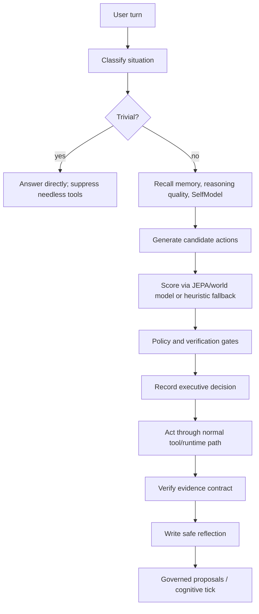

# Cognitive Executive Loop

The Cognitive Executive Loop coordinates Archon's learning systems into a
bounded, policy-governed controller. It observes a user turn, classifies the
situation, recalls safe context, plans candidate actions, scores them with the
world model when available, applies policy gates, records a compact decision,
verifies meaningful actions, reflects on the outcome, and feeds governed
learning proposals.

It is not a hidden chain-of-thought store. The persisted records are compact
labels, hashes, candidate ids, verification contracts, outcomes, and lessons.
Raw user text is not stored unless policy explicitly opts into it.

## Runtime stages

| Stage | Purpose | Fails how |
|---|---|---|
| Situation classifier | Separates greetings, simple questions, code changes, CI debug, pipeline control, world-model work, research, and high-risk requests | Foreground work continues with conservative defaults |
| Tool-use gate | Suppresses pointless probes for trivial turns and non-repo git probes | Tool is allowed if the gate is unavailable |
| SelfModel | Reads trust, failure clusters, and caution rules by domain | Neutral profile |
| Candidate planner | Produces 2-5 action candidates with risk, expected evidence, and rollback hints | Direct answer or clarification |
| World-model scorer | Uses promoted latent/JEPA model when available | Heuristic `prediction_unavailable` score |
| Policy gate | Denies high-risk, unavailable-policy, prompt/policy/network/blocking-gate changes | Safe direct answer/clarification |
| Verification contract | Requires evidence for code changes, commits, CI debug, world-model promotion, and quality-gate overrides | Completion is marked not-run/skipped/degraded |
| Reflection writer | Stores compact outcome lessons for later governed learning | Reflection skipped, no foreground failure |
| Cognitive tick | Replays dead letters, evaluates repeated lessons, and optionally applies low-risk proposals | Audit row records errors |
| Cognitive daemon | Runs bounded tick jobs on an interval with lock/state files | Does not start unless config and policy both opt in |

## Storage

Project-local state lives under `<workspace>/.archon/cognitive/`:

| File or relation | Purpose |
|---|---|
| `cognitive.db` | Cozo-backed relations for situations, candidates, decisions, reflections, policy state, tick audit |
| `cognitive-decisions.jsonl` | Append-only decision ledger |
| `cognitive-reflections.jsonl` | Append-only reflection ledger |
| `cognitive-daemon-state.json` | Last daemon heartbeat, tick count, and safe status |
| `cognitive-daemon.lock` | Single-runner lockfile for daemon ownership |

The CLI, TUI, and web surfaces read the same persisted state. They should never
invent state from canned labels.

## Safety rules

- Store hashes and summaries, not raw prompt text.
- Do not store hidden chain-of-thought.
- Treat world-model/JEPA predictions as advisory.
- Keep autonomous application behind `policy.cognitive`.
- Require `allow_background_daemon = true` before starting unattended ticks.
- Require human review for prompt, policy, network, and blocking-gate changes.
- Continue foreground work if cognitive storage or scoring is unavailable.

See [Cognitive commands](../reference/cognitive-commands.md) and
[Cognitive configuration](../reference/cognitive-config.md).
