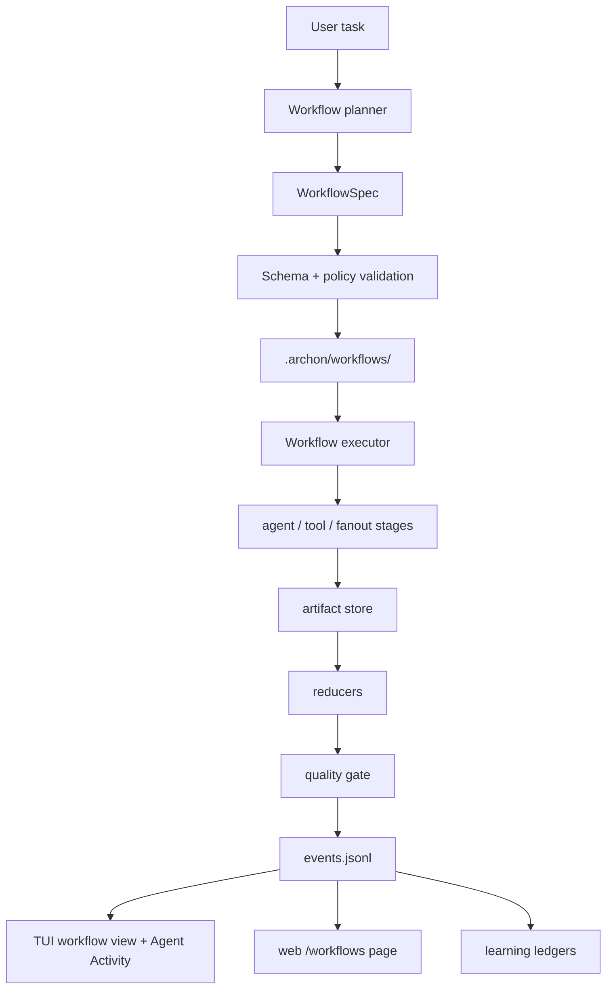

# Dynamic workflows

Dynamic workflows are Archon's provider-neutral runtime for large ad hoc tasks
that need a durable plan, multiple stages, fan-out/fan-in, resumable state, and
compact progress outside the parent chat context.

They are implemented by the `archon-workflow` crate and are separate from the
static coding, research, and game-theory pipelines. The intent is to share the
runtime substrate over time without breaking the audited pipeline lanes.

## Runtime model



## WorkflowSpec

A workflow plan is YAML with:

- `schema: archon.workflow.v1`
- `name` and `task`
- `max_parallelism` and `max_agents`
- provider tiers such as `planner`, `critic`, and `reducer`
- stages of kind `agent`, `fanout`, `reduce`, `condition`, `tool`,
  `checkpoint`, `quality_gate`, or `human_gate`
- artifact, permission, quality-gate, and learning-hook metadata

Provider-specific model IDs are not allowed inside stages. A stage may request
a capability tier, but the active provider configuration resolves the concrete
provider/model at runtime.

## Durable state

Each run lives under:

```text
.archon/workflows/<run-id>/
```

The run directory contains `manifest.toml`, `spec.yaml`, `state.json`,
`events.jsonl`, `artifacts/`, `agent-outputs/`, `prompts/`, `reducers/`,
`quality/`, and `learning/`.

State writes use temp-file plus rename. Artifacts carry content hashes,
producer stage, source-input hash, and accepted status so resume/reuse can
reject stale or poisoned outputs.

## Safety model

Dynamic workflow validation rejects:

- unknown stage kinds
- unknown dependencies
- dependency cycles
- fan-out stages without a downstream reducer
- hard-coded provider or model fields
- policy-denied dangerous tool stages

Event payloads are sanitized before persistence. Provider-private reasoning
fields such as `thinking`, `reasoning_encrypted`, OAuth tokens, API keys, and
authorization headers are stripped.

## Command surface

Shell:

```bash
archon workflow plan "Audit this repository deeply"
archon workflow run "Audit this repository deeply"
archon workflow status <run-id>
archon workflow resume <run-id>
archon workflow restart-agent <run-id> <stage-id>
archon workflow save <run-id> repo-deep-audit
archon workflow list
```

TUI:

```text
/workflow plan Audit this repository deeply
/workflow run Audit this repository deeply
/workflow status <run-id>
/workflow resume <run-id>
/workflow restart-agent <run-id> <stage-id>
/workflow save <run-id> repo-deep-audit
/workflow list
```

When invoked from the TUI, `plan`, `run`, and `resume` use the active TUI LLM
adapter. `plan` asks the active provider for `archon.workflow.v1` YAML, validates
it locally, and attempts one schema repair before falling back to the heuristic
planner. `run` and `resume` execute workflow stages through the same in-process
adapter so Agent Activity shows the run id, stage/agent name, status, provider
tier detail, and resolved model alias. Shell commands keep the deterministic
offline execution path for smoke tests and scripted inspection.

`/workflow list` opens the Dynamic Workflows TUI view with recent durable runs.
`/workflow status <run-id>` opens the same view scoped to stage rows, including
failed and retried stages.

## Web workbench

The web workbench exposes a dedicated **Workflows** page backed by:

```text
GET /api/workflows/summary
```

The response lists durable runs, accepted/failed stage counts, artifact counts,
sanitized recent events, and policy-gated controls. Raw tool output and
provider-private reasoning fields are not returned.

## Learning records

Completed and failed workflow runs write inspectable records under:

```text
.archon/workflows/<run-id>/learning/
```

The ledger files are:

- `records.jsonl` — every stage outcome for audit visibility
- `durable-memory.jsonl` — accepted stages with artifacts only
- `world-traces.jsonl` — trace references for world-model/JEPA consumers
- `governed-proposals.jsonl` — proposal records only; no auto-apply

Failed, forced, skipped, or still-running stages are recorded for audit but are
not treated as durable memory.

## Current integration status

The first implementation provides the provider-neutral crate, spec validation,
durable store, event sanitization, deterministic shell executor, live TUI
planner and runner through the active LLM adapter, lifecycle commands, template
sanitizer, TUI workflow view, web workflow page/API, and learning ledgers.

The static `/archon-code`, `/archon-research`, and `/gametheory` paths remain
the production subagent-backed pipelines. Dynamic workflows are the new runtime
foundation for generated workflows; static audited lanes remain first-class.
