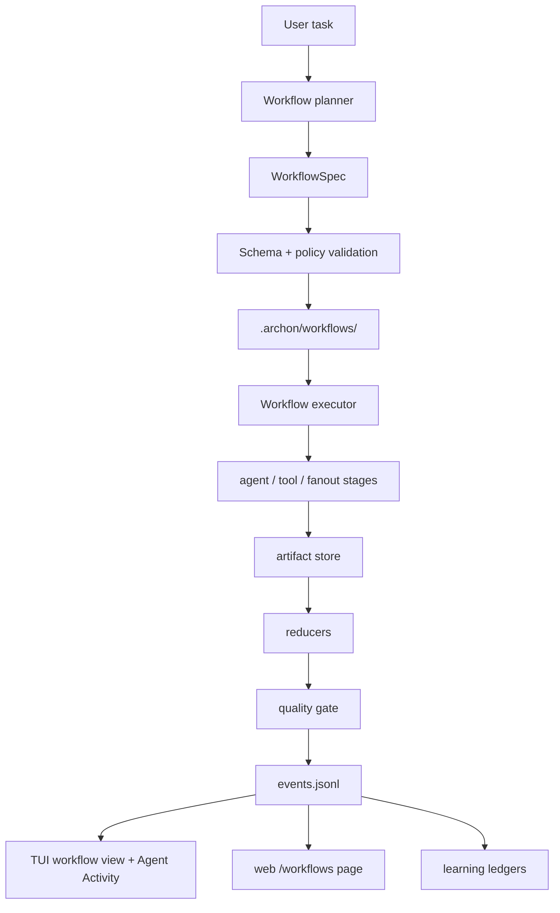

# Dynamic workflows

Dynamic workflows are Archon's provider-neutral runtime for large ad hoc tasks
that need a durable plan, multiple stages, fan-out/fan-in, resumable state, and
compact progress outside the parent chat context.

They are implemented by the `archon-workflow` crate and are separate from the
static coding, research, and game-theory pipelines. The intent is to share the
runtime substrate over time without breaking the audited pipeline lanes.

## Runtime model


```mermaid
flowchart TB
    USER["User task"] --> PLAN["Workflow planner"]
    PLAN --> SPEC["WorkflowSpec"]
    SPEC --> VALIDATE["Schema + policy validation"]
    VALIDATE --> STORE[".archon/workflows/<run-id>"]
    STORE --> EXEC["Workflow executor"]
    EXEC --> AGENT["agent / tool / fanout stages"]
    AGENT --> ART["artifact store"]
    ART --> REDUCE["reducers"]
    REDUCE --> QUALITY["quality gate"]
    QUALITY --> EVENTS["events.jsonl"]
    EVENTS --> TUI["TUI workflow view + Agent Activity"]
    EVENTS --> WEB["web /workflows page"]
    EVENTS --> LEARN["learning ledgers"]
```

## WorkflowSpec

A workflow plan is YAML with:

- `schema: archon.workflow.v1`
- `name` and `task`
- `max_parallelism` and `max_agents`
- stages of kind `agent`, `fanout`, `reduce`, `tool`, `checkpoint`,
  `quality_gate`, `human_gate`, or `implementation`
- permission and learning-hook metadata

Provider-specific model IDs are not allowed inside stages. A stage may request
a capability tier via `provider_tier`, but the active provider configuration
(`WorkflowConfig::provider_tiers`) resolves the concrete provider/model at
runtime.

Generated plans may include a concise per-stage `task` objective. Live generated
specs are normalized before validation: `inputs`/`outputs` metadata can infer
missing `depends_on` edges, missing agent names fall back to the stage id,
missing fan-out `foreach` values run as a single item, and missing reducer kinds
default to `evidence_weighted_report`.

`reducer` is declarative. It records what a `reduce` stage is *for*; nothing
dispatches on it. Reduction is performed by an agent, except for
`w.finalReport()`, which is assembled deterministically from typed prior
host-call results by `WorkflowV2FinalReportBuilder`. A deterministic
`ReducerRegistry` with seven implementations once sat behind these names with
no call site anywhere in the tree — not even its input producer was reachable
— and its contract (N text blobs in, one markdown document out) did not match
what a live `reduce` call returns, which is a typed result envelope carrying
routing data the scheduler consumes. It was deleted rather than wired.

A spec-level `provider_tiers`, `artifact_policy`, or `quality_gates` block is
accepted and ignored for backward compatibility. None of the three was ever
read; tier resolution has always come from `WorkflowConfig`, and quality gates
are expressed as `quality_gate` stages. A `condition` stage kind is likewise
accepted and loaded as `checkpoint`: no condition evaluator was ever wired up,
so such a stage always proceeded unconditionally.

Write-capable generated plans must use a typed implementation contract. Known
single-stage edits use `kind: implementation` with `expected_target_files`.
Per-task fan-out edits use `kind: fanout` with `item_kind: implementation`; each
item must carry `target_files`, and the runtime grants write tools to each item
only after binding acceptance to those target files. A text-only fan-out cannot
stand in for implementation.

## Durable state

Each run lives under:

```text
.archon/workflows/<run-id>/
```

The run directory contains `manifest.toml`, `spec.yaml`, `state.json`,
`events.jsonl`, `artifacts/`, `agent-outputs/`, `prompts/`, `quality/`, and
`learning/`. (A `reducers/` directory used to be created here and never
written to; it went with the unreachable reducer registry.)

State writes use temp-file plus rename. Artifacts carry content hashes,
producer stage, source-input hash, and accepted status so resume/reuse can
reject stale or poisoned outputs.

## Safety model

Dynamic workflow validation rejects:

- unknown stage kinds
- unknown dependencies
- dependency cycles
- hard-coded provider or model fields
- hard-coded provider/model values inside generated provider-tier maps or lists
- policy-denied dangerous tool stages
- implementation fan-out stages without inline items or `foreach`

Event payloads are sanitized before persistence. Provider-private reasoning
fields such as `thinking`, `reasoning_encrypted`, OAuth tokens, API keys, and
authorization headers are stripped.

Live stage execution also has an evidence contract. Stage agents receive a
structured input envelope with `stage_input`, upstream `dependencies`, and
`source_files` extracted from the workflow task or stage payload. Fan-out stages
can derive their items from upstream artifacts such as `${discover.items}`;
payloads that name project-local files are enriched with bounded source-file
content before the live agent runs. Reducers consume the actual accepted
artifact content instead of placeholder summaries.

If a live stage reports that it is blocked, missing evidence, unable to audit,
or has empty findings because required file/artifact content was absent, Archon
marks the stage failed. Quality gates inspect upstream artifacts for the same
blocked/no-evidence signals, so hollow live runs cannot pass merely because an
agent returned a polite report.

## Command surface

Shell:

```bash
archon workflow plan "Audit this repository deeply"
archon workflow run "Audit this repository deeply"
archon workflow run --live "Audit this repository deeply"
archon workflow run --spec-file workflow.yaml --live
archon workflow run --from-template repo-deep-audit --live
archon workflow status <run-id>
archon workflow resume <run-id> --live
archon workflow restart-agent <run-id> <stage-id>
archon workflow force-accept <run-id> <stage-id> "audit rationale"
archon workflow save <run-id> repo-deep-audit
archon workflow list
```

TUI:

```text
/workflow plan Audit this repository deeply
/workflow run Audit this repository deeply
/workflow run --spec-file workflow.yaml
/workflow run --from-template repo-deep-audit
/workflow status <run-id>
/workflow resume <run-id>
/workflow restart-agent <run-id> <stage-id>
/workflow force-accept <run-id> <stage-id> audit rationale
/workflow save <run-id> repo-deep-audit
/workflow list
```

When invoked from the TUI, `plan`, `run`, and `resume` use the active TUI LLM
adapter. `plan` asks the active provider for `archon.workflow.v1` YAML, validates
it locally, and attempts one schema repair. If the live plan still fails
validation, the command fails instead of falling back to the deterministic smoke
planner. `run` and `resume` execute workflow stages through the same in-process
adapter so Agent Activity shows the run id, stage/agent name, status, provider
tier detail, and resolved provider model. Shell commands keep the deterministic
offline execution path for smoke tests and scripted inspection unless `--live`
is passed. In live shell mode, Archon builds the configured provider-neutral
pipeline adapter and runs stages as real LLM-backed agents. Saved templates are
reusable with `archon workflow run --from-template <name>` or
`/workflow run --from-template <name>`. Existing YAML specs are reusable with
`--spec-file`; validation still rejects hard-coded `provider` or `model` fields.

`/workflow list` opens the Dynamic Workflows TUI view with recent durable runs.
`/workflow status <run-id>` opens the same view scoped to stage rows, including
failed and retried stages.

## Web workbench

The web workbench exposes a dedicated **Workflows** page backed by:

```text
GET /api/workflows/summary
GET /api/workflows/<run-id>
GET /api/workflows/<run-id>/events?after=<seq>
GET /api/workflows/<run-id>/stream
POST /api/workflows/control
```

The page lists durable runs, opens stage/artifact detail, follows sanitized
events through SSE, and submits policy-gated lifecycle controls. `resume`,
`pause`, `cancel`, `restart-stage`, and `force-accept` all go through the same
server-side lifecycle controller as the CLI/TUI. Forced acceptance requires an
explicit rationale and writes a durable `forced_accepted` audit event; it does
not turn the stage into durable memory.

Raw tool output and provider-private reasoning fields are not returned.

## Learning records

Every run gets a `.archon/workflows/<run-id>/learning/` directory — it is one
of the fixed run subdirectories created up front — and two things write into
it.

`record_write_coordination_outcome` appends metadata-only rows (file paths,
blake3 hashes, sizes; never patch content) to
`write-coordination/outcomes.jsonl` when a coordinated write completes.

`WorkflowLearningSink`
([`learning.rs`](../../crates/archon-workflow/src/learning.rs)) writes
**one** stream, `records.jsonl`, at run completion: one line per stage
outcome, carrying the stage's status, verification, quality score, artifact
references, retry telemetry, and the spec's `learning_hooks` verbatim. An
earlier design demultiplexed the same outcomes into ten files
(`durable-memory.jsonl`, `world-traces.jsonl`, `governed-proposals.jsonl` and
six `adapter-*.jsonl`); those are gone. Routing is the reader's job, and
`learning_hooks` is what it routes on.

The reader is the topology fold
([`src/command/topology_fold/workflow_learning.rs`](../../src/command/topology_fold/workflow_learning.rs)).
`archon-workflow` depends on exactly one Archon crate and cannot reach
`LearningIntegration` — that thinness is why persistence here is file-based
in the first place — so the file handoff crosses the boundary and the binary,
which is the composition root for the learning stack, consumes it. Hooks that
name a subsystem reachable through `LearningIntegration` (`sona`,
`reasoning_bank`, `desc`) dispatch a completed stage outcome into it; hooks
with no write-side entry point (`world_model`, `jepa`, `rlm`, `reflexion`)
are counted and reported as unrouted rather than silently dropped. **An empty
`learning_hooks` list dispatches nothing.**

## Current integration status

The implementation provides the provider-neutral crate, spec validation,
durable store, event sanitization, deterministic shell executor, live TUI
planner and runner through the active LLM adapter, lifecycle commands, forced
acceptance audit, template sanitizer, TUI workflow view, web workflow
SSE/control API, metadata-only write-coordination outcome records, and the
single per-stage learning record stream with its `learning_hooks`-routed
consumer in the topology fold.

The static `/archon-code`, `/archon-research`, and `/gametheory` paths remain
the production subagent-backed pipelines. Dynamic workflows are the new runtime
foundation for generated workflows; static audited lanes remain first-class.
