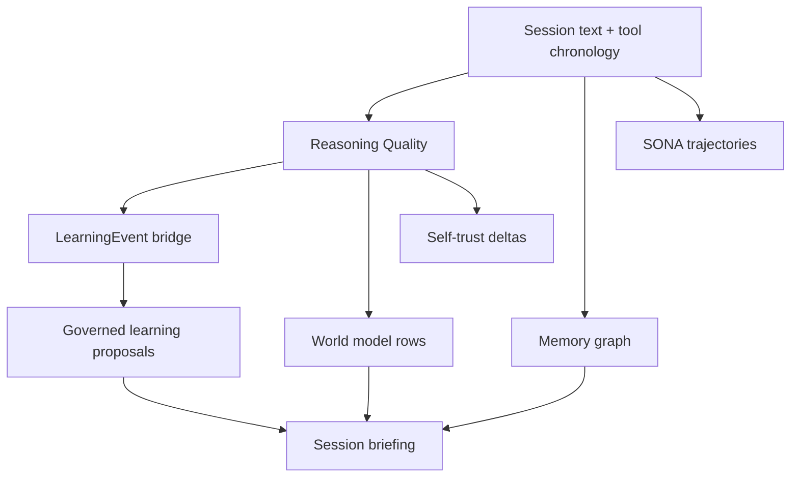

# Learning Systems Index

Archon has several learning surfaces. This page defines which subsystem owns which signal so future work does not duplicate storage, trust updates, or behavioral changes.

| System | Owns | Does Not Own |
|---|---|---|
| Memory graph | Durable facts, entities, relationships, embeddings, recall context. | Behavior changes or trust scoring. |
| Memory garden | Consolidation, decay, pruning, and session-start memory briefing. | Claim correctness. |
| ReasoningBank | Runtime reasoning modes and mode selection. | Persistent learning rows. |
| SONA | Trajectory patterns for agent and pipeline execution. | Text-level claim quality. |
| GNN enhancer | Graph-aware embedding enhancement and triplet training. | User-facing decisions. |
| CausalMemory | Cause/effect hyperedges and causal retrieval. | Completion verification. |
| Completion integrity | Evidence-backed completion claims, false-completion incidents, subagent trust. | General assistant claim calibration. |
| Self-calibration | Post-session retrospectives, plan-vs-outcome inspection, self-trust reporting. | Per-turn claim emission. |
| Governed learning | LearningEvents, behavior proposals, policy-gated manifests, rollback. | Raw extraction from conversation text. |
| World model | Local trace corpus, latent next-state prediction, advisory risk/counterfactuals. | Authoritative truth or behavior changes without policy. |
| Reasoning Quality | Visible claim/evidence events, user correction links, critic rows, briefing warnings. | Hidden chain-of-thought, source ingestion, or standalone governance. |

## Signal Routing

## Rules

- Reasoning-quality rows are canonical for visible claim mistakes.
- Retrospectives may summarize reasoning-quality rows, but must not double-count trust updates for the same claim.
- World-model rows derived from reasoning quality count as trace evidence, not as independent truth.
- Behavior-changing outcomes still go through governed learning and policy gates.
- LLM critics are advisory. Deterministic chronology, user correction, and source contradiction carry stronger trust weight.

## Storage Map

| Store | Default Path | Retention |
|---|---|---|
| Reasoning Quality | `~/.archon/reasoning-quality/` | JSONL events plus Cozo indexes; raw text off by default. |
| World Model | `~/.archon/world-model/` | JSONL rotates at 500 MB, raw rows 90 days, summaries retained. |
| Learning | `~/.archon/learning.db` | Cozo governed-learning events and proposals. |
| Self-trust | `.archon/self-calibration/trust/self-trust.json` | Small JSON counters, file-locked updates. |
| Sessions | `~/.archon/sessions/` | Session transcripts and activity logs. |

## Maintenance Check

When adding a new learning feature, update this page with:

- The signal it owns.
- Which existing system it consumes.
- Which bridges it writes.
- Whether trust is shadow-only, active, or never applied.
- Which policy gates control outbound data flow or behavior changes.
