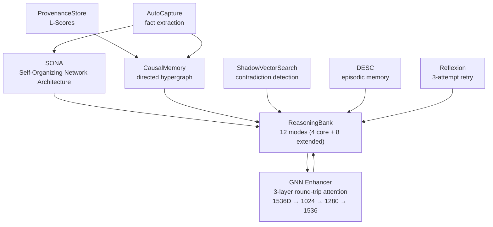
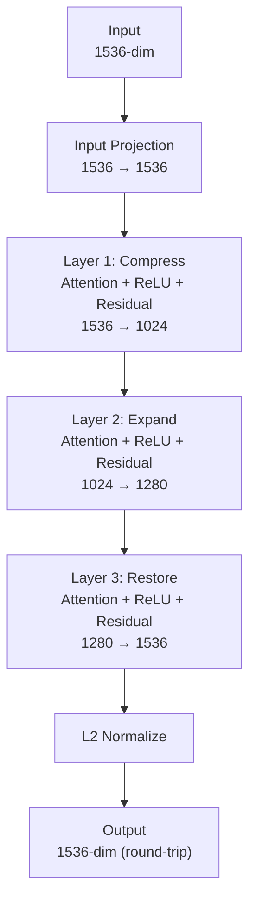

# Learning systems

archon-cli's pipeline engine includes 8 interconnected learning subsystems. They provide trajectory optimization, causal reasoning, graph neural enhancement, and contradiction detection. All systems accept `Option<T>` dependencies — when a system is unavailable, the pipeline continues with reduced capability rather than failing (`REQ-LEARN-013`).

## Component map



## System details

### SONA (Self-Organizing Network Architecture)

Trajectory-based pattern store. Every agent step (route, agent_key, outcome, metadata) is captured as a `Trajectory`. SONA clusters similar trajectories into patterns; agents query SONA for relevant prior trajectories before acting.

- **Storage:** CozoDB `sona_trajectories` relation
- **Embeddings:** trajectory embeddings via fastembed (768-dim) or OpenAI (1536-dim)
- **Capture:** every successful agent dispatch via AutoCapture

### ReasoningBank — 12 reasoning modes

Multi-modal reasoning surface. The `ReasoningBank::reason()` dispatch routes to specialized engines based on either explicit `mode` selection or `ModeSelector::select()` keyword heuristics.

| Mode | Purpose |
|---|---|
| Deductive | General rules → specific conclusions |
| Inductive | Specific observations → general rules |
| Abductive | Best-explanation reasoning |
| Analogical | Structural-similarity transfer |
| Adversarial | Counterexample / red-team |
| Counterfactual | Alternate-outcome "what if" |
| Temporal | Time-aware sequence |
| Constraint | Constraint satisfaction |
| Decomposition | Sub-problem breakdown |
| FirstPrinciples | Axiom-based derivation |
| Causal | Cause-effect (backed by CausalMemory hypergraph) |
| Contextual | Context-aware similarity |

Plus 2 meta-modes: `PatternMatch` (legacy LLM template matching) and `Hybrid` (auto-aggregator across modes). 14 total enum variants; 12 named spec modes.

Each mode has a per-mode weight in `ReasoningBankConfig` for the Hybrid aggregator.

Engine modules live at `crates/archon-pipeline/src/learning/modes/*.rs`. The dispatch wiring is at `crates/archon-pipeline/src/learning/reasoning.rs:176`.

### GNN Enhancer — graph attention network

3-layer round-trip GNN matching root archon's TS reference implementation. Used to enhance embeddings with graph-context awareness.



- **Attention heads:** 12
- **Initialization:** He init for ReLU/leaky_relu activations, Xavier for tanh/sigmoid
- **Residual connections:** active where input/output dims match
- **Layer norm:** after residual, on each layer
- **Cache:** LRU + TTL with FNV-1a smart cache key (matches TS Math.imul behavior byte-for-byte)
- **Round-trip preserves dimensionality** so enhanced vectors can replace originals in the same vector store

Training infrastructure:
- **Optimizer:** Adam with bias correction, persisted state via CozoDB `gnn_adam_state` relation
- **Loss:** triplet contrastive loss with HardestNegative selection
- **Regularization:** EWC (Elastic Weight Consolidation) with Fisher information matrix
- **Early stopping:** `epochs_since_improvement >= patience` triggers stop, restores best-epoch weights
- **NaN guard:** training run rolls back to prior weight version if any layer goes NaN/Inf, or if final loss > initial loss × 1.1

Auto-retraining (`AutoTrainer`):
- Background tokio task with `spawn_blocking` for the sync trainer call
- 60s tick interval checks 3 trigger conditions (any fires):
  - 50 new memories since last run
  - 6h elapsed since last run
  - 5 user corrections since last run
- 1h minimum throttle between runs
- 5min max runtime per run, 256 triplets max per batch
- First-run kickoff at startup if existing memory_count > 100
- Versioned weight snapshots in `gnn_weights` relation

### CausalMemory — directed hypergraph

Stores cause-effect relationships as directed hyperedges (cause set → effect set). Used by ReasoningBank's Causal mode for cause-tracing and root-cause analysis.

- **Storage:** CozoDB `causal_nodes` + `causal_hyperedges` relations
- **Insertion:** AutoCapture extracts causal claims from agent transcripts
- **Query:** backward and forward graph traversal with cycle detection

### ProvenanceStore — L-Scores

Each memory carries an L-Score (Lineage Score) tracking source reliability. Memories with high-quality provenance are weighted more in ReasoningBank queries.

- **Score range:** 0.0 (dubious) to 1.0 (verified)
- **Decay:** L-Scores decay over time without reinforcement
- **Reinforcement:** successful prediction events boost the L-Score of contributing memories

### ShadowVectorSearch — contradiction detection

Detects when newly captured memories contradict existing ones. Runs alongside the primary memory search; flags conflicts so the agent can reconcile or escalate.

### DESC — episodic memory

Detailed Episodic Storage and Compression. Stores full agent episodes with structured metadata; supports retrieval by episode similarity.

### Reflexion — 3-attempt retry loop

When an agent task fails, Reflexion captures the failure, generates a self-critique, and retries up to 3 times with the critique injected into context. Configured in `[reflexion]` section.

### AutoCapture & AutoExtraction

- **AutoCapture:** records every successful agent dispatch as a trajectory
- **AutoExtraction:** parses transcripts for structured facts (entities, relationships, claims) and stores them in the memory graph

## Wiring (pipeline runner)

`LearningIntegration` orchestrates all 8 systems. Construction site: `crates/archon-pipeline/src/runner.rs:388,402`.

```rust
LearningIntegration::new(
    Some(sona),
    Some(reasoning_bank),
    Some(auto_trainer),
    config,
)
```

All deps are `Option<T>` for graceful degradation. Hooks fire on:
- `on_agent_start` — query ReasoningBank for context, create SONA trajectory
- `on_agent_complete` — finalize trajectory, capture facts via AutoCapture, signal AutoTrainer
- `on_correction_recorded` — increment correction counter, may trigger retrain
- `score_quality` — assigns quality score to trajectory for triplet sampling

## /learning-status

The `/learning-status` slash command reports config-derived enabled/disabled state of all 8 subsystems plus AutoTrainer telemetry:

```
GNN
├─ enabled         true
├─ weight_version  3
├─ last_run        2026-04-28T12:34:56Z (reason=memory_threshold, loss=0.412→0.298)
├─ next_eligible   2026-04-28T13:34:56Z
├─ total_runs      7
└─ total_rollbacks 0

ReasoningBank
├─ enabled         true
├─ modes           14 (12 spec + PatternMatch + Hybrid)
└─ trajectories    1240

[other systems...]
```

## Configuration

```toml
[learning.gnn]
enabled = true
input_dim = 1536
output_dim = 1536
num_layers = 3
attention_heads = 12
max_nodes = 50
use_residual = true
use_layer_norm = true
activation = "relu"

[learning.gnn.training]
learning_rate = 0.001
batch_size = 32
max_epochs = 10
early_stopping_patience = 3
validation_split = 0.2
ewc_lambda = 0.1
margin = 0.5
max_gradient_norm = 1.0
max_triplets_per_run = 256
max_runtime_ms = 300000

[learning.gnn.auto_trainer]
enabled = true
min_throttle_ms = 3600000     # 1 hour
trigger_new_memories = 50
trigger_elapsed_ms = 21600000 # 6 hours
trigger_corrections = 5
first_run_threshold = 100
max_runtime_ms = 300000       # 5 minutes
max_triplets_per_run = 256

[reasoning_bank]
default_max_results = 5
default_confidence_threshold = 0.7
default_min_l_score = 0.3
enable_trajectory_tracking = true
enable_auto_mode_selection = true
# Per-mode weights (used by Hybrid aggregator)
deductive_weight = 1.0
inductive_weight = 1.0
abductive_weight = 1.0
analogical_weight = 1.0
adversarial_weight = 1.0
counterfactual_weight = 1.0
temporal_weight = 1.0
constraint_weight = 1.0
decomposition_weight = 1.0
first_principles_weight = 1.0
causal_weight = 1.0
contextual_weight = 1.0
pattern_weight = 0.5

[reflexion]
enabled = true
max_attempts = 3

[auto_extraction]
enabled = true
min_confidence = 0.6
```

## See also

- [Pipelines](pipelines.md) — how the learning systems integrate with the 50-agent and 46-agent pipelines
- [Configuration](../reference/config.md) — full config schema
- [Memory cookbook](../cookbook/memory-driven-coding.md) — using SONA + ReasoningBank in practice
