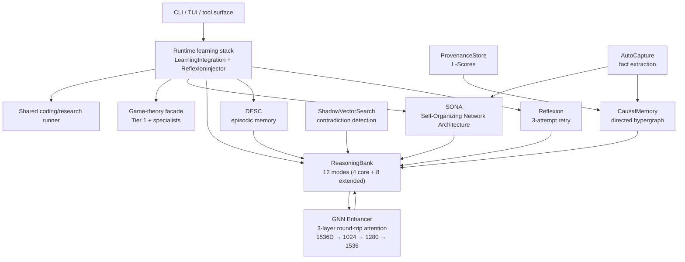
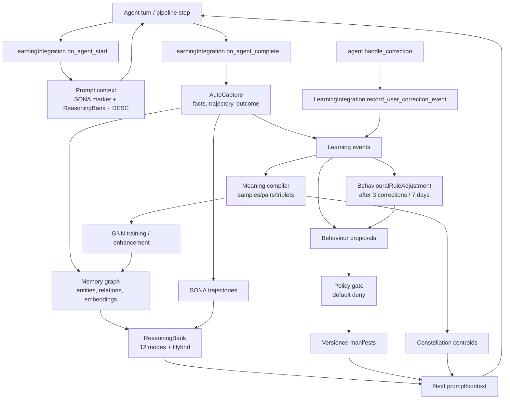
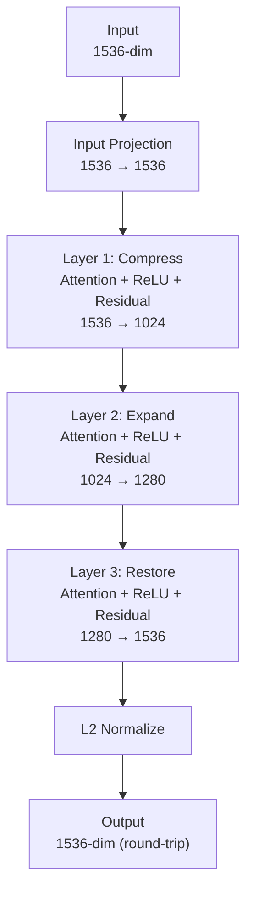

# Learning systems

archon-cli's pipeline engine includes 8 interconnected learning subsystems.
They provide trajectory optimization, causal reasoning, graph neural
enhancement, episodic recall, contradiction detection, and retry learning.
Runtime wiring is deliberately fail-open: every subsystem is optional, and when
one dependency is unavailable the pipeline continues with reduced capability
rather than failing (`REQ-LEARN-013`).

The persistent runtime stack now proves the live paths for SONA, ReasoningBank,
DESC, and Reflexion. Coding/research command surfaces build
`LearningIntegration` plus `ReflexionInjector` in
`src/command/pipeline_support.rs`; the shared runner injects the resulting
context into real agent execution; and the game-theory facade calls the same
learning start/complete hooks from classify, specialist, replay,
slash-command, and tool-executor paths.

## Component map



## Memory And Self-Learning Loop

Archon has two loops that reinforce each other. The first loop improves
reasoning during agent and pipeline execution. The second loop turns verified
outcomes into governed, inspectable system changes.



Practically, this means Archon can remember useful prior work, retrieve it
semantically, detect contradictions, learn from false completions or accepted
outputs, and suggest behaviour changes without silently rewriting itself.
Risky changes go through governed learning and policy gates.

v1.0.0 adds a self-calibration read path over the data Archon was already
writing. `archon self retrospective <session-id>` reads the session activity
JSONL, extracts a small set of evidence-backed lessons, writes a retrospective
artifact, and attempts to store matching memories plus LearningEvents. v1.0.1
adds the default `--analyzer hybrid` mode: it keeps the conservative local
extractor for source-tree mistakes, tool or agent failures, and verification
habits, then adds a provider-neutral LLM pass through the active configured
`LlmProvider`. That keeps Anthropic OAuth, Codex OAuth, and compatible providers
on the same validated path. Existing proactive memory injection emits
`MemorySurfaced` activity events, so later retrospectives can tell when prior
context was actually shown to the agent.
`archon self trust status` reports domain-scoped first-answer reliability using
the same Laplace-smoothed shape as completion trust, and `archon self plans
inspect <session-id>` compares stored plans with recorded step outcomes.

v1.2.0 adds the local world model as a separate, consumer-friendly learning
layer. It reads redacted session, pipeline, memory, retrospective, provider,
plan, transcript, and agent-output traces into `~/.archon/world-model`, learns a
compact latent transition model, and predicts likely next state plus auxiliary
risk labels. The world model is advisory and fail-open: cold start, store
failure, training, or backend failure records a typed unavailable event and the
foreground task continues. Shell and TUI coding/research pipelines, memory
reindex, governed agent evolution, and observed provider-runtime starts append
runtime advisory records through the same fail-open contract. Pipeline
completion links outcomes and audited bundles back to persisted predictions
when an active advisory model exists.

v1.2.0 also adds Reasoning Quality as the text-level claim/evidence signal.
It captures visible assistant claims, matching evidence chronology, user
corrections, later source verification, and later source contradictions into
`~/.archon/reasoning-quality`. Optional LLM critique runs through the active
provider only when config and policy allow it. These events feed governed
LearningEvents, world-model rows, self-trust deltas, and proactive session
briefing without becoming a hidden or unreviewable behavior change.

User corrections have a separate governed-learning edge. When
`agent.handle_correction` detects a correction, the existing memory graph,
inner-voice, GNN counter, and behavioural-rule reinforcement paths still run.
After rule reinforcement, the agent emits a `UserCorrected` event through
`LearningIntegration.record_user_correction_event`. The proposal engine scans
those events and emits a `BehaviouralRuleAdjustment` proposal when three or
more corrections cluster on the same rule id within seven days.
`archon learning tick` can run this loop end to end without human intervention
when `[policy.learning].autonomous_apply = true`, but the same policy gates
still enforce risk ceilings, evidence floors, recent-incident limits, and the
hard rule that `PolicyOverride` proposals never self-apply.

## System details

### SONA (Self-Organizing Network Architecture)

Trajectory-based pattern store. Agent steps are captured as `Trajectory` rows
with route, agent key, outcome, and metadata. SONA clusters similar
trajectories into patterns and supplies training samples to the GNN
auto-trainer.

- **Storage:** CozoDB `sona_trajectories` relation
- **Embeddings:** trajectory embeddings via fastembed (768-dim) or OpenAI (1536-dim)
- **Interactive capture:** normal interactive learning and TUI slash pipelines
  record when `learning.sona.enabled = true`
- **Batch capture:** `archon pipeline ...`, `archon gametheory ...`, and
  agent-callable GameTheory tools record SONA only when
  `learning.sona.pipeline_recording = true`
- **Prompt context:** the runner injects the active trajectory id into agent
  context so accepted output can be fed back to the same trajectory

### ReasoningBank — 12 reasoning modes

Multi-modal reasoning surface. The `ReasoningBank::reason()` dispatch routes to specialized engines based on either explicit `mode` selection or `ModeSelector::select()` keyword heuristics.

| Mode | Purpose |
|---|---|
| Deductive | General rules → specific conclusions |
| Inductive | Specific observations → general rules |
| Abductive | Best-explanation reasoning |
| Analogical | Structural-similarity transfer |
| Adversarial | Counterexample / red-team |
| Counterfactual | Alternate-outcome "what if" |
| Temporal | Time-aware sequence |
| Constraint | Constraint satisfaction |
| Decomposition | Sub-problem breakdown |
| FirstPrinciples | Axiom-based derivation |
| Causal | Cause-effect (backed by CausalMemory hypergraph) |
| Contextual | Context-aware similarity |

Plus 2 meta-modes: `PatternMatch` (legacy LLM template matching) and `Hybrid` (auto-aggregator across modes). 14 total enum variants; 12 named spec modes.

Each mode has a per-mode weight in `ReasoningBankConfig` for the Hybrid aggregator.

Engine modules live at `crates/archon-pipeline/src/learning/modes/*.rs`. The dispatch wiring is at `crates/archon-pipeline/src/learning/reasoning.rs:176`.

### GNN Enhancer — graph attention network

3-layer round-trip GNN matching root archon's TS reference implementation. Used to enhance embeddings with graph-context awareness.



- **Attention heads:** 12
- **Initialization:** He init for ReLU/leaky_relu activations, Xavier for tanh/sigmoid
- **Residual connections:** active where input/output dims match
- **Layer norm:** after residual, on each layer
- **Cache:** LRU + TTL with FNV-1a smart cache key (matches TS Math.imul behavior byte-for-byte)
- **Round-trip preserves dimensionality** so enhanced vectors can replace originals in the same vector store

Training infrastructure:
- **Optimizer:** Adam with bias correction, persisted state via CozoDB `gnn_adam_state` relation
- **Loss:** trajectory quality + EWC + hydrated meaning-triplet margin loss; per-epoch logs split `loss_quality`, `loss_ewc`, and `loss_triplet`
- **Regularization:** EWC (Elastic Weight Consolidation) with Fisher information matrix
- **Early stopping:** `epochs_since_improvement >= patience` triggers stop, restores best-epoch weights
- **NaN guard:** training run rolls back to prior weight version if any layer goes NaN/Inf, or if final loss > initial loss × 1.1

Auto-retraining (`AutoTrainer`):
- Background tokio task with `spawn_blocking` for the sync trainer call
- 60s tick interval checks 3 trigger conditions (any fires):
  - 20 new memories since last run
  - 6h elapsed since last run
  - 3 user corrections since last run
- 1h minimum throttle between runs
- 5min max runtime per run, 256 hydrated meaning triplets max per batch
- First-run kickoff if existing memory_count >= 30, or if 3 corrections arrive before the first run
- Versioned weight snapshots in `gnn_weights` relation

### CausalMemory — directed hypergraph

Stores cause-effect relationships as directed hyperedges (cause set → effect set). Used by ReasoningBank's Causal mode for cause-tracing and root-cause analysis.

- **Storage:** CozoDB `causal_nodes` + `causal_hyperedges` relations
- **Insertion:** AutoCapture extracts causal claims from agent transcripts
- **Query:** backward and forward graph traversal with cycle detection

### ProvenanceStore — L-Scores

Each memory carries an L-Score (Lineage Score) tracking source reliability. Memories with high-quality provenance are weighted more in ReasoningBank queries.

- **Score range:** 0.0 (dubious) to 1.0 (verified)
- **Decay:** L-Scores decay over time without reinforcement
- **Reinforcement:** successful prediction events boost the L-Score of contributing memories

### ShadowVectorSearch — contradiction detection

Detects when newly captured memories contradict existing ones. Runs alongside the primary memory search; flags conflicts so the agent can reconcile or escalate.

### DESC — episodic memory

Detailed Episodic Storage and Compression. Stores agent episodes with
structured metadata, filters high-quality prior episodes by phase/task type,
injects relevant summaries at agent start, and persists the current episode at
agent completion.

- **Storage:** CozoDB `desc_episodes` and `desc_episode_metadata`
- **Injection:** coding/research runner system context and game-theory prompt
  context
- **Persistence:** successful and low-quality completions are both recorded,
  with `outcome = "success"` or `"needs_improvement"`

### Reflexion — 3-attempt retry loop

When a shared-runner agent attempt misses its quality threshold, Reflexion
records the failed trajectory and retries with a formatted "prior failed
attempts" section injected into context. Configured in
`[learning.reflexion]`.

### AutoCapture & AutoExtraction

- **AutoCapture:** records every successful agent dispatch as a trajectory
- **AutoExtraction:** parses transcripts for structured facts (entities, relationships, claims) and stores them in the memory graph

## Wiring (pipeline runner)

Runtime construction happens in `src/command/pipeline_support.rs`.
`LearningIntegration` owns SONA, ReasoningBank, DESC, event-store, and
AutoTrainer hooks. `ReflexionInjector` is constructed beside it and passed into
the shared runner because Reflexion is retry-loop state, not persisted
trajectory state.

```rust
build_pipeline_learning_stack(config, cwd)
build_interactive_learning_stack(config, cozo_db, auto_trainer)
build_reflexion_injector(config)
```

All deps are `Option<T>` for graceful degradation. Hooks fire on:
- `on_agent_start` — create SONA trajectory, retrieve DESC episodes, query ReasoningBank context
- `on_agent_complete` — finalize SONA feedback, persist DESC episode, signal AutoTrainer
- `on_correction_recorded` — increment correction counter, may trigger retrain
- `record_user_correction_event` — persist `UserCorrected` events for governed proposals
- `score_quality` — assigns quality score to trajectory for triplet sampling

GameTheory does not use the shared coding/research bundle runner, but it does
call the same learning hooks from Tier 1 classification, specialist execution,
and replay. Its strategic source-of-truth tables stay `gt_*`; SONA/DESC are
cross-run learning signals rather than replacements for the GameTheory run
ledger.

Regression coverage for these live paths:

- `crates/archon-pipeline/tests/runner.rs::test_runner_persists_sona_trajectory_when_learning_supplied`
- `crates/archon-pipeline/tests/runner.rs::test_runner_injects_reasoning_bank_and_desc_context`
- `crates/archon-pipeline/tests/runner.rs::test_parallel_wave_injects_reflexion_context_on_retry`
- `crates/archon-pipeline/src/learning/integration/tests.rs::persistent_learning_stack_injects_reasoning_bank_and_desc_episodes`
- `crates/archon-pipeline/src/gametheory/facade/tests/pipeline.rs::test_full_pipeline_records_sona_when_learning_supplied`

## /learning-status

The `/learning-status` slash command reports config-derived enabled/disabled state of all 8 subsystems plus AutoTrainer telemetry:

```
GNN
├─ enabled         true
├─ weight_version  3
├─ last_run        2026-04-28T12:34:56Z (reason=memory_threshold, loss=0.412→0.298)
├─ next_eligible   2026-04-28T13:34:56Z
├─ total_runs      7
└─ total_rollbacks 0

ReasoningBank
├─ enabled         true
├─ modes           14 (12 spec + PatternMatch + Hybrid)
└─ trajectories    1240

[other systems...]
```

## Evidence Engine Learning Commands

The Evidence Engine adds CLI surfaces for inspecting learning state beyond the
pipeline telemetry view:

```bash
archon completion incidents
archon completion trust --agent verifier --model sonnet
archon behaviour status
archon behaviour list-events
archon behaviour generate-proposals
archon behaviour list --pending
archon behaviour approve <proposal-id>
archon behaviour history <manifest-kind>
archon meaning build --from learning-events
archon meaning triplets
archon learning gnn status
archon self retrospective <session-id>
archon self trust status
archon self plans inspect <session-id>
archon constellation build --target strategic-workflow
archon constellation bootstrap --target memory
archon constellation drift --target strategic-workflow --text "new workflow description"
```

Use these when you want to know not just "what did the model say?", but "what
did Archon store, learn, propose, apply, or reject?"

## Configuration

```toml
[learning.sona]
enabled = true
pipeline_recording = false

[learning.desc]
enabled = true

[learning.reasoning_bank]
enabled = true

[learning.reflexion]
enabled = true
max_per_agent = 3

[learning.gnn]
enabled = true
input_dim = 1536
output_dim = 1536
num_layers = 3
attention_heads = 12
max_nodes = 50
use_residual = true
use_layer_norm = true
activation = "relu"

[learning.gnn.training]
learning_rate = 0.001
batch_size = 32
max_epochs = 10
early_stopping_patience = 3
validation_split = 0.2
ewc_lambda = 0.1
margin = 0.5
triplet_loss_coefficient = 0.1
max_gradient_norm = 1.0
max_triplets_per_run = 256
max_runtime_ms = 300000

[learning.gnn.auto_trainer]
enabled = true
min_throttle_ms = 3600000     # 1 hour
trigger_new_memories = 20
trigger_elapsed_ms = 21600000 # 6 hours
trigger_corrections = 3
first_run_threshold = 30
max_runtime_ms = 300000       # 5 minutes
tick_interval_ms = 60000      # 1 minute

[auto_extraction]
enabled = true
min_confidence = 0.6
```

## See also

- [Pipelines](pipelines.md) — how the learning systems integrate with the 50-agent and 47-agent pipelines
- [Configuration](../reference/config.md) — full config schema
- [Memory cookbook](../cookbook/memory-driven-coding.md) — using SONA + ReasoningBank in practice
- [Governed learning](../governed-learning.md) — proposal, approval, and rollback workflow
