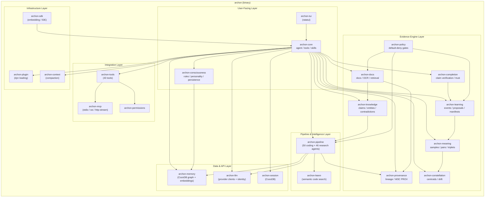
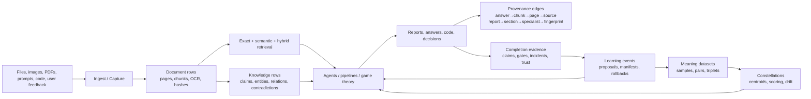

# Architecture overview

archon-cli is a Cargo workspace organized around one integration binary,
long-lived local state, multi-agent pipelines, and the Evidence Engine. The
`archon` binary is the integration point for CLI commands, slash commands,
TUI screens, agent tools, and background jobs.

## Layered crate structure

## Crates

| Crate | Purpose |
|---|---|
| `archon-cli-workspace` | Top-level binary (`archon`) |
| `archon-tui` | ratatui-based terminal UI |
| `archon-core` | Agent loop, tool dispatch, skill registry |
| `archon-consciousness` | Inner voice, rule engine, personality persistence |
| `archon-session` | Per-session checkpoint store (CozoDB) |
| `archon-memory` | Memory graph with embeddings (CozoDB) |
| `archon-llm` | Anthropic, Codex, native/provider-compatible clients + identity spoofing |
| `archon-tools` | Built-in tools, including Evidence Engine and game-theory tools |
| `archon-permissions` | 7 permission modes + rule lists + sandboxing |
| `archon-mcp` | Model Context Protocol transport |
| `archon-pipeline` | 50-agent coding pipeline, 46-agent research pipeline, audited bundles, game-theory pipeline, learning systems |
| `archon-leann` | LEANN semantic code search |
| `archon-docs` | Document ingest, OCR, VLM policy, embeddings, exact/semantic/hybrid retrieval |
| `archon-knowledge` | Claims, entities, relations, source quality, contradiction scanning |
| `archon-provenance` | Chain hashes, provenance traversal, W3C PROV JSON-LD export |
| `archon-completion` | Completion claim extraction, evidence gates, incidents, trust scores |
| `archon-learning` | Learning events, behaviour proposals, manifests, approval/rollback |
| `archon-meaning` | Derived labels, contrastive pairs, triplets, evaluation datasets |
| `archon-constellation` | Project/research/workflow centroids, scoring, drift detection |
| `archon-policy` | Layered TOML policy gates for risky behaviour |
| `archon-plugin` | Plugin loading + manifest parsing |
| `archon-sdk` | Embedding API + IDE bridge |
| `archon-context` | Context compaction |
| `archon-observability` | Metrics, tracing, structured logs |

The remaining crates are internal helpers and test/observability support.

## Evidence Engine Flow

The Evidence Engine adds a durable reasoning loop on top of the agent loop:

The key principle is full-state verification: every important claim should have
a source of truth you can inspect separately from the model response.

## Request lifecycle

When you send a message in the TUI:

1. **TUI** captures input, builds a `UserMessage`.
2. **Session** appends the message to the session journal (CozoDB).
3. **Core agent loop** assembles context:
   - Recent turns from session
   - Relevant memories from memory graph (semantic search)
   - Active rules from consciousness layer
   - System prompt (with identity spoofing layer if enabled)
4. **LLM client** sends the request to the active provider: Anthropic, Codex, a native provider, or a compatible proxy.
5. Response streams back; tool calls are dispatched to the tools registry.
6. Each tool call passes through **permissions** before execution.
7. Tool results feed back into the agent loop until the model returns a final assistant message.
8. **Memory** ingests new facts via AutoCapture.
9. **Pipeline** can be invoked at any point via `/archon-code`, `/archon-research`, or `/run-agent`.

## Concurrency model

Built on tokio multi-thread runtime. Critical constraints:

- Subagent dispatch uses `tokio::task::spawn` (not `std::thread::spawn`)
- Long-running synchronous work runs inside `tokio::task::spawn_blocking` so the runtime keeps polling
- `tokio::Mutex::blocking_lock` is forbidden in async paths (caused panics pre-v0.1.13)
- Background trainers (GNN auto-retraining, memory garden consolidation) yield via `tokio::task::yield_now()` between batches

## Data persistence

| Store | Backend | What it holds |
|---|---|---|
| Session checkpoints | CozoDB (mem + disk) | Per-session message journal, fork lineage, recovery state |
| Memory graph | CozoDB | Semantic memories, relationships, embeddings |
| Document evidence | CozoDB | Document sources, OCR runs, pages, chunks, embeddings, answer provenance |
| Knowledge base | CozoDB | Claims, entities, relations, source quality, contradictions |
| Game-theory runs | CozoDB | Fingerprints, routing, specialists, sections, reports, checkpoints |
| Completion integrity | CozoDB | Claims, evidence, gate results, false-completion incidents, trust scores |
| Governed learning | CozoDB | Learning events, proposals, manifests, policy decisions, rollbacks |
| Meaning and constellations | CozoDB | Samples, contrastive pairs, triplets, centroids, drift reports |
| Learning telemetry | CozoDB | GNN weights, training runs, ReasoningBank patterns, SONA trajectories |
| Logs | flat text files | Per-session human-readable logs |
| Config | TOML | User + project layered config |
| OAuth tokens | JSON | Refresh tokens with file locking |

CozoDB is the system-wide vector/graph store. Schema initialization happens on first run.

## Threading model: parent + subagents

- Parent agent runs in the main TUI/print loop
- Subagents (spawned via `Agent` tool or `/run-agent`) run as child tokio tasks
- Each subagent gets an `Arc<AgentConfig>` so live config changes (model swap, effort change, fast mode toggle) propagate without restart
- Subagents share the parent's LLM client and identity (so spoofing layer is consistent)
- Subagent output streams back via channels; parent collects results and re-injects into its context

## Identity spoofing

When `[identity] mode = "spoof"` is set in config, archon-cli mimics the original Claude Code client when calling the Anthropic API:

- Discovers installed Claude Code version from `package.json` at the binary's parent dir
- Adds `x-anthropic-billing-header` text block at the start of system prompt
- Spoofs `User-Agent`, `x-stainless-os`, `anthropic-beta` headers based on installed Claude Code identity
- Falls back to config defaults if no Claude Code installation is detected

See [Identity & spoofing](../integrations/identity-spoofing.md) for full details.

## Learning systems

The self-learning layer has two complementary halves:

- Pipeline learning systems optimize reasoning behaviour from trajectories,
  memories, graph structure, and corrections.
- Evidence Engine governed learning converts verified outcomes into reviewable
  proposals, manifests, meaning datasets, and constellation centroids.

8 interconnected pipeline learning subsystems (see [Learning systems](learning-systems.md) for details):

1. **SONA** — Self-Organizing Network Architecture (trajectory-based pattern store)
2. **ReasoningBank** — 12 reasoning modes (deductive, inductive, abductive, analogical, adversarial, counterfactual, temporal, constraint, decomposition, first-principles, causal, contextual)
3. **GNN Enhancer** — 3-layer round-trip graph attention network (1536→1024→1280→1536)
4. **CausalMemory** — directed hypergraph of causal relationships
5. **ProvenanceStore** — L-Score system tracking memory reliability
6. **DESC** — Episodic memory store
7. **Reflexion** — 3-attempt retry loop with self-critique
8. **AutoCapture** — automatic fact extraction from agent transcripts

Evidence Engine learning surfaces:

1. **Learning events** — retrieval, routing, completion, correction, and outcome signals
2. **Behaviour proposals** — suggested changes generated from evidence
3. **Versioned manifests** — applied prompt/policy/threshold/routing changes with rollback
4. **Meaning compiler** — labels, contrastive pairs, triplets, and eval datasets
5. **Constellations** — project/domain/workflow centroids for scoring and drift detection

## See also

- [Learning systems](learning-systems.md) — full deep dive on the 8 subsystems
- [Pipelines](pipelines.md) — 50-agent coding + 46-agent research orchestration with audited run bundles
- [Evidence Engine](../evidence-engine.md) — durable evidence, provenance, and governed learning
- [Crate-level diagrams](https://github.com/ste-bah/archon-cli) — code layout in the repo itself
