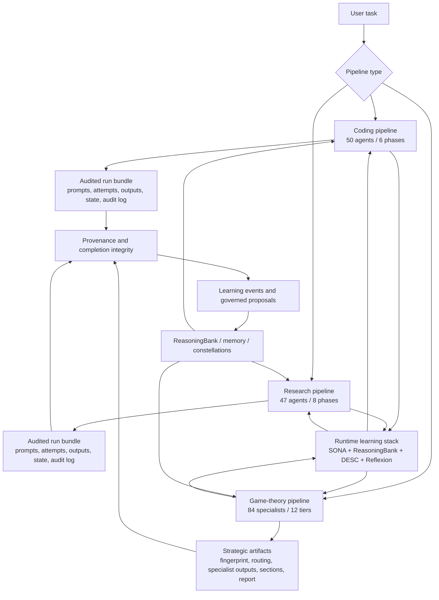

# Pipelines

archon-cli ships three production pipeline families: a 50-agent coding pipeline,
a 47-agent research pipeline, and the Evidence Engine game-theory pipeline.
They are stateful, resumable, and integrate with memory, provenance,
completion integrity, and governed learning. The built-in coding/research
pipelines write audited run bundles that can be verified, inspected, exported,
and resumed safely.



## Coding pipeline (50 agents)

Triggered by `/archon-code` (or `archon pipeline code <task>`). Decomposes a coding task into 6 phases across 50 specialized agents.

### Phases

| Phase | Agents | Purpose |
|---|---|---|
| 1. Understanding (8) | contract-agent, requirement-extractor, requirement-prioritizer, scope-definer, context-gatherer, codebase-analyzer, pattern-explorer, technology-scout | Parse the task, extract requirements, define scope, explore codebase context |
| 2. Design (10) | feasibility-analyzer, research-planner, phase-1-reviewer, phase-2-reviewer, system-designer, component-designer, interface-designer, data-architect, performance-architect, security-architect | Validate feasibility, plan research, design system/components/interfaces, and review early phases |
| 3. WiringPlan (3) | integration-architect, wiring-obligation-agent, phase-3-reviewer | Plan integration obligations and review the wiring plan |
| 4. Implementation (11) | code-generator, type-implementer, unit-implementer, service-implementer, data-layer-implementer, api-implementer, frontend-implementer, error-handler-implementer, config-implementer, logger-implementer, integration-verification-agent | Generate and wire the implementation slices |
| 5. Testing (9) | phase-4-reviewer, test-generator, test-runner, integration-tester, regression-tester, security-tester, coverage-analyzer, test-fixer, phase-5-reviewer | Generate, run, fix, and review test/security/coverage evidence |
| 6. Refinement (9) | dependency-manager, implementation-coordinator, quality-gate, performance-optimizer, code-quality-improver, final-refactorer, sign-off-approver, phase-6-reviewer, recovery-agent | Coordinate, optimize, refactor, sign off, and recover failed work |

50 total agents. Each phase has reviewers that gate progression.

### Agent definition system

Pipeline agents are defined as **Rust constants** in:
- `crates/archon-pipeline/src/coding/agents.rs::AGENTS` — 50 coding agents
- `crates/archon-pipeline/src/research/agents.rs::RESEARCH_AGENTS` — 47 research agents

Each entry has fields: `key`, `phase`, `tool_access` (`ReadOnly` / `Full`), `depends_on` (predecessor keys), and `prompt_source_path` (path to a markdown file containing the agent's prompt template, e.g. `.archon/agents/coding-pipeline/<key>.md`).

The agent loader at `crates/archon-pipeline/src/agent_loader.rs` reads the prompt source files and combines them with the Rust struct to build the runtime agent definitions.

Flat-file YAML-frontmatter agents (added in v0.1.10) live separately at `<workdir>/.archon/agents/` or `~/.archon/agents/` and are loaded by `crates/archon-core/src/agents/loader.rs::AgentRegistry::load_with_user_home`. Those are user-extensible and invoked via `/run-agent <name>`, NOT part of the pipeline.

### Runtime execution model

Inside the TUI, `/archon-code`, `/archon-research`, and `/gametheory` run
pipeline stages through the installed Archon subagent executor. Each stage is
launched as a real subagent with its pipeline agent key, model tier, allowed
tool set, memory/doc/LEANN access where applicable, transcript capture, hooks,
and Agent Activity events. This matches the god-code/god-research style runtime
instead of treating a pipeline stage as a plain provider chat call.

The shared runner still keeps a provider-only fallback for tests and standalone
non-interactive command paths. In that fallback, the same prompts and audited
bundle are used, but no live subagent executor is available.

Before each coding/research agent runs, the command layer builds the runtime
learning stack. The runner asks `LearningIntegration` for SONA trajectory
metadata, ReasoningBank context, and DESC episodes, injects those into the
agent system context, then writes SONA feedback and DESC episodes after the
quality score is known. `ReflexionInjector` is passed separately and supplies
prior failed-attempt context on retries.

### Layered context (L0-L3)

Every coding pipeline agent receives 4 layers of context:

| Layer | Source | Purpose |
|---|---|---|
| L0 | Task description | Original user request |
| L1 | Prior agent outputs | Outputs from completed agents in the audited session |
| L2 | LEANN semantic search | Code from the working repo relevant to the current step |
| L3 | Learning context | SONA trajectory marker, ReasoningBank context, and DESC episodes from prior similar tasks |

L3 is what makes the pipeline self-improving — past successes and prior
failures inform present decisions, while the accepted output feeds SONA/DESC
for later runs.

### Gate enforcement

5 deterministic gates between phases:
1. Understanding → Design: requirements complete, scope defined
2. Design → WiringPlan: architecture/design reviewed and feasible
3. WiringPlan → Implementation: integration obligations reviewed
4. Implementation → Testing: code compiles, wiring verified
5. Testing → Refinement: tests/security/coverage reviewed

Each gate has explicit pass/fail criteria. Failed gates block progression and can trigger a Reflexion retry.

### Audited run bundle

Built-in coding/research pipeline state lives in
`<workdir>/.archon/pipelines/<session-id>/`:

| Path | Purpose |
|---|---|
| `manifest.json` | Session id, pipeline type, Archon version, worktree, initial git head, task, created time |
| `state.json` | Checksum-protected status, current agent, completed count, token/cost totals, completion-integrity summary |
| `audit.log` | Append-only JSONL event stream for run creation/resume, prompts, LLM attempts, quality scores, retries, completion, abort/failure |
| `prompts/` | Serialized prompt/system/tool records with content hashes |
| `agents/` | Per-agent audit records linking prompts, accepted output, attempts, quality, tokens, cost, and tool-use log |
| `outputs/markdown/` | Research pipeline canonical Markdown copy of every accepted agent output |
| `outputs/artifacts/` | Research pipeline named per-agent artifacts declared by the agent definition |
| `outputs/rlm/` | Research pipeline run-level memory namespaces materialized as Markdown |
| `outputs/` | Accepted agent outputs plus `outputs/attempts/` for retry/failure attempt text |
| `exports/final-paper.md` | Research pipeline final paper normalized to the canonical APA 7 Markdown structure |
| `exports/final-paper.pdf` | Research pipeline final paper rendered as a page-numbered PDF artifact |
| `verification/` | Optional verifier reports written by `archon pipeline verify --write-report` |
| `rewound/` | Quarantined audited agent records from pipeline rewind operations |
| `exports/` | Operator-chosen trace export destination when writing into the bundle |

Resume is verifier-gated: `archon pipeline resume <id>` verifies the bundle,
hydrates completed agents from the audited records, and continues from the next
agent instead of trusting ad hoc local state. A failed research or coding run
that stopped only because a critical agent missed its quality threshold can be
continued deliberately with `--force-quality-gate`; Archon records the override
in `audit.log`, marks the accepted attempt with a force-accepted reason, and
then continues from the next agent. It does not override transport errors,
bundle verification failures, missing artifacts, or prompt/build failures.

If completed outputs themselves are bad, do not force-resume. Use
`archon pipeline rewind <id> --to-agent <key>` to quarantine the bad agent and
all downstream completed records, then resume so those agents are regenerated.
Rewind moves the stale agent records, their primary prompt/output/attempt
artifacts, and stale final research exports into `rewound/`, then removes those
records from the active completed set before resume.

### Inspection and export

```bash
archon pipeline status <session-id>
archon pipeline verify <session-id> --write-report
archon pipeline inspect <session-id>
archon pipeline export-traces <session-id> --out traces.jsonl
```

`export-traces` emits JSONL rows for every recorded attempt, including retries
that were rejected by the quality gate. By default it refuses bundles that fail
verification; `--include-unverified` is available for incident response.

When a built-in pipeline completes through the CLI path, Archon runs completion
integrity against the final output and stores the report summary/id in
`state.json` with a `completion_checked` audit event.

v1.2.0 also records non-blocking world-model advisory evidence around
coding and research runs. Before launch, the pipeline asks for advisory
next-state and counterfactual/shadow-plan signals. After completion, it records
the observed outcome, computes surprise when a persisted prediction exists, and
links the audited bundle into the world-model ledgers. These calls are
fail-open: a cold or unavailable world model never blocks the pipeline.

## Research Pipeline (47 Agents / 8 Phases)

Triggered by `/archon-research` (or `archon pipeline research <topic>`). It runs 46 specialized agents across 8 phases; Phase 8 is final assembly by `chapter-synthesizer`.

### Phases

| Phase | Agents | Purpose |
|---|---|---|
| 1. Foundation | step-back-analyzer, self-ask-decomposer, ambiguity-clarifier, research-planner, construct-definer, dissertation-architect | Frame the topic, decompose questions, resolve ambiguity, plan research, define constructs, and lock chapter structure |
| 2. Discovery | literature-mapper, source-tier-classifier, citation-extractor, context-tier-manager | Map sources, classify credibility, extract citations, and organize context tiers |
| 3. Architecture | theoretical-framework-analyst, contradiction-analyzer, gap-hunter, risk-analyst | Build the theoretical frame and identify contradictions, gaps, and risks |
| 4. Synthesis | evidence-synthesizer, pattern-analyst, thematic-synthesizer, theory-builder, opportunity-identifier | Synthesize evidence into patterns, themes, theory, and opportunities |
| 5. Design | method-designer, hypothesis-generator, model-architect, analysis-planner, sampling-strategist, instrument-developer, validity-guardian, methodology-scanner, methodology-writer | Design methodology, hypotheses, models, analysis, sampling, instruments, validity controls, and methodology prose |
| 6. Writing | introduction-writer, literature-review-writer, results-writer, discussion-writer, conclusion-writer, abstract-writer | Draft the major paper sections against the locked structure |
| 7. Validation | systematic-reviewer, ethics-reviewer, adversarial-reviewer, confidence-quantifier, citation-validator, reproducibility-checker, apa-citation-specialist, consistency-validator, quality-assessor, bias-detector, file-length-manager | Validate citations, consistency, quality, ethics, reproducibility, bias, confidence, and structure |
| 8. Final Assembly | chapter-synthesizer | Compose the validated chapter outputs into the final research paper |

46 total agents. The final assembly agent is part of the runtime agent loop and must use the locked chapter structure produced during the run. The research facade maintains a run-level memory pack: accepted outputs are written to research namespaces, pinned chapter/citation context is carried forward, recent outputs are supplied through a phase-aware rolling window, and validation agents receive deterministic pre-scan evidence from the host runtime. On successful research completion, Archon validates that the final text has a title, abstract, body, one `References` section, and appendices after references, then writes `exports/final-paper.md` and `exports/final-paper.pdf` in the audited bundle. Backed by DESC episodic memory across phases.

Research context comes from ingested docs/KB/provenance plus the RLM bundle.
LEANN semantic code search is reserved for coding/context workflows and is not
initialized by `/archon-research` or `archon pipeline research`.

## Game-Theory Evidence Pipeline

Triggered by `archon gametheory ...` or `/gametheory run ...`. It classifies a
strategic situation, builds a 9-axis fingerprint, routes through the
project-local `.archon/specs/gametheory.yaml`, executes selected specialists in
dependency-respecting parallel waves, and persists the report.

The game-theory lane is deliberately separate from the coding/research bundle
runner: classification, YAML routing, specialist DAGs, checkpoints, and Cozo
source-of-truth tables remain owned by `archon-pipeline::gametheory`. In the
TUI, Tier 1 classifiers and selected specialists still execute through the
shared subagent-backed `LlmClient::run_agent` seam so they get the same agent
runtime as the other slash-driven pipelines without changing routing semantics.

GameTheory is also learning-aware. Tier 1 classification, specialist waves,
replay, slash commands, and agent-callable GameTheory tools call
`LearningIntegration::on_agent_start` / `on_agent_complete`. That means
ReasoningBank and DESC context can shape classification and specialist prompts,
and SONA trajectories are recorded for TUI runs by default. Shell and tool
GameTheory runs record SONA only when `learning.sona.pipeline_recording = true`;
the canonical strategic state remains the `gt_*` tables.

Use it for:

- Incentive design and mechanism-design questions
- Marketplace and platform strategy
- Competitive retaliation or coordination risks
- Negotiation, bargaining, and principal-agent problems
- Strategic policy, governance, and ecosystem design

Example:

```bash
archon gametheory \
  "Assess the incentive structure of this plugin marketplace design" \
  --kb policy-pack \
  --budget 20 \
  --max-concurrent 4 \
  --style executive \
  --debug-memory
```

State is persisted to `gt_runs`, `gt_fingerprints`,
`gt_routing_decisions`, `gt_specialist_outputs`, `gt_sections`,
`gt_final_reports`, and `gt_run_checkpoints`.

## Pipeline execution

```bash
# Coding
archon pipeline code "implement OAuth2 token refresh with file locking" --dry-run
archon pipeline code "implement OAuth2 token refresh with file locking"

# Research
archon pipeline research "literature review on graph attention networks" --dry-run
archon pipeline research "literature review on graph attention networks"

# Game theory
archon gametheory "Assess this marketplace incentive design" --kb policy-pack

# Status and verification
archon pipeline status <session-id>
archon pipeline list
archon pipeline verify <session-id> --write-report
archon pipeline inspect <session-id>
archon pipeline export-traces <session-id> --out traces.jsonl

# Resume / abort
archon pipeline resume <session-id>
archon pipeline resume <session-id> --force-quality-gate
archon pipeline rewind <session-id> --to-agent <agent-key>
archon pipeline abort <session-id>
```

In the TUI, `/archon-code` and `/archon-research` start coding and research
runs. Continuation is shared: `/pipeline resume <session-id>` resumes either
pipeline type after verifying the audited bundle. Use
`/pipeline resume <session-id> --force-quality-gate` only when you have
reviewed the failed attempt output and want the audited bundle to continue
despite a critical quality score miss.

When accepted downstream outputs are contaminated, use
`/pipeline rewind <session-id> --to-agent <agent-key>` first, then
`/pipeline resume <session-id>`. The rewind command performs a quick audited
state mutation and prints the result in the transcript; the following TUI resume
uses the in-process path, so regenerated agents appear in Agent Activity.

## Session recovery

Pipeline sessions persist all state to `<workdir>/.archon/pipelines/<session-id>/`. If archon-cli crashes or you `Ctrl-C` mid-run:

```bash
archon pipeline list                      # find your session
archon pipeline resume <session-id>       # verifies bundle, then continues at the next agent
archon pipeline resume <session-id> --force-quality-gate  # audited quality-gate override
archon pipeline rewind <session-id> --to-agent conclusion-writer  # re-run this agent and later agents
```

Session recovery requires the same git working tree state (file modifications
mid-pipeline can interfere). The recovery layer verifies the audited bundle
before continuing, including state checksums, audit JSONL, prompt records, agent
records, accepted outputs, and attempt-output hashes.

For contaminated outputs, rewind to the earliest bad accepted agent rather than
the final failed agent. See the [pipeline rewind cookbook](../cookbook/pipeline-rewind.md)
for the operator flow and TUI commands.

## Agent loop (single agent, not pipeline)

The non-pipeline agent loop is simpler — it runs in `crates/archon-core/src/agent.rs`:

1. Build request: system prompt + memories + tool catalog + user message
2. Send to LLM client
3. Parse streaming response: text deltas → TUI; tool_use blocks → tool dispatch
4. For each tool call: permission check → execute → stream tool result back to model
5. Repeat until model returns final assistant text
6. Capture trajectory via AutoCapture

## Subagent spawning

The `Agent` tool spawns a subagent within the current parent's tokio runtime. Subagents:
- Inherit parent's LLM client and identity (spoofing layer consistent)
- Get an `Arc<AgentConfig>` so live config changes propagate
- Run as child tokio tasks (not OS threads)
- Stream output back via channels
- Are subject to the parent's permission mode (configurable)

`/run-agent <name> <task>` is the slash-command interface to the same machinery.

### Background subagents

`archon run-agent-async <name>` submits a task to the TaskService for asynchronous execution:
- Returns a task_id immediately
- Task runs in background, output buffered to disk
- Check status: `archon task-status <task-id>`
- Get result: `archon task-result <task-id>`
- Stream events: `archon task-events <task-id>`

Useful for long-running pipeline runs, batch processing, or detached workflows.

## Multi-agent teams

Teams are defined in `<workdir>/.archon/teams.toml`:

```toml
[team.code-review]
agents = ["security-reviewer", "performance-reviewer", "style-reviewer"]
mode = "parallel"   # parallel | sequential | orchestrated
timeout_secs = 300
```

Run with:
```bash
archon team run --team code-review "review the last commit"
```

Modes:
- `parallel` — all agents run concurrently, results collated
- `sequential` — agents run in declaration order, each receives prior outputs
- `orchestrated` — first agent acts as orchestrator, dispatches to others

## See also

- [Learning systems](learning-systems.md) — the 8 subsystems that pipelines integrate with
- [Pipeline rewind cookbook](../cookbook/pipeline-rewind.md) — audited recovery for poisoned pipeline outputs
- [god-code cookbook](../cookbook/god-code-pipeline.md) — full coding-pipeline walkthrough
- [Custom agents](../cookbook/custom-agent-workflows.md) — writing your own agents
- [Adding an agent](../development/adding-an-agent.md) — agent definition format
- [Game theory](../gametheory.md) — strategic Evidence Engine pipeline
- [Real-world examples](../cookbook/real-world-evidence-engine.md)
