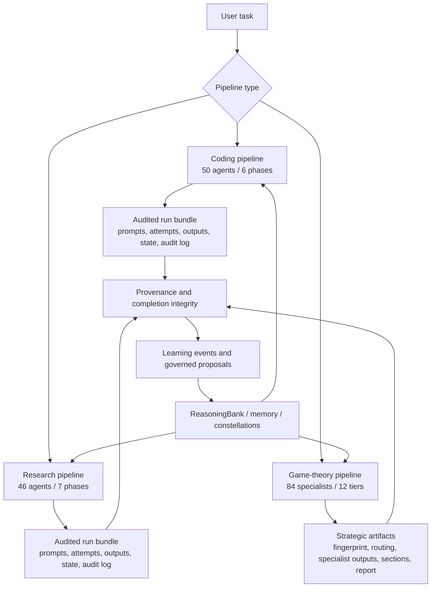

# Pipelines

archon-cli ships three production pipeline families: a 50-agent coding pipeline,
a 46-agent research pipeline, and the Evidence Engine game-theory pipeline.
They are stateful, resumable, and integrate with memory, provenance,
completion integrity, and governed learning. The built-in coding/research
pipelines write audited run bundles that can be verified, inspected, exported,
and resumed safely.



## Coding pipeline (50 agents)

Triggered by `/archon-code` (or `archon pipeline code <task>`). Decomposes a coding task into 6 phases across 50 specialized agents.

### Phases

| Phase | Agents | Purpose |
|---|---|---|
| 1. Understanding | contract-agent, requirement-extractor, requirement-prioritizer, scope-definer, context-gatherer, feasibility-analyzer, pattern-explorer, technology-scout | Parse the task, extract requirements, define scope, explore codebase |
| 2. Exploration | context-gatherer, codebase-analyzer, pattern-explorer, technology-scout, ambiguity-clarifier | Explore the codebase, identify patterns, clarify unknowns |
| 3. Architecture | system-designer, component-designer, interface-designer, data-architect, security-architect, integration-architect, performance-architect | Design system architecture, components, interfaces |
| 4. Implementation | code-generator, unit-implementer, service-implementer, api-implementer, frontend-implementer, data-layer-implementer, type-implementer, error-handler-implementer, logger-implementer, config-implementer, integration-tester, dependency-manager | Generate code, types, error handling |
| 5. Quality | code-quality-improver, sherlock-holmes (forensic review), security-tester, regression-tester, coverage-analyzer, code-simplifier, final-refactorer | Review, test, refactor |
| 6. Sign-off | sign-off-approver, phase-1-reviewer ... phase-6-reviewer | Final review and approval |

50 total agents. Each phase has reviewers that gate progression.

### Agent definition system

Pipeline agents are defined as **Rust constants** in:
- `crates/archon-pipeline/src/coding/agents.rs::AGENTS` — 50 coding agents
- `crates/archon-pipeline/src/research/agents.rs::RESEARCH_AGENTS` — 46 research agents

Each entry has fields: `key`, `phase`, `tool_access` (`ReadOnly` / `Full`), `depends_on` (predecessor keys), and `prompt_source_path` (path to a markdown file containing the agent's prompt template, e.g. `.archon/agents/coding-pipeline/<key>.md`).

The agent loader at `crates/archon-pipeline/src/agent_loader.rs` reads the prompt source files and combines them with the Rust struct to build the runtime agent definitions.

Flat-file YAML-frontmatter agents (added in v0.1.10) live separately at `<workdir>/.archon/agents/` or `~/.config/archon/agents/` and are loaded by `crates/archon-core/src/agents/loader.rs::AgentRegistry::load_with_user_home`. Those are user-extensible and invoked via `/run-agent <name>`, NOT part of the pipeline.

### Layered context (L0-L3)

Every coding pipeline agent receives 4 layers of context:

| Layer | Source | Purpose |
|---|---|---|
| L0 | Task description | Original user request |
| L1 | Prior agent outputs | Outputs from completed agents in the audited session |
| L2 | LEANN semantic search | Code from the working repo relevant to the current step |
| L3 | ReasoningBank patterns | Successful patterns from prior similar tasks |

L3 is what makes the pipeline self-improving — past successes inform present decisions.

### Gate enforcement

5 deterministic gates between phases:
1. Specification → Exploration: requirements complete, scope defined
2. Exploration → Architecture: codebase understood, patterns identified
3. Architecture → Implementation: design approved by 2 reviewers
4. Implementation → Quality: code compiles, tests defined
5. Quality → Sign-off: all tests pass, Sherlock review approves

Each gate has explicit pass/fail criteria. Failed gates block progression and can trigger a Reflexion retry.

### Audited run bundle

Built-in coding/research pipeline state lives in
`<workdir>/.archon/pipelines/<session-id>/`:

| Path | Purpose |
|---|---|
| `manifest.json` | Session id, pipeline type, Archon version, worktree, initial git head, task, created time |
| `state.json` | Checksum-protected status, current agent, completed count, token/cost totals, completion-integrity summary |
| `audit.log` | Append-only JSONL event stream for run creation/resume, prompts, LLM attempts, quality scores, retries, completion, abort/failure |
| `prompts/` | Serialized prompt/system/tool records with content hashes |
| `agents/` | Per-agent audit records linking prompts, accepted output, attempts, quality, tokens, cost, and tool-use log |
| `outputs/` | Accepted agent outputs plus `outputs/attempts/` for retry/failure attempt text |
| `verification/` | Optional verifier reports written by `archon pipeline verify --write-report` |
| `exports/` | Operator-chosen trace export destination when writing into the bundle |

Resume is verifier-gated: `archon pipeline resume <id>` verifies the bundle,
hydrates completed agents from the audited records, and continues from the next
agent instead of trusting ad hoc local state.

### Inspection and export

```bash
archon pipeline status <session-id>
archon pipeline verify <session-id> --write-report
archon pipeline inspect <session-id>
archon pipeline export-traces <session-id> --out traces.jsonl
```

`export-traces` emits JSONL rows for every recorded attempt, including retries
that were rejected by the quality gate. By default it refuses bundles that fail
verification; `--include-unverified` is available for incident response.

When a built-in pipeline completes through the CLI path, Archon runs completion
integrity against the final output and stores the report summary/id in
`state.json` with a `completion_checked` audit event.

v1.2.0-beta also records non-blocking world-model advisory evidence around
coding and research runs. Before launch, the pipeline asks for advisory
next-state and counterfactual/shadow-plan signals. After completion, it records
the observed outcome, computes surprise when a persisted prediction exists, and
links the audited bundle into the world-model ledgers. These calls are
fail-open: a cold or unavailable world model never blocks the pipeline.

## Research pipeline (46 agents)

Triggered by `/archon-research` (or `archon pipeline research <topic>`). 7 phases, 46 specialized agents.

### Phases

| Phase | Agents | Purpose |
|---|---|---|
| 1. Self-Ask Decomposition | self-ask-decomposer, ambiguity-clarifier, construct-definer | Break the topic into 15-20 essential questions |
| 2. Context Tier Manager | context-tier-manager | Hot/warm/cold tier organization for 300+ sources |
| 3. Literature Mapping | literature-mapper, source-tier-classifier, citation-extractor, theoretical-framework-analyst, methodology-scanner | Build the literature landscape |
| 4. Gap Analysis | gap-hunter, contradiction-analyzer, risk-analyst | Identify gaps, contradictions, risks |
| 5. Synthesis | systematic-reviewer, quality-assessor, bias-detector, evidence-synthesizer, pattern-analyst, thematic-synthesizer, theory-builder | Synthesize findings |
| 6. Methodology | hypothesis-generator, model-architect, opportunity-identifier, method-designer, sampling-strategist, instrument-developer, ethics-reviewer, validity-guardian, analysis-planner | Design empirical methodology |
| 7. Writing | dissertation-architect, introduction-writer, literature-review-writer, methodology-writer, results-writer, discussion-writer, conclusion-writer, chapter-synthesizer, apa-citation-specialist, abstract-writer, adversarial-reviewer, citation-validator, reproducibility-checker, confidence-quantifier, file-length-manager, consistency-validator | Write the manuscript |

46 total agents. Backed by DESC episodic memory across phases.

## Game-Theory Evidence Pipeline

Triggered by `archon gametheory ...` or `/gametheory run ...`. It classifies a
strategic situation, builds a 9-axis fingerprint, routes through the
project-local `.archon/specs/gametheory.yaml`, executes selected specialists in
dependency-respecting parallel waves, and persists the report.

Use it for:

- Incentive design and mechanism-design questions
- Marketplace and platform strategy
- Competitive retaliation or coordination risks
- Negotiation, bargaining, and principal-agent problems
- Strategic policy, governance, and ecosystem design

Example:

```bash
archon gametheory \
  "Assess the incentive structure of this plugin marketplace design" \
  --kb policy-pack \
  --budget 20 \
  --max-concurrent 4 \
  --style executive \
  --debug-memory
```

State is persisted to `gt_runs`, `gt_fingerprints`,
`gt_routing_decisions`, `gt_specialist_outputs`, `gt_sections`,
`gt_final_reports`, and `gt_run_checkpoints`.

## Pipeline execution

```bash
# Coding
archon pipeline code "implement OAuth2 token refresh with file locking" --dry-run
archon pipeline code "implement OAuth2 token refresh with file locking"

# Research
archon pipeline research "literature review on graph attention networks" --dry-run
archon pipeline research "literature review on graph attention networks"

# Game theory
archon gametheory "Assess this marketplace incentive design" --kb policy-pack

# Status and verification
archon pipeline status <session-id>
archon pipeline list
archon pipeline verify <session-id> --write-report
archon pipeline inspect <session-id>
archon pipeline export-traces <session-id> --out traces.jsonl

# Resume / abort
archon pipeline resume <session-id>
archon pipeline abort <session-id>
```

In the TUI, `/archon-code` and `/archon-research` start coding and research
runs. Continuation is shared: `/pipeline resume <session-id>` resumes either
pipeline type after verifying the audited bundle.

## Session recovery

Pipeline sessions persist all state to `<workdir>/.archon/pipelines/<session-id>/`. If archon-cli crashes or you `Ctrl-C` mid-run:

```bash
archon pipeline list                      # find your session
archon pipeline resume <session-id>       # verifies bundle, then continues at the next agent
```

Session recovery requires the same git working tree state (file modifications
mid-pipeline can interfere). The recovery layer verifies the audited bundle
before continuing, including state checksums, audit JSONL, prompt records, agent
records, accepted outputs, and attempt-output hashes.

## Agent loop (single agent, not pipeline)

The non-pipeline agent loop is simpler — it runs in `crates/archon-core/src/agent.rs`:

1. Build request: system prompt + memories + tool catalog + user message
2. Send to LLM client
3. Parse streaming response: text deltas → TUI; tool_use blocks → tool dispatch
4. For each tool call: permission check → execute → stream tool result back to model
5. Repeat until model returns final assistant text
6. Capture trajectory via AutoCapture

## Subagent spawning

The `Agent` tool spawns a subagent within the current parent's tokio runtime. Subagents:
- Inherit parent's LLM client and identity (spoofing layer consistent)
- Get an `Arc<AgentConfig>` so live config changes propagate
- Run as child tokio tasks (not OS threads)
- Stream output back via channels
- Are subject to the parent's permission mode (configurable)

`/run-agent <name> <task>` is the slash-command interface to the same machinery.

### Background subagents

`archon run-agent-async <name>` submits a task to the TaskService for asynchronous execution:
- Returns a task_id immediately
- Task runs in background, output buffered to disk
- Check status: `archon task-status <task-id>`
- Get result: `archon task-result <task-id>`
- Stream events: `archon task-events <task-id>`

Useful for long-running pipeline runs, batch processing, or detached workflows.

## Multi-agent teams

Teams are defined in `<workdir>/.archon/teams.toml`:

```toml
[team.code-review]
agents = ["security-reviewer", "performance-reviewer", "style-reviewer"]
mode = "parallel"   # parallel | sequential | orchestrated
timeout_secs = 300
```

Run with:
```bash
archon team run --team code-review "review the last commit"
```

Modes:
- `parallel` — all agents run concurrently, results collated
- `sequential` — agents run in declaration order, each receives prior outputs
- `orchestrated` — first agent acts as orchestrator, dispatches to others

## See also

- [Learning systems](learning-systems.md) — the 8 subsystems that pipelines integrate with
- [god-code cookbook](../cookbook/god-code-pipeline.md) — full coding-pipeline walkthrough
- [Custom agents](../cookbook/custom-agent-workflows.md) — writing your own agents
- [Adding an agent](../development/adding-an-agent.md) — agent definition format
- [Game theory](../gametheory.md) — strategic Evidence Engine pipeline
- [Real-world examples](../cookbook/real-world-evidence-engine.md)
