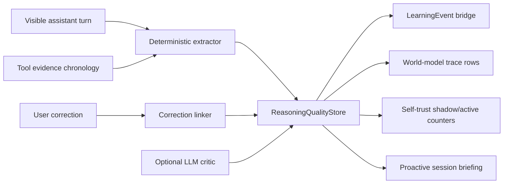

# Reasoning Quality Events

Reasoning Quality is Archon's first-class signal for visible assistant claims. It exists because tool-event retrospectives cannot see the most important failure mode: the agent makes a confident statement before reading the source, the user corrects it, and no durable learning row is written.

This subsystem records observable reasoning quality. It does not record hidden chain-of-thought.

## Runtime Flow



The event store is source of truth. Bridges are best-effort consumers. If a bridge fails, Archon writes a dead-letter row and the foreground session continues.

## What Gets Recorded

Reasoning Quality stores immutable rows under `~/.archon/reasoning-quality/`:

| Row | Meaning |
|---|---|
| `claim_before_source_read` | A code/config/provider/docs claim was made before relevant evidence existed. |
| `source_verified_claim` | A claim was backed by prior evidence or later superseded by matching evidence. |
| `claim_contradicted_by_source` | Later evidence shows the claim was wrong. |
| `claim_corrected_by_user` | The user corrected a likely prior claim. |
| `completion_claim_without_evidence` | The assistant said work was done without matching evidence. |
| `test_status_claim_without_command` | The assistant claimed test/build status without a test/build result. |
| `critic_unavailable` | Optional LLM critique could not run because of policy, budget, parsing, or provider failure. |

Rows include deterministic `claim_id`, `event_id`, subject, entity key, confidence signal, verification state, severity, redacted excerpt, raw text hash, evidence refs, source system, and shadow flag.

## Privacy And Policy

Raw text storage is off by default. Entity keys and excerpts are redacted before persistence. LLM critic calls are disabled by default and require:

- `learning.reasoning_quality.critic.allow_llm = true`
- `policy.reasoning_quality.allow_llm_critic = true`
- `policy.reasoning_quality.allow_critic_cloud_data_flow = true` when the provider is cloud-hosted

The active `LlmProvider` path is used, so Anthropic OAuth, Codex OAuth, OpenAI-compatible, and local providers share the same policy and telemetry shape.

## Shadow Mode

Reasoning Quality starts in shadow mode for 30 days by default. Events and bridge rows are written, but trust effects are logged as deltas until fixture gates and operator-labeled samples prove the extractor is precise enough.

Use:

```bash
archon reasoning shadow-report
archon reasoning sample-label <session-id>
```

If shadow exit is blocked, proactive briefing surfaces the next labeling action instead of silently staying in shadow forever.

## Commands

```bash
archon reasoning status
archon reasoning inspect <session-id>
archon reasoning claims <session-id>
archon reasoning patterns
archon reasoning backfill --sessions 50
archon reasoning fixture-audit
archon reasoning cost status
archon reasoning replay-dead-letter
archon reasoning migrate --to-version 1 --dry-run
archon briefing preview --task "fix failing tests"
```

The TUI mirrors these through `/reasoning ...` and `/briefing preview`.

## Relationship To Retrospectives

`archon self retrospective` remains useful for post-session summaries, but it is no longer the canonical source for reasoning-quality facts. When a reasoning-quality row already exists for a claim or turn, retrospective output should summarize rather than write duplicate trust-affecting learning events.
