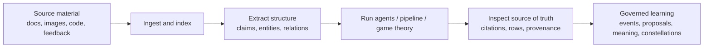

# Real-World Evidence Engine Workflows

Archon is no longer just a coding assistant. It is an evidence-aware local
reasoning system: ingest source material, extract structured knowledge, run
specialist pipelines, preserve provenance, verify claims, and feed outcomes
back into governed learning.

The pattern is always:



Use synthetic fixtures or known facts first. If you know what should be found,
you can prove the system is working before trusting it on messy real material.

## CLI And TUI Command Parity

Every Evidence Engine CLI surface is available inside the TUI. Use the direct
slash family when one exists, or use `/archon` as the universal in-TUI mirror of
the OS command line.

| OS command | TUI command |
| --- | --- |
| `archon docs ...` | `/docs ...` |
| `archon kb ...` | `/kb ...` |
| `archon gametheory ...` | `/gametheory ...` |
| `archon pipeline ...` | `/pipeline ...` or `/archon-code` / `/archon-research` |
| `archon completion ...` | `/completion ...` |
| `archon behaviour ...` | `/behaviour ...` |
| `archon meaning ...` | `/meaning ...` |
| `archon constellation ...` | `/constellation ...` |
| `archon prov ...` | `/prov ...` |
| any other `archon ...` command | `/archon ...` |

Example: `archon docs ingest .archon/docs/inbox` from a shell is
`/docs ingest .archon/docs/inbox` inside the TUI. If a new CLI command lands
before a dedicated slash wrapper exists, run it as `/archon <same args>`.

## Provider Choice

Archon can run the same command surfaces through Anthropic or Codex. Anthropic
OAuth/API-key/proxy is the default path. To use a ChatGPT/Codex subscription for
agentic work:

```bash
archon auth login --provider openai-codex
archon auth status
```

```toml
[llm]
provider = "openai-codex"

[api]
default_model = "gpt-5.4"
```

After that, the TUI, `/btw`, `/run-agent`, `/archon-code`,
`/archon-research`, `/gametheory`, and team-driven agentic flows use Codex
instead of Anthropic. Verify capability support at any time with:

```bash
archon providers capabilities
archon providers doctor
```

TUI equivalent:

```text
/providers capabilities
/providers doctor
```

## Project Setup

```bash
sh scripts/archon-init.sh --target /path/to/project --archon-cli-repo /path/to/archon-cli
cd /path/to/project
```

Drop source files into:

```text
.archon/docs/inbox/
```

Then ingest and inspect:

```bash
archon docs ingest .archon/docs/inbox
archon docs status
archon docs list
archon docs inspect <document-id>
archon docs index --all
```

Inside the TUI, use:

```text
/docs ingest .archon/docs/inbox
/docs status
/docs open
/docs list
/docs inspect <document-id>
/docs provenance <chunk-or-artifact-id>
/docs index --all
```

## Research Workflow

Use this for literature reviews, technical reports, policy packs, papers, or
large document collections.

Example: research a local folder of PDFs and notes about AI provenance.

```bash
mkdir -p .archon/docs/inbox/provenance
cp ~/papers/*.pdf .archon/docs/inbox/provenance/
cp ~/notes/*.md .archon/docs/inbox/provenance/

archon docs ingest .archon/docs/inbox/provenance
archon docs index --all
archon docs search "chain of custody for derived data" --mode hybrid --debug
archon kb process --claims --entities --relations --contradictions
archon kb contradictions
archon docs answer "What are the strongest claims about OCR provenance?"
```

TUI equivalent:

```text
/docs ingest .archon/docs/inbox/provenance
/docs index --all
/docs search "chain of custody for derived data" --mode hybrid --debug
/kb process --claims --entities --relations --contradictions
/kb contradictions
/docs answer "What are the strongest claims about OCR provenance?"
```

Then run the research pipeline:

```bash
archon pipeline research "Systematic review of OCR provenance and derived-data auditability"
```

Or from the TUI:

```text
/archon-research Systematic review of OCR provenance and derived-data auditability
```

Full-state verification:

```bash
archon docs provenance <answer-id-or-chunk-id>
archon kb claims
archon kb entities
archon kb stats
```

TUI equivalent:

```text
/docs provenance <answer-id-or-chunk-id>
/kb claims
/kb entities
/kb stats
```

Expected outcome: a research synthesis that cites local document chunks, flags
contradictions, and leaves inspectable document, KB, and provenance rows.

## Education Workflow

Use this to turn course material into a tutor, revision assistant, or
assignment-prep system.

Example: ingest lecture slides, textbook excerpts, and handwritten scan images.

```bash
mkdir -p .archon/docs/inbox/economics-101
cp ~/classes/econ101/*.pdf .archon/docs/inbox/economics-101/
cp ~/classes/econ101/scans/*.png .archon/docs/inbox/economics-101/

archon docs ingest .archon/docs/inbox/economics-101
archon docs index --all
archon kb process --claims --entities --relations
```

TUI equivalent:

```text
/docs ingest .archon/docs/inbox/economics-101
/docs index --all
/kb process --claims --entities --relations
```

Ask grounded questions:

```bash
archon docs answer "Explain price elasticity using only the course material."
archon docs search "deadweight loss" --mode hybrid --debug
```

Use the TUI as a study browser:

```text
/docs open
/docs list
/docs chunks <document-id>
/docs answer "Explain price elasticity using only the course material."
/docs search "deadweight loss" --mode hybrid --debug
```

Use governed learning to capture corrections:

```bash
archon behaviour list-events
archon behaviour generate-proposals
archon behaviour list-proposals
```

TUI equivalent:

```text
/behaviour list-events
/behaviour generate-proposals
/behaviour list-proposals
```

Expected outcome: a local tutor that answers from the ingested class material,
not generic internet memory, and can evolve from corrections without silently
auto-applying risky changes.

## Business And Due-Diligence Workflow

Use this for customer research, investor prep, competitive analysis, partner
diligence, procurement, or market-entry planning.

Example: evaluate a plugin marketplace business model.

```bash
mkdir -p .archon/docs/inbox/plugin-marketplace
cp ./policy-pack/*.pdf .archon/docs/inbox/plugin-marketplace/
cp ./market-notes/*.md .archon/docs/inbox/plugin-marketplace/

archon docs ingest .archon/docs/inbox/plugin-marketplace
archon docs index --all
archon kb process --claims --entities --relations --contradictions

archon gametheory \
  "Assess the incentive structure of this plugin marketplace design" \
  --kb plugin-marketplace \
  --budget 20 \
  --max-concurrent 4 \
  --style executive \
  --debug-memory
```

TUI equivalent:

```text
/docs ingest .archon/docs/inbox/plugin-marketplace
/docs index --all
/kb process --claims --entities --relations --contradictions
/gametheory run Assess the incentive structure of this plugin marketplace design --kb plugin-marketplace
```

Inspect the persisted report:

```bash
archon gametheory list-runs
archon gametheory status <run-id>
archon gametheory inspect-fingerprint <run-id>
archon gametheory inspect-routing <run-id>
archon gametheory show <run-id>
```

TUI equivalent:

```text
/gametheory list-runs
/gametheory status <run-id>
/gametheory inspect-fingerprint <run-id>
/gametheory inspect-routing <run-id>
/gametheory show <run-id>
```

Use the strategic engagement agent when you need an outreach package:

```text
/run-agent research-orchestrator
```

Expected outcome: a decision-grade evidence pack with document citations,
structured claims, contradiction checks, a game-theory assessment, and a
provenance trail for the report.

## Trading And Market-Research Workflow

Archon is not a financial adviser and does not make trades. Treat this workflow
as research support: organizing filings, transcripts, policy documents, and
thesis evidence.

Example: analyze whether a company has durable AI infrastructure advantage.

```bash
mkdir -p .archon/docs/inbox/market-thesis
cp ~/filings/company-10k.pdf .archon/docs/inbox/market-thesis/
cp ~/transcripts/earnings-call.md .archon/docs/inbox/market-thesis/
cp ~/notes/competitors.md .archon/docs/inbox/market-thesis/

archon docs ingest .archon/docs/inbox/market-thesis
archon docs index --all
archon kb process --claims --entities --relations --contradictions

archon docs search "gross margin pressure from infrastructure costs" --mode hybrid --debug
archon docs answer "What evidence supports and weakens the AI infrastructure moat thesis?"

archon gametheory \
  "Assess competitive incentives around AI infrastructure pricing and customer lock-in" \
  --kb market-thesis \
  --style technical \
  --budget 15
```

Full-state verification:

```bash
archon kb contradictions
archon docs provenance <answer-id-or-chunk-id>
archon gametheory inspect-routing <run-id>
```

TUI equivalent:

```text
/kb contradictions
/docs provenance <answer-id-or-chunk-id>
/gametheory inspect-routing <run-id>
```

Expected outcome: a grounded thesis brief with source-backed claims and
contradictions. The human still owns judgement, risk management, and any trade.

## Coding Pipeline Workflow

Use this when the change is bigger than a normal edit: cross-crate refactors,
new subsystems, risky behavior, or work that needs independent review.

Example: add a new evidence-backed CLI subcommand.

```bash
archon pipeline code \
  "Implement archon docs summarize <document-id> using persisted chunks, citations, tests, and provenance edges" \
  --dry-run

archon pipeline code \
  "Implement archon docs summarize <document-id> using persisted chunks, citations, tests, and provenance edges" \
  --max-budget-usd 20
```

In the TUI:

```text
/archon-code Implement archon docs summarize <document-id> using persisted chunks, citations, tests, and provenance edges
/pipeline code "Implement archon docs summarize <document-id> using persisted chunks, citations, tests, and provenance edges" --max-budget-usd 20
```

Use completion integrity around claims of success:

```bash
archon completion verify <run-id> --agent code-quality-improver --model sonnet
archon completion incidents
archon completion trust --agent code-quality-improver
```

TUI equivalent:

```text
/completion verify <run-id> --agent code-quality-improver --model sonnet
/completion incidents
/completion trust --agent code-quality-improver
```

Expected outcome: a structured coding run with requirements, exploration,
architecture, implementation, quality review, sign-off, and persisted evidence
for claims about tests or build status.

## Research Pipeline Workflow

Use this when the desired output is a literature map, synthesis, report, paper,
or domain model.

```bash
archon pipeline research \
  "Research how provenance-aware OCR systems can support legal discovery workflows" \
  --dry-run

archon pipeline research \
  "Research how provenance-aware OCR systems can support legal discovery workflows"
```

Recommended preparation:

```bash
archon docs ingest .archon/docs/inbox/legal-ocr
archon docs index --all
archon kb process --claims --entities --relations --contradictions
```

TUI equivalent:

```text
/archon-research Research how provenance-aware OCR systems can support legal discovery workflows
/docs ingest .archon/docs/inbox/legal-ocr
/docs index --all
/kb process --claims --entities --relations --contradictions
```

Expected outcome: a multi-agent research package that can reuse local evidence
and prior learning rather than starting cold each time.

## Game-Theory Workflow

Use game theory when the problem involves incentives, strategic behavior,
coordination, asymmetric information, mechanism design, bargaining, or
competitive dynamics.

Examples:

```bash
archon gametheory \
  "Assess whether this open-source plugin ecosystem creates incentives for low-quality extensions" \
  --kb plugin-marketplace \
  --style executive

archon gametheory \
  "Analyze the bargaining dynamics between a platform, third-party developers, and enterprise buyers" \
  --kb partner-diligence \
  --style academic \
  --debug-memory

archon gametheory \
  "Evaluate whether a pricing policy will trigger competitor retaliation or tacit coordination" \
  --kb market-thesis \
  --style technical \
  --budget 15
```

Inspect what happened:

```bash
archon gametheory inspect-fingerprint <run-id>
archon gametheory inspect-routing <run-id>
archon gametheory inspect specialist:<run-id>:payoff-matrix-builder
archon gametheory show <run-id>
```

TUI equivalent:

```text
/gametheory inspect-fingerprint <run-id>
/gametheory inspect-routing <run-id>
/gametheory inspect specialist:<run-id>:payoff-matrix-builder
/gametheory show <run-id>
```

Expected outcome: a specialist-routed strategic report with a 9-axis
fingerprint, auditable routing decision, per-specialist outputs, report
sections, cost tracking, and provenance.

## Turning Work Into Learning

After meaningful runs, compile what Archon learned:

```bash
archon behaviour status
archon behaviour generate-proposals
archon behaviour list-proposals

archon meaning build --from learning-events
archon meaning build --from gametheory-runs
archon meaning triplets

archon constellation build --target strategic-workflow
archon constellation score --target strategic-workflow --text "new strategic workflow description"
archon constellation drift --target strategic-workflow --text "changed workflow description"
```

TUI equivalent:

```text
/behaviour status
/behaviour generate-proposals
/behaviour list-proposals
/meaning build --from learning-events
/meaning build --from gametheory-runs
/meaning triplets
/constellation build --target strategic-workflow
/constellation score --target strategic-workflow --text "new strategic workflow description"
/constellation drift --target strategic-workflow --text "changed workflow description"
```

If a proposal is safe and wanted:

```bash
archon behaviour approve <proposal-id>
archon behaviour history <manifest-kind>
```

TUI equivalent:

```text
/behaviour approve <proposal-id>
/behaviour history <manifest-kind>
```

If it was wrong:

```bash
archon behaviour rollback <version-id> --reason "proposal degraded research quality"
```

TUI equivalent:

```text
/behaviour rollback <version-id> --reason "proposal degraded research quality"
```

## Operator Checklist

Before trusting an output:

1. Ingest source material and check `archon docs status`.
2. Run exact search for a known phrase from the fixture.
3. Run hybrid search with `--debug` and inspect scores/provenance.
4. Extract KB claims/entities/contradictions and inspect row counts.
5. Run the chosen pipeline or game-theory command.
6. Inspect persisted run state, not just the terminal response.
7. Trace provenance from answer/report back to source.
8. Record corrections and review governed-learning proposals.
