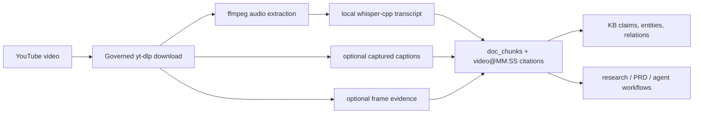

# Real-World Video Evidence: YouTube To Searchable Knowledge

Use this workflow when a meeting recording, webinar, lecture, product demo, or
research interview is hosted on YouTube and you want Archon to turn it into
source-grounded evidence for search, KB extraction, research, or PRD work.

The practical goal is:



## When To Use This

Good fits:

- a public lecture you are allowed to process
- an internal screen recording with technical architecture detail
- a vendor demo you need to compare against your own roadmap
- a training video where timestamps matter
- a research interview where the transcript becomes evidence

Poor fits:

- videos you are not permitted to download or process
- playlist/channel bulk collection
- CAPTCHA-gated or platform-blocked sources
- cases where the platform terms disallow local processing

Archon does not do proxy rotation, CAPTCHA bypass, fingerprint spoofing, or
other anti-evasion behaviour.

## One-Time Project Policy

In the project-local `<workspace>/.archon/policy.toml`, enable only the video
paths you intend to use. This example keeps transcription local and allows
YouTube acquisition through `yt-dlp`.

```toml
[policy.video]
enabled = true
allow_youtube = true
allow_direct_urls = false
allow_external_downloaders = true
allow_browser_automation = false
allow_caption_capture = true
allow_cloud_asr = false
allow_cloud_vlm = false
require_user_confirmation_for_download = true
max_duration_minutes = 120
max_download_mb = 2048
max_frames = 500
frame_interval_secs = 10
scene_change_threshold = 0.35
dedupe_threshold = 0.94

[policy.video.acquire]
external_downloader_bin = "/opt/homebrew/bin/yt-dlp"
browser_profile = "default"
po_token_provider = ""

[policy.video.asr]
provider = "whisper-cpp"
model = "/Users/you/Library/Application Support/archon/models/whisper/ggml-small.en.bin"
device = "auto"
vad_stable_timestamps = false
model_cache_dir = ""
model_source = ""
diarization = false

[policy.video.frames]
mode = "hybrid"
ocr = true
vlm = false

[policy.video.summary]
enabled = false
allow_llm_summary = false
allow_cloud_summary = false
provider = "disabled"
```

Set `allow_cloud_vlm = true` and `[policy.video.frames].vlm = true` only when
you deliberately want frame descriptions from a cloud VLM. For a local visual
path, use the local docs VLM policy from [VLM integrations](../integrations/vlm.md).

## Local Tooling On Apple Silicon

Install or configure:

- `yt-dlp` for YouTube acquisition
- `ffmpeg` and `ffprobe` for media metadata, audio extraction, and frame work
- `whisper-cli` from whisper.cpp for local ASR
- a local Whisper model such as `ggml-small.en.bin`
- optional `opencv-python` for frame fallback on awkward YouTube codecs
- optional `rapidocr` for local chart/text OCR fallback

From the repo clone, the cross-OS dependency installer handles the packaged
tools:

```bash
# Linux
sudo scripts/install-system-deps.sh

# macOS/Homebrew
scripts/install-system-deps.sh
```

Export binary overrides before starting the TUI, so slash commands inherit
them:

```bash
export ARCHON_YTDLP_BIN=/opt/homebrew/bin/yt-dlp
export ARCHON_FFMPEG_BIN=/opt/homebrew/bin/ffmpeg
export ARCHON_FFPROBE_BIN=/opt/homebrew/bin/ffprobe
export ARCHON_WHISPER_BIN=/opt/homebrew/bin/whisper-cli
# Optional: prefer RapidOCR for frame OCR and use Python/OpenCV frame fallback.
export ARCHON_OCR_ENGINE=rapidocr
```

Then start Archon from that shell.

## TUI Workflow

Inside the TUI, run the video ingest directly:

```text
/video ingest "https://youtu.be/s4s25rep8JM?si=mmb41i3lqQRLKRjz" --frames hybrid --asr whisper-cpp --yes
```

To attach the YouTube evidence to an existing named KB, add `--kb <name>`:

```text
/video ingest "https://youtu.be/s4s25rep8JM?si=mmb41i3lqQRLKRjz" --kb trading-elliott-wave --frames hybrid --asr whisper-cpp --yes
```

What happens:

1. Archon checks project policy.
2. `yt-dlp` downloads the single video into `.archon/video-artifacts/downloads`.
3. `ffmpeg` extracts temporary WAV audio for ASR.
4. `whisper-cli` transcribes the audio and returns JSON segments.
5. Archon writes transcript chunks, timecode refs, doc chunks, and provenance.
6. Optional frame extraction writes frame evidence chunks.

For a 20-30 minute video, local ASR can take several minutes depending on model
size and hardware. The video status remains `running` until chunks are written
or the command fails.

## Monitoring

From the TUI:

```text
/video status
/video inspect <video-id>
/video transcript <video-id> --format vtt
/video reprocess <video-id> --frames
```

Useful signs:

- `Tracks` is greater than `0`
- `Segments` is greater than `0`
- `Doc chunks` is greater than `0`
- transcript export contains real timecoded text

After ingest, index and query the evidence:

```text
/docs index --all
/docs search "phrase from the video" --mode hybrid --debug
/docs answer "What did the speaker say about the architecture?"
/kb process --claims --entities --relations
/kb process --kb trading-elliott-wave --claims --entities --relations
/kb search --kb trading-elliott-wave "phrase from the video"
```

The answer path can cite `video@MM:SS` when timestamp provenance exists.

## Shell Equivalent

The same workflow can run outside the TUI:

```bash
archon video ingest "https://youtu.be/s4s25rep8JM?si=mmb41i3lqQRLKRjz" \
  --frames hybrid \
  --asr whisper-cpp \
  --yes
```

Always quote shell URLs that contain `&`, `?`, or playlist parameters.

## Failure Playbook

`Error: no evidence extracted; all enabled paths produced zero chunks`

Check:

- ASR is enabled by command or policy.
- `ARCHON_WHISPER_BIN` points to a working `whisper-cli`.
- `[policy.video.asr].model` points to an existing Whisper model.
- frame evidence is enabled only if you expect OCR/VLM chunks.
- `archon video inspect <video-id>` does not show `0` tracks/chunks forever.

Video status remains `running` with no active `archon` child process

- The previous ingest was interrupted.
- Rerun ingest with the current binary. Duplicate detection ignores failed or
  incomplete rows and only skips successful source hashes.

`ffmpeg` appears idle and temporary WAV output is `0B`

- Current builds run `ffmpeg` with `-nostdin -y` so it cannot wait on an
  invisible overwrite prompt.
- Rebuild or update the project binary if you see this on an older local build.

Transcript ingest succeeds but frame extraction reports `0` frames

- Current builds extract PNG frames rather than MJPEG/JPEG, avoiding common
  AV1/non-full-range YUV encoder failures on YouTube WebM sources.
- Rebuild or update the project binary, then run
  `/video reprocess <video-id> --frames` from the TUI.

`yt-dlp` cannot find `ffmpeg`

- Set `ARCHON_FFMPEG_BIN=/opt/homebrew/bin/ffmpeg` before starting Archon.
- Archon passes the parent directory to `yt-dlp` as `--ffmpeg-location`.

`yt-dlp` reports missing formats or JavaScript runtime warnings

- URL extraction can still work, but some YouTube formats may be unavailable.
- Install a supported JavaScript runtime such as Deno or Node if `yt-dlp`
  requires one for that video.

## Using The Evidence

Once the video is ingested, treat it like any other source:

- use `/docs answer` for source-grounded Q&A
- use `/kb process` to extract claims/entities/relations
- cite the video as a primary source in `/archon-research`
- feed the transcript into PRD/spec workflows with exact timecode references
- inspect provenance with `/docs provenance <chunk-or-artifact-id>`

For high-stakes outputs, include the video path or URL explicitly in the prompt
and require timecoded citations so the generated work stays anchored to the
ingested evidence.
