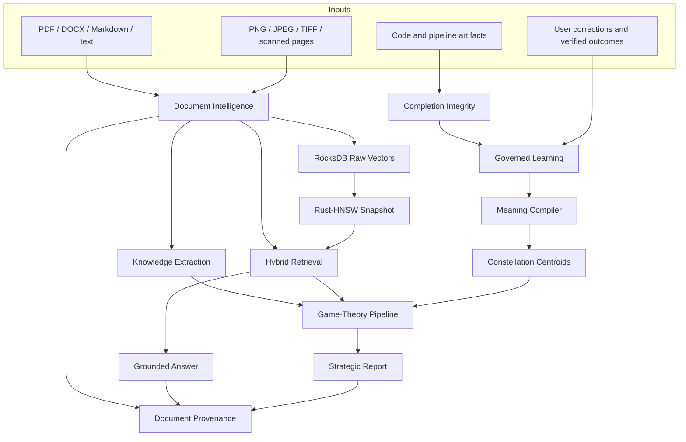

# Archon Evidence Engine

The Evidence Engine turns Archon from a chat-first assistant into an inspectable
reasoning system. It stores documents, claims, provenance, game-theory runs,
completion-integrity checks, learning signals, meaning datasets, and
constellation centroids in queryable local state instead of leaving them as
transient model output.

> **TUI parity.** Every `archon X` shell command in this doc has a `/X` slash equivalent inside the TUI. Both forms drive the same crate machinery and the same Cozo source-of-truth tables. See [CLI and TUI Command Parity](cookbook/real-world-evidence-engine.md#cli-and-tui-command-parity). The end-to-end flow below shows the shell form for clarity; replace each `archon X` with `/X` to drive the same pipeline from inside the TUI.

## Combined architecture

| Layer | Crate or module | Source of truth | Main commands |
|---|---|---|---|
| Document intelligence | `archon-docs` | document/page/chunk/OCR/provenance Cozo rows, RocksDB raw vectors, Rust-HNSW snapshots | `archon docs ...` |
| Knowledge extraction | `archon-knowledge` | claims, entities, relations, source quality, contradictions | `archon kb ...` |
| Provenance | `archon-provenance` plus document provenance | chain hashes and artifact lineage rows | `archon prov ...`, `archon docs provenance` |
| Game-theory pipeline | `archon-pipeline::gametheory` | `gt_runs`, fingerprints, routing, specialist outputs, sections, reports, checkpoints | `archon gametheory ...`, `/gametheory ...`, `GameTheory*` tools |
| Completion integrity | `archon-completion` | completion claims, evidence, gate results, incidents, run contexts, trust scores | `archon completion ...` |
| Governed learning | `archon-learning` and `src/command/behaviour.rs` | learning events, proposals, manifests, decisions | `archon behaviour ...`, `/learning-status` |
| Meaning compiler | `archon-meaning` | labeled samples, contrastive pairs, triplets | `archon meaning ...` |
| Constellation | `archon-constellation` | versioned centroid profiles | `archon constellation ...` |
| Policy | `archon-policy` | layered TOML policy files | read by feature gates |



## End-to-end flow

CLI form (e.g., scripted from a shell):

```bash
archon docs ingest ./policy-pack
archon docs index --all
archon docs index --document <document-id> --batch-size 64
archon docs index-status
archon docs index-retry-failed --limit 500
archon docs index-daemon start
archon docs vector-status
archon docs vector-migrate --limit 1000 --batch-size 250
archon docs vector-compact
archon kb process --claims --entities --contradictions
archon gametheory run "Assess the incentive structure of this plugin marketplace design" --budget 20 --max-concurrent 4
archon meaning build --from gametheory-runs
archon constellation build --target strategic-workflow
```

TUI form (same flow, driven from inside an interactive session):

```
> /docs ingest ./policy-pack
> /docs index --all
> /docs index --document <document-id> --batch-size 64
> /docs index-status
> /docs index-retry-failed --limit 500
> /docs index-daemon status
> /docs vector-status
> /kb process --claims --entities --contradictions
> /gametheory run "Assess the incentive structure of this plugin marketplace design" --budget 20 --max-concurrent 4
> /meaning build --from gametheory-runs
> /constellation build --target strategic-workflow
```

`docs index` reports candidate counting, embedding provider loading, candidate
loading, per-window and per-batch start/finish counts, bulk vector storage,
failures, skipped rows, and elapsed time. Normal pending indexing automatically
uses a durable `doc_index_queue` and bounded 1024-chunk leases when `--limit`
is omitted, so large repairs do not need to materialize the whole backlog
before progress starts. `docs index-status` shows pending/leased/indexed/failed
queue rows plus running/completed/failed job records; `docs index-retry-failed`
requeues failed rows without re-ingesting sources.
`docs index-daemon start` drains the same queue in a background Rust process;
manual `docs index` remains available and does not require the daemon.
Use `docs index-pause <job-id>`, `docs index-resume <job-id>`, and
`docs index-cancel <job-id>` to control durable job state. Paused or cancelled
jobs release leased rows back to pending so a later foreground or daemon run can
continue without reprocessing the original documents.

The indexer uses adaptive batch sizing by default and a content-hash embedding
cache. Cache hits copy an already stored vector for identical chunk text under
the same provider, update the queue row to indexed, and avoid another embedding
request.

For higher throughput, keep a single `docs index` process and increase the
in-process embedding pool instead of starting multiple CLIs. The queue
coordinator leases chunks from Cozo, embedding workers process bounded batches,
and the writer path remains single-threaded for RocksDB vector writes and Cozo
status updates. Use `ARCHON_DOCS_INDEX_EMBEDDING_WORKERS=2`,
`ARCHON_DOCS_INDEX_MAX_IN_FLIGHT_BATCHES=2`, and
`ARCHON_DOCS_INDEX_WRITER_BATCH_SIZE=256` as a conservative starting point.
Local fastembed can run true parallel batches only when multiple model
instances are enabled with `ARCHON_DOCS_FASTEMBED_INSTANCES`; otherwise the
provider cap keeps it at one worker. OpenAI-compatible embedding providers can
benefit from concurrent HTTP calls without extra local model instances.

Document metadata, chunks, queue rows, and provenance stay in Cozo. New raw
embedding writes go to `.archon/doc-vector-store` in RocksDB, and
`docs vector-compact` builds a Rust-HNSW search snapshot from that raw-vector
store. Existing Cozo vector rows can be migrated without re-embedding using
`docs vector-migrate`; the command is resumable and skips rows already present
in RocksDB.

Hybrid retrieval is staged so common questions do not always pay the semantic
startup cost. Archon first sanitizes the user query into Cozo FTS-safe terms
and tries exact evidence. When enough strong lexical hits are available, it
returns those cited chunks immediately. Specific definition-style questions can
also short-circuit on one clear lexical hit, which keeps large KB answers fast
without disabling semantic fallback for ambiguous or weak lexical results. If a
definition-style query has a minor typo, hybrid tries a narrow relaxed exact
retry before paying the semantic startup cost.

Every stage should leave physical evidence behind. Use the inspection commands
instead of trusting return values:

```bash
archon docs status
archon kb stats
archon gametheory list-runs
archon completion trust
archon meaning samples
archon constellation list
```

## Full State Verification pattern

For any feature or manual smoke test, define the trigger, the process, and the
stored outcome before calling it done.

| Step | What to do | Example |
|---|---|---|
| Trigger | Run the command or tool that should create state | `archon completion verify run-1 --agent verifier --model sonnet` |
| Process | Let the crate execute the real path | claim extraction, gate checks, incident recording, trust recompute |
| Outcome | Read the independent source of truth | `archon completion trust --agent verifier --model sonnet` |

Happy path and edge cases should include at least empty input, missing provider,
duplicate input, invalid format, interruption/resume, and contradictory content
where the feature accepts those shapes.

## Data locations

Evidence Engine commands share the project-local Cozo-backed SQLite file at
`<workspace>/.archon/archon-data.db` by default. Use environment overrides only
when you intentionally want to split a surface into a separate store:

| Area | Default or override |
|---|---|
| Shared evidence store | `<workspace>/.archon/archon-data.db`, or `ARCHON_EVIDENCE_DB_PATH` |
| Docs | `ARCHON_DOCS_DB_PATH`, then shared evidence store |
| KB | `ARCHON_KB_DB_PATH`, then shared evidence store |
| Meaning | `ARCHON_MEANING_DB_PATH`, then `ARCHON_KB_DB_PATH`, then shared evidence store |
| Constellation | `ARCHON_CONSTELLATION_DB_PATH`, then `ARCHON_MEANING_DB_PATH`, then `ARCHON_KB_DB_PATH`, then shared evidence store |
| Completion integrity | `ARCHON_COMPLETION_DB_PATH`, then shared evidence store |
| Game-theory and governed learning | `ARCHON_LEARNING_DB_PATH`, then shared evidence store |
| Policy | `/etc/archon/policy.toml`, `~/.archon/policy.toml`, `<workspace>/.archon/policy.toml` |

On startup, pipeline learning also checks for the legacy project-local RocksDB
store at `<workspace>/.archon/learning.db`. If the shared evidence store is
using the default path, Archon copies legacy SONA/GNN rows into
`<workspace>/.archon/archon-data.db` once and writes
`<workspace>/.archon/learning.db.migrated-to-archon-data`. Explicit
`ARCHON_LEARNING_DB_PATH` or `ARCHON_EVIDENCE_DB_PATH` overrides disable this
automatic migration.

## Project Initialisation

For a new project, run:

```bash
sh scripts/archon-init.sh --target /path/to/project --archon-cli-repo /path/to/archon-cli
```

The initialiser creates the Evidence Engine project tree:

| Path | Purpose |
|---|---|
| `.archon/policy.toml` | Safe local-first defaults for docs VLM, retrieval weights, learning gates, and game-theory Tier 11 |
| `.archon/specs/` | Routing/spec files such as `gametheory.yaml` |
| `.archon/docs/inbox/` | Optional drop zone for PDFs, DOCX, Markdown, text, and image files before `archon docs ingest` |
| `.archon/evidence/` | Workspace-local evidence artifacts and manual verification transcripts |
| `.archon/agents/` | Project agent definitions, including copied game-theory agents when available |
| `prds/` and `tasks/` | PRD-driven work artifacts |

Runtime databases still live in the application data directory by default; the
workspace tree holds policy, specs, input files, agents, and verification
artifacts.

See the focused guides for command details:

- [Document intelligence](docs.md)
- [Knowledge base](knowledge.md)
- [Game theory](gametheory.md)
- [Completion integrity](completion-integrity.md)
- [Governed learning](governed-learning.md)
- [Policy](policy.md)
- [Provenance](provenance.md)
- [Real-world examples](cookbook/real-world-evidence-engine.md)

## Derived learning commands

The meaning and constellation commands expose the derived-data side of governed
learning:

| Command | Purpose |
|---|---|
| `archon meaning build --from learning-events` | Build meaning samples from learning events |
| `archon meaning build --from gametheory-runs` | Build meaning samples from game-theory runs |
| `archon meaning samples` | List labeled samples |
| `archon meaning contrastive` | List contrastive pairs |
| `archon meaning triplets` | List triplets |
| `archon meaning export --kind samples|triplets` | Export JSONL datasets |
| `archon constellation build --target project|research-domain|strategic-workflow` | Build centroid profiles |
| `archon constellation score --target <target> --text <text>` | Score text or a file |
| `archon constellation drift --target <target> --text <text>` | Detect drift against a centroid |
| `archon constellation list` | List persisted centroids |
