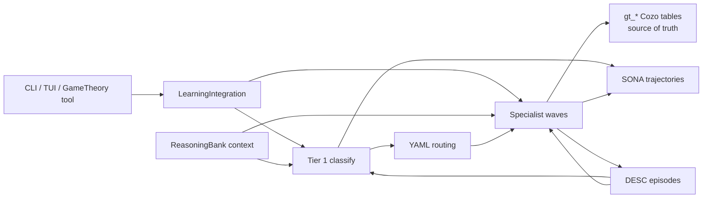

# Game-Theory Evidence Pipeline

The game-theory pipeline classifies a strategic situation, routes it through a
YAML specialist graph, executes selected specialists, and persists a final
report with provenance. It is exposed through CLI commands, a `/gametheory`
slash umbrella, and eight agent-callable tools.

## CLI

Current `archon gametheory --help` surface:

| Command | Purpose | Important flags |
|---|---|---|
| `<situation>` | PRD shorthand for classify, route, specialists, final report | `--kb`, `--classify-only`, `--spec-path`, `--debug-memory`, `--budget`, `--max-concurrent`, `--style`, `--enable-tier11` |
| `run <situation>` | Explicit form of the same full pipeline | `--kb`, `--classify-only`, `--spec-path`, `--debug-memory`, `--budget`, `--max-concurrent`, `--style`, `--enable-tier11` |
| `list-runs` | List persisted runs | none |
| `show <run-id>` | Show full run details | none |
| `status [run-id]` | Show one run or aggregate status counts | optional run id |
| `inspect <artifact-id>` | Inspect run, specialist, section, fingerprint, routing, or report artifact | artifact id forms include `fingerprint:<run-id>` and `specialist:<run-id>:<agent>` |
| `inspect-fingerprint <run-id>` | Inspect Tier 1 fingerprint | none |
| `inspect-routing <run-id>` | Inspect routing decision | none |
| `replay <run-id>` | Replay from persisted fingerprint | `--spec-path`, `--reclassify`, `--rerun-specialist <key>` |
| `resume <run-id>` | Resume interrupted `InProgress` run from checkpoints | `--spec-path` |
| `list-agents` | List curated specialists | `--tier N` |
| `specimens` | List or ingest known-fingerprint library | `--filter axis=value`, `--ingest` |

Example:

```bash
archon gametheory "Assess this plugin marketplace design" --kb policy-pack

archon gametheory run "Assess this plugin marketplace design" \
  --kb policy-pack \
  --budget 20 \
  --max-concurrent 4 \
  --style executive \
  --debug-memory
```

## Real-World Uses

Good prompts include the strategic actors, the decision being made, and the
source pack to ground the analysis:

```bash
archon gametheory \
  "Assess whether a marketplace ranking algorithm creates incentives for plugin developers to game reviews instead of improve quality" \
  --kb plugin-marketplace \
  --style executive

archon gametheory \
  "Analyze bargaining power between a SaaS platform, enterprise buyers, and third-party integration vendors" \
  --kb partner-diligence \
  --style academic \
  --debug-memory

archon gametheory \
  "Evaluate whether competitors are likely to retaliate against a price cut in this infrastructure market" \
  --kb market-thesis \
  --style technical \
  --budget 15
```

Use `--style executive` for board-level recommendations, `--style academic`
for theory-heavy reasoning, and `--style technical` for mechanism details and
assumptions.

## Source of truth

The pipeline persists real state into Cozo relations including:

| Relation | Meaning |
|---|---|
| `gt_runs` | run id, situation, timestamps, status, cost |
| `gt_fingerprints` | Tier 1 classification fingerprint |
| `gt_routing_decisions` | enabled and skipped specialists |
| `gt_specialist_outputs` | per-agent outputs, status, cost |
| `gt_sections` | report section drafts |
| `gt_final_reports` | final assembled report |
| `gt_run_checkpoints` | resume/replay checkpoints |
| `gt_specimen_library` | lazy-loaded known fingerprints |

When `--kb <pack>` is supplied, the run reads matching `doc_sources` and
`doc_chunks` from the document evidence store, injects the retrieved chunks into
Tier 1 and specialist prompts, and writes a `stage:kb-context` checkpoint with
the pack id plus document/chunk counts.

## Learning integration

GameTheory has its own routing and persistence lane, but it now calls Archon's
shared learning stack at the same execution boundaries as the coding/research
pipelines.



Practical behavior:

- ReasoningBank and DESC are injected into Tier 1 and specialist prompts when
  their `[learning.*]` toggles are enabled.
- TUI `/gametheory` runs record SONA trajectories when `learning.sona.enabled =
  true`.
- Shell `archon gametheory ...` runs and agent-callable GameTheory tools record
  SONA only when `learning.sona.pipeline_recording = true`.
- SONA/DESC do not replace the strategic source of truth. Operators should
  inspect `gt_runs`, `gt_fingerprints`, `gt_routing_decisions`,
  `gt_specialist_outputs`, `gt_sections`, and `gt_final_reports` for run
  verification.

Full State Verification should read these through CLI inspection commands:

```bash
archon gametheory list-runs
archon gametheory status <run-id>
archon gametheory inspect-fingerprint <run-id>
archon gametheory inspect-routing <run-id>
archon gametheory inspect specialist:<run-id>:<agent-key>
```

## Slash commands

Interactive TUI users get one umbrella command:

| Slash form | Equivalent intent |
|---|---|
| `/gametheory run <situation> [--kb <pack>]` | Start an async game-theory run |
| `/gametheory classify-only <situation>` | Persist a Tier 1 fingerprint only |
| `/gametheory status [run-id]` | Show status |
| `/gametheory inspect <artifact-id>` | Inspect an artifact |
| `/gametheory inspect-fingerprint <run-id>` | Inspect the Tier 1 fingerprint |
| `/gametheory inspect-routing <run-id>` | Inspect the routing decision |
| `/gametheory list-runs` | List persisted runs |
| `/gametheory show <run-id>` | Show run details |
| `/gametheory replay <run-id> [--reclassify|--rerun-specialist <key>]` | Replay a run |
| `/gametheory list-agents [--tier N]` | List specialists |
| `/gametheory specimens [--filter axis=value] [--ingest]` | Inspect specimen library |

When used from the TUI, Tier 1 classification agents and routed specialists run
through Archon's subagent executor. The game-theory lane itself is unchanged:
the YAML routing graph, dependency waves, checkpoints, and Cozo tables still
control the run. The subagent layer supplies runtime parity with `/archon-code`
and `/archon-research`: tool filtering, memory/doc access, transcripts, hooks,
and live Agent Activity rows.

## End-to-end TUI walkthrough

The pipeline is async — `/gametheory run` queues a run and returns immediately with a `run-id`. You then use the inspection commands to watch it progress. Here's a real session for evaluating a strategic decision.

### Step 0 — ingest source material (optional but recommended)

If the analysis depends on documents, ingest them first as a knowledge pack:

```
> /docs ingest --pack plugin-marketplace ./docs/research/marketplace-design.md ./docs/research/dev-incentives.md
[ingest] 2 documents, 47 chunks, 12 entities, 38 claims persisted
[ingest] pack id: plugin-marketplace
```

The pack id is what `--kb` consumes. Skip this step if you want a model-only analysis.

### Step 1 — classify-only first (cheap fingerprint)

Before paying for a full specialist run, see what the pipeline thinks the situation IS. `--classify-only` runs Tier 1 only:

```
> /gametheory classify-only "Assess whether a marketplace ranking algorithm creates incentives for plugin developers to game reviews instead of improve quality"
[gametheory] queued run 01HYCDB7T2QM8R… (classify-only)
[gametheory] Tier 1 fingerprint complete (3.4s, $0.012)
```

Inspect what came back:

```
> /gametheory inspect-fingerprint 01HYCDB7T2QM8R…
─── Tier 1 Fingerprint ─────────────────────────────────────────
  axes:
    information.symmetry        = asymmetric
    information.public_signals  = present (rankings, reviews)
    moves.sequencing            = simultaneous
    moves.commitment            = none
    payoffs.alignment           = misaligned
    payoffs.zero_sum            = false
    actors.count                = many
    actors.identity_known       = pseudonymous
    repetition                  = repeated
    horizon                     = infinite
  hypothesis: principal-agent with hidden action; signal-jamming feasible
─────────────────────────────────────────────────────────────────
```

Wrong axes? Stop here, refine the situation prompt, re-classify. Cheap.

### Step 2 — full run with budget cap

Once the fingerprint looks right, kick off the full pipeline:

```
> /gametheory run "Assess whether a marketplace ranking algorithm creates incentives for plugin developers to game reviews instead of improve quality" --kb plugin-marketplace --budget 15 --style executive
[gametheory] queued run 01HYCDC4XKM91Y… (full)
[gametheory] cost cap: $15.00, max-concurrent: 4, style: executive
[gametheory] use /gametheory status 01HYCDC4XKM91Y… to monitor
```

The TUI returns to the prompt immediately. The pipeline runs in the background.

### Step 3 — see what specialists got picked

```
> /gametheory inspect-routing 01HYCDC4XKM91Y…
─── Routing Decision ───────────────────────────────────────────
  enabled (7):
    asymmetric-info-detective         (mandatory: information.symmetry=asymmetric)
    behavioral-bias-detector          (cond: actors.count>3)
    cheap-talk-evaluator              (cond: information.public_signals=present)
    auction-strategist                (cond: payoffs.alignment=misaligned)
    bayesian-belief-updater           (cond: repetition=repeated)
    business-strategy-gamifier        (mandatory: domain=business)
    bluff-and-deception-analyst       (cond: information.symmetry=asymmetric AND moves.commitment=none)
  skipped (4):
    backward-induction-solver         (skip: horizon=infinite, not finite)
    centipede-game-analyst            (skip: actors.count>2 violated)
    auction-format-comparer           (skip: domain≠auction)
    coalition-stability-checker       (skip: payoffs.zero_sum=false AND actors.count>10)
─────────────────────────────────────────────────────────────────
```

Don't like the routing? `replay --rerun-specialist <key>` after the run completes, or refine the spec YAML.

### Step 4 — monitor live

```
> /gametheory status 01HYCDC4XKM91Y…
─── Run 01HYCDC4XKM91Y… ────────────────────────────────────────
  status:        InProgress
  phase:         specialists
  agents:        3/7 complete, 2 running, 2 queued
  cost:          $4.18 / $15.00
  started:       2026-05-04 19:34:12Z
  elapsed:       00:02:48

  agent breakdown:
    asymmetric-info-detective    DONE     ($0.62, 18.4s)
    behavioral-bias-detector     DONE     ($0.71, 22.1s)
    cheap-talk-evaluator         DONE     ($0.55, 16.0s)
    auction-strategist           RUNNING  ($1.24 so far, 41.2s)
    bayesian-belief-updater      RUNNING  ($1.06 so far, 38.7s)
    business-strategy-gamifier   QUEUED   —
    bluff-and-deception-analyst  QUEUED   —
─────────────────────────────────────────────────────────────────
```

### Step 5 — read the final report

When `status` shows `Complete`:

```
> /gametheory show 01HYCDC4XKM91Y…
[gametheory] writing report to .archon/gametheory/01HYCDC4XKM91Y…/report.md
─── Final Report (executive style) ─────────────────────────────
  # Marketplace Ranking — Strategic Risk Assessment
  ...
─────────────────────────────────────────────────────────────────
```

Inspect a single specialist's reasoning:

```
> /gametheory inspect specialist:01HYCDC4XKM91Y…:asymmetric-info-detective
```

### Step 6 — replay with a tweak

You disagree with one specialist's reasoning. Re-run just that one without re-doing the rest:

```
> /gametheory replay 01HYCDC4XKM91Y… --rerun-specialist auction-strategist
[gametheory] reusing fingerprint, routing decision, and 6 specialist outputs
[gametheory] re-running auction-strategist (cost cap from original run still in force)
```

Or re-classify if you've refined the situation prompt:

```
> /gametheory replay 01HYCDC4XKM91Y… --reclassify
```

### Resume an interrupted run

If a run was crashed mid-specialists (your machine slept, network blip, etc):

```
> /gametheory list-runs
RUN ID                        STATUS       SITUATION (truncated)
01HYCDC4XKM91Y…              Complete      Assess whether a marketplace ra…
01HYCDB1YYXP3R…              InProgress    Evaluate competitor retaliation…

> /gametheory resume 01HYCDB1YYXP3R…
[gametheory] resuming from checkpoint stage:specialists (3/5 complete)
```

Cost cap from the original run carries over.

### Pick a specialist tier to scope your inspection

```
> /gametheory list-agents --tier 4
TIER 4 — bargaining and negotiation
  bargaining-power-analyst
  threat-credibility-assessor
  reservation-value-estimator
  …
```

## Agent tools

`archon-tools` registers these game-theory tools when a `GameTheoryExecutor` is
installed:

| Tool | Inputs |
|---|---|
| `GameTheoryRun` | `situation`, optional `budget_usd`, `max_concurrent`, `style` |
| `GameTheoryStatus` | optional `run_id` |
| `GameTheoryListAgents` | optional `tier` |
| `GameTheorySpecimens` | optional `filter`, `ingest` |
| `GameTheoryInspect` | `artifact_id` |
| `GameTheoryReplay` | `run_id`, `reclassify`, optional `rerun_specialist` |
| `GameTheoryClassify` | `situation` |
| `GameTheoryCallSpecialist` | `run_id`, `agent_key` |

These tools call the same persisted machinery as the CLI. They should not print
canned text without writing or reading the expected Cozo state.

See [Real-world Evidence Engine examples](cookbook/real-world-evidence-engine.md)
for business, trading-research, education, coding, and research workflows.
