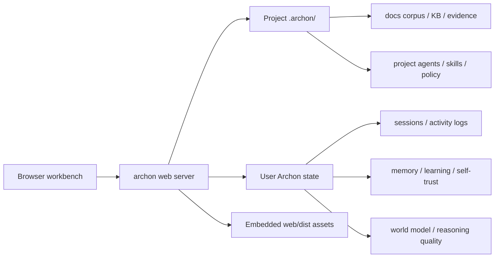

# Web workbench

The Archon web workbench is a browser interface for inspecting and operating
the same local project state that the CLI and TUI use. It is not a separate
service, SaaS dashboard, or cloud UI. It is served by `archon web` from the
embedded `web/dist` assets inside the `archon` binary.

Use it when you want a visual control room for memory, learning, corpus data,
world-model state, reasoning-quality events, pipelines, metrics, and evidence
relationships without remembering every slash command.

## Launch

Run from the project root you want to inspect:

```bash
archon web --port 8421 --bind-address 127.0.0.1
```

By default Archon opens `http://localhost:8421`. Use `--no-open` when running
under WSL, SSH, or another environment where you want to open the URL manually:

```bash
archon web --no-open
```

For a blank project, initialise the directory first:

```bash
mkdir -p ~/projects/my-archon-project
sh /path/to/archon-cli/scripts/archon-init.sh \
  --target ~/projects/my-archon-project \
  --archon-cli-repo /path/to/archon-cli
cd ~/projects/my-archon-project
archon web
```

There is no per-project web install step. Normal users do not need Node.js,
Vite, or `npm install`; those are only needed when developing the web UI itself.

## Configuration

The web workbench uses the normal Archon config layers:

```toml
[web]
port = 8421
bind_address = "127.0.0.1"
open_browser = true
```

`127.0.0.1` is the safe default. Binding to `0.0.0.0` makes the workbench
network-accessible and causes Archon to create/use a bearer token. Use that only
behind a trusted network boundary or reverse proxy.

## Mental model

The workbench is a visual inspector over local Archon state:



Most pages are inspection-first. Mutating operations are exposed through typed
action previews and policy gates rather than direct unchecked buttons.

## Tabs

### Overview

The overview tab shows runtime posture:

| Area | Shows |
|---|---|
| Runtime | version, bind address, auth posture, asset mode |
| Features | which web surfaces are enabled |
| Stores | high-level status for memory, world model, corpus, pipelines |
| Live snapshot | bounded event snapshot from the web live event manager |

Use this as the first place to confirm that the browser is connected to the
right Archon process and project directory.

### Chat

The chat tab is the browser entry point for agent interaction. It is intended to
share the same provider configuration, permissions, session state, and tool
surface as the CLI/TUI.

Current foundation behaviour:

| Area | Shows |
|---|---|
| Conversation shell | prompt area and response surface |
| Attachments | upload/attachment policy posture |
| Auth state | whether the web session is loopback or token-protected |

When uploads are enabled by policy, attachment metadata is checked before the
file is accepted. Uploads do not bypass normal tool, file, or policy gates.

### Corpus

The corpus tab lets you interact with the material created by `/docs`, `archon
docs ...`, `/kb`, and related document-ingest workflows.

| Area | Shows |
|---|---|
| Roots | repository docs, `.archon/docs`, `.archon/docs/inbox`, `.archon/docs/images`, and other configured roots |
| Source list | path, type, size, excerpts, match scores |
| Preview | safe text preview for files inside allowed corpus roots |
| Search | bounded ranked keyword search over source names, paths, and preview chunks |
| Chunk hits | line start, excerpt, score, and embedding/index hint |

The browser preview is read-only and rooted. It refuses paths outside the known
corpus roots. Full ingestion still happens through the CLI/TUI:

```bash
archon docs ingest .archon/docs/inbox
archon docs index --all
archon docs search "known phrase" --mode hybrid
```

### Memory

The memory tab surfaces learning and memory state that would otherwise require
multiple slash commands.

| Area | Shows |
|---|---|
| Signals | sessions, reasoning-quality store, self-calibration, proposal stores |
| Memories | recent memory rows and rule-like records |
| LearningEvents | governed learning events and correction-linked rows |
| Behaviour proposals | pending proposal previews |
| Trust deltas | self-trust and calibration rows |
| Filters | graph-style filtering across memory, events, proposals, and trust rows |

Buttons that inspect behaviour proposals use dry-run action previews. They do
not apply behaviour changes unless policy and confirmation gates allow that
action.

### World

The world tab inspects the local world model and its reasoning-quality bridge.

| Area | Shows |
|---|---|
| Root and ledgers | world-model store, advisor events, trace ledgers |
| Signals | cold-start state, candidate store, active pointer, reasoning bridge |
| Advisor events | fail-open prediction status and unavailable reasons |
| Candidates | candidate checkpoint rows and promotion-gate details |
| Predictions | persisted prediction/outcome previews |
| Reasoning rows | reasoning-quality events that feed world-model traces |
| Shadow reports | shadow-mode precision/report artifacts |

Promotion and rollback controls are surfaced as dry-run action previews. The
world model remains advisory unless subsystem policy allows behaviour-changing
use.

### Pipelines

The pipeline tab is a control-room view for `/archon-code`, `/archon-research`,
`/gametheory`, and declarative pipeline runs.

| Area | Shows |
|---|---|
| Stages | swimlane-style stage families such as intake, implementation, verification, research |
| Agents | specialist names, responsibilities, paths, status |
| Runs | recent pipeline session ids, family, status, updated time |
| Artifacts | report/audit/output files with tails |
| Live activity | recent activity JSONL summaries from session logs |

Pipeline buttons must go through the web action envelope and subsystem policy
gates. The page is designed to make stage state and output visible before an
operator acts.

### Metrics

The metrics tab shows operational health.

| Area | Shows |
|---|---|
| Web bundle | embedded asset count and size |
| Performance targets | tab/event/search target values |
| Queue depth | action audit, reasoning event, and world advisor ledgers |
| Store health | sessions, memory, world model, reasoning-quality, web dist |
| Provider runtime | request/error/retry/token/cost/latency aggregates from provider runtime events |
| Event tails | recent web, reasoning, world, and provider events |

Provider cost and latency are shown only when those fields exist in the runtime
event payload. If the provider runtime did not record cost or latency, the UI
shows that honestly as unavailable rather than guessing.

### Settings

The settings tab is intentionally bounded.

| Area | Shows |
|---|---|
| Theme | dark/light toggle |
| Accent | fixed accent swatches |
| Density | compact/comfortable mode |
| Theme profile | export/import JSON persisted at `~/.archon/web/theme-profile.json` |
| Policy posture | read-only display of web-facing policy state |

The web UI does not provide a general policy editor. Policy remains TOML-based
and reviewable in the normal config files.

### Evidence Graph

The evidence graph shows how major local data families relate. Source nodes
and aggregate counts are derived from the local filesystem and scanned corpus
text; the graph does not invent chunk/claim counts from fixed multipliers.
Claim and evidence counts are deterministic text-marker counts until a richer
indexed evidence graph is available.

| Node family | Meaning |
|---|---|
| Docs / KB | ingested files and knowledge-base material |
| Chunks | searchable document spans |
| Claims / Evidence | extracted or cited assertions and provenance |
| Memory / LearningEvents | durable learning rows |
| Reasoning quality | visible claim/evidence and correction events |
| World model | trace rows, candidates, predictions |
| Sessions / Pipelines / Artifacts | runtime work and outputs |

The graph uses a node/edge budget. If the corpus grows beyond the render budget,
the server should degrade through clustering or refuse the render with an
explicit message rather than freezing the browser.

## Action safety

The web workbench uses a typed action envelope for mutating operations:

| Field | Purpose |
|---|---|
| `actionId` | stable action identity |
| `actionKind` | operation family, such as `world.candidate.promote` |
| `dryRun` | preview without applying |
| `payloadSummary` | human-readable target |
| `confirmationToken` | confirmation when required |

Policy is composed as an AND gate:

1. the web action policy must allow the action;
2. the subsystem policy must allow the action;
3. confirmation must be present when required.

Dry-run previews are safe to use for inspection. They still write audit rows so
operators can review what was attempted.

The default `[policy.web]` posture is inspect-only:

```toml
[policy.web]
allow_mutating_actions = false
allow_file_uploads = false
allow_pipeline_controls = false
allow_model_training_actions = false
allow_corpus_open_paths = false
```

Set the global gate and the specific action-family gate to enable a browser
operation family. Model-training and checkpoint-promotion actions also require
`policy.world_model.allow_behavior_changes = true`.

## Security posture

| Deployment | Recommended posture |
|---|---|
| Local laptop | `bind_address = "127.0.0.1"` |
| WSL | use `--no-open` if browser auto-launch does not cross the WSL boundary |
| LAN/shared server | bind non-loopback only with bearer-token handling and a trusted network boundary |
| Internet-exposed | do not expose directly; put behind a hardened reverse proxy and review permissions |

The web workbench can expose sensitive local project state: paths, session
summaries, corpus excerpts, reasoning-quality events, provider runtime status,
and pipeline artifacts. Treat it like access to the local Archon workspace.

## Development mode

Only contributors working on the web UI need Node.js.

```bash
cd web
npm install
npm run dev
```

Production builds are embedded:

```bash
cd web
npm run typecheck
npm run build
cd ..
cargo build --release --bin archon
```

The frontend uses React, Vite, generated TypeScript DTOs from Rust, Playwright
screenshots, and tab-level lazy loading for heavier graph assets.

## Troubleshooting

| Symptom | Likely cause | Fix |
|---|---|---|
| Browser opens but data looks empty | You launched from the wrong directory | Stop and rerun `archon web` from the project root |
| Blank project has no `.archon/` state | Project was not initialised | Run `scripts/archon-init.sh --target <dir>` |
| `archon web` opens the wrong browser on WSL | auto-open cannot cross host boundary cleanly | Use `archon web --no-open` and open the URL manually |
| Corpus preview refused | path is outside configured corpus roots | ingest/copy the file under `.archon/docs/inbox` or another allowed root |
| Provider metrics are missing | no provider runtime events have been recorded yet | run provider-backed sessions, then refresh metrics |
| Theme import does nothing | invalid bounded theme profile JSON | export a fresh profile, edit only known fields, import again |

## See also

- [Installation](../getting-started/installation.md) — build and project bootstrap
- [Project setup](../getting-started/project-setup.md) — `archon-init.sh` details
- [Remote control](remote-control.md) — WebSocket, SSH, web, and headless modes
- [Configuration](../reference/config.md) — `[web]` and config precedence
- [Data locations](data-locations.md) — persisted state paths
